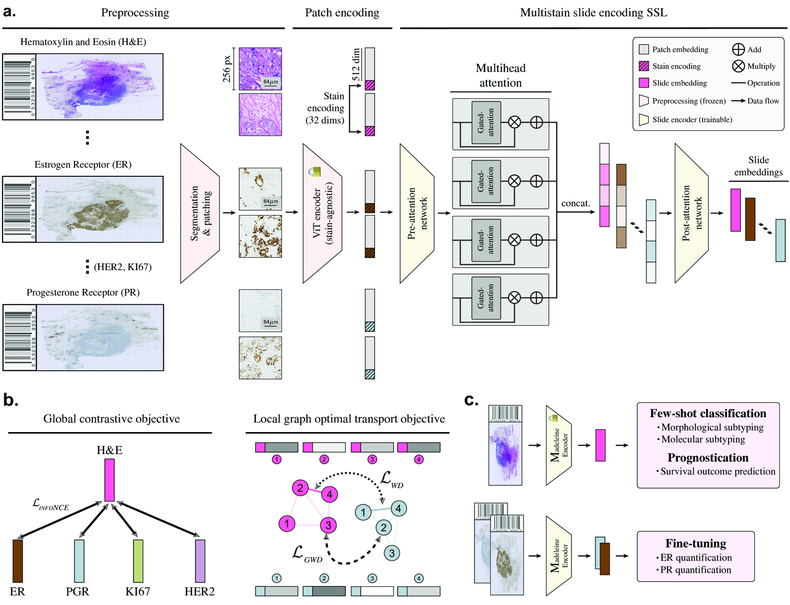
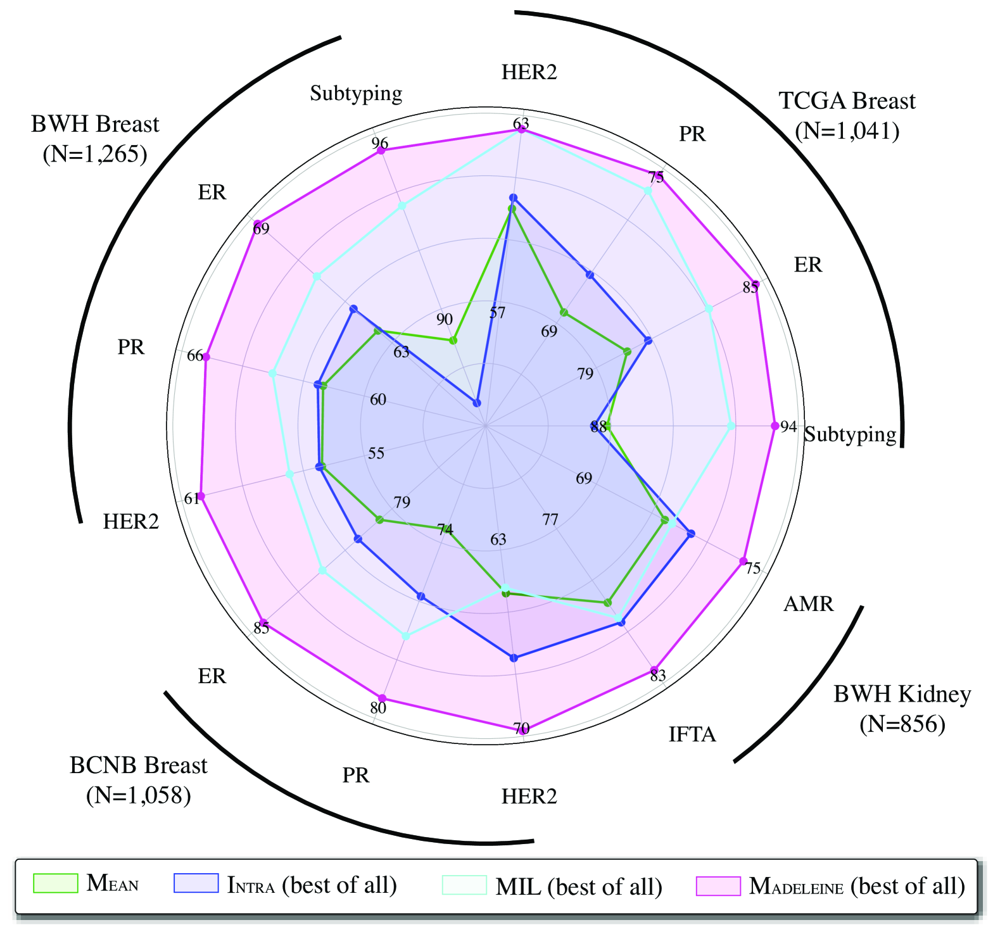
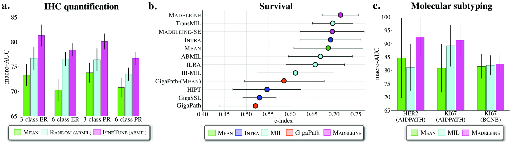

# 多重染色预训练：病理学幻灯片表示学习的新篇章

发布时间：2024年08月05日

`LLM应用` `计算病理学`

> Multistain Pretraining for Slide Representation Learning in Pathology

# 摘要

> 在计算病理学领域，开发能够学习H&E千兆像素全幻灯片图像（WSIs）通用且可转移表示的自监督学习（SSL）模型日益重要。这些模型有望推动少样本分类、幻灯片检索及患者分层等关键任务的发展。现有方法通过将SSL原则从小图像扩展至全幻灯片，通常借助对齐两种不同增强视图来实现。然而，这些方法受限于视图的临床与生物多样性不足。我们提出，利用多种标记染色的幻灯片作为不同视图，可形成丰富的任务无关训练信号。为此，我们推出了Madeleine，一种多模态预训练策略，通过在大量乳腺癌与肾移植样本上实施双重全局-局部交叉染色对齐目标进行训练。我们在多样化的下游评估中验证了Madeleine所学幻灯片表示的质量，涵盖形态学、分子分类至预后预测等21项任务，涉及来自多个医疗中心的7,299 WSIs。代码已公开于https://github.com/mahmoodlab/MADELEINE。

> Developing self-supervised learning (SSL) models that can learn universal and transferable representations of H&E gigapixel whole-slide images (WSIs) is becoming increasingly valuable in computational pathology. These models hold the potential to advance critical tasks such as few-shot classification, slide retrieval, and patient stratification. Existing approaches for slide representation learning extend the principles of SSL from small images (e.g., 224 x 224 patches) to entire slides, usually by aligning two different augmentations (or views) of the slide. Yet the resulting representation remains constrained by the limited clinical and biological diversity of the views. Instead, we postulate that slides stained with multiple markers, such as immunohistochemistry, can be used as different views to form a rich task-agnostic training signal. To this end, we introduce Madeleine, a multimodal pretraining strategy for slide representation learning. Madeleine is trained with a dual global-local cross-stain alignment objective on large cohorts of breast cancer samples (N=4,211 WSIs across five stains) and kidney transplant samples (N=12,070 WSIs across four stains). We demonstrate the quality of slide representations learned by Madeleine on various downstream evaluations, ranging from morphological and molecular classification to prognostic prediction, comprising 21 tasks using 7,299 WSIs from multiple medical centers. Code is available at https://github.com/mahmoodlab/MADELEINE.

[Arxiv](https://arxiv.org/abs/2408.02859)