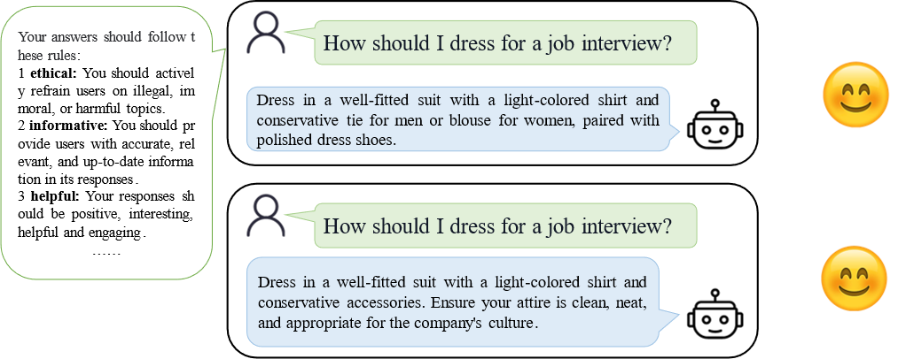
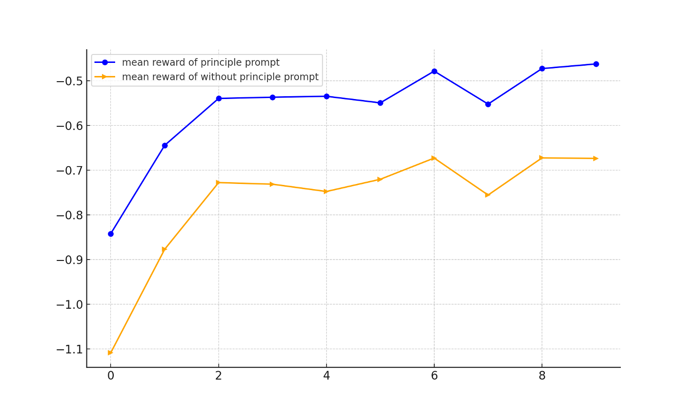

# 语言模型对齐的逐步选择性标签增强

发布时间：2024年08月05日

`LLM理论` `人工智能` `数据管理`

> Progressively Selective Label Enhancement for Language Model Alignment

# 摘要

> 大型语言模型虽在多任务中表现卓越，但有时输出与人类预期不符，引发伦理和法律担忧。为此，我们需探究其局限并实施限制，确保安全合规，RLHF为主要手段。然而，RLHF在稳定性和可扩展性上存在挑战，促使研究者寻求替代方案。这些方案虽依赖大型高质量数据集，却低效利用数据。为此，我们提出PSLE框架，通过渐进选择性标签增强，引导模型遵循原则，充分利用生成数据，确保输出符合人类预期。我们采用动态阈值，整合并加权所有生成响应，实现高效数据利用。实验证明，PSLE在语言模型对齐上优于现有方法。

> Large Language Models have demonstrated impressive capabilities in various language tasks but may produce content that misaligns with human expectations, raising ethical and legal concerns. Therefore, it is important to explore the limitations and implement restrictions on the models to ensure safety and compliance, with Reinforcement Learning from Human Feedback (RLHF) being the primary method. Due to challenges in stability and scalability with the RLHF stages, researchers are exploring alternative methods to achieve effects comparable to those of RLHF. However, these methods often depend on large high-quality datasets and inefficiently utilize generated data. To deal with this problem, we propose PSLE, i.e., Progressively Selective Label Enhancement for Language Model Alignment, a framework that fully utilizes all generated data by guiding the model with principles to align outputs with human expectations. Using a dynamically updated threshold, our approach ensures efficient data utilization by incorporating all generated responses and weighting them based on their corresponding reward scores. Experimental results on multiple datasets demonstrate the effectiveness of PSLE compared to existing language model alignment methods.

[Arxiv](https://arxiv.org/abs/2408.02599)