# 修订版：渲染工具助力视觉-语言模型实现空间保真

发布时间：2024年08月05日

`LLM应用` `计算机视觉` `多模态学习`

> REVISION: Rendering Tools Enable Spatial Fidelity in Vision-Language Models

# 摘要

> T2I 和 MLLMs 在解决计算机视觉和多模态学习任务中已被广泛应用，但这些模型在空间关系推理上存在不足。为此，我们推出了 REVISION 框架，通过 3D 渲染技术生成精确的合成图像，显著提升了模型的空间保真度。REVISION 框架支持多种 3D 资产和空间关系，且视角和背景多样。实验证明，无需额外训练，仅通过 REVISION 提供的图像作为指导，就能大幅提升 T2I 模型的空间一致性，在 VISOR 和 T2I-CompBench 等基准测试中表现优异。此外，我们设计的 RevQA 基准测试显示，即便是最先进的 MLLMs，在复杂空间推理任务中也显得不够稳健。这些发现强调了基于渲染的框架在开发空间感知生成模型中的重要性。

> Text-to-Image (T2I) and multimodal large language models (MLLMs) have been adopted in solutions for several computer vision and multimodal learning tasks. However, it has been found that such vision-language models lack the ability to correctly reason over spatial relationships. To tackle this shortcoming, we develop the REVISION framework which improves spatial fidelity in vision-language models. REVISION is a 3D rendering based pipeline that generates spatially accurate synthetic images, given a textual prompt. REVISION is an extendable framework, which currently supports 100+ 3D assets, 11 spatial relationships, all with diverse camera perspectives and backgrounds. Leveraging images from REVISION as additional guidance in a training-free manner consistently improves the spatial consistency of T2I models across all spatial relationships, achieving competitive performance on the VISOR and T2I-CompBench benchmarks. We also design RevQA, a question-answering benchmark to evaluate the spatial reasoning abilities of MLLMs, and find that state-of-the-art models are not robust to complex spatial reasoning under adversarial settings. Our results and findings indicate that utilizing rendering-based frameworks is an effective approach for developing spatially-aware generative models.

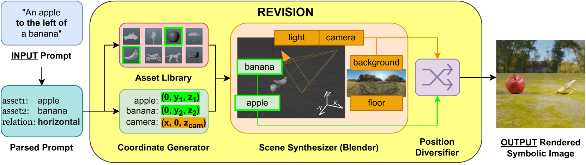

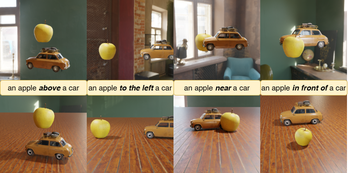

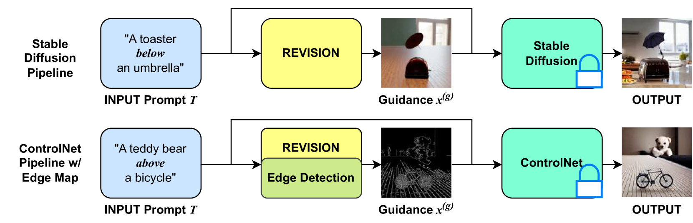

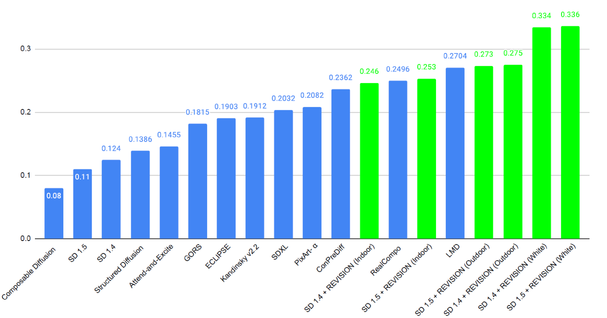

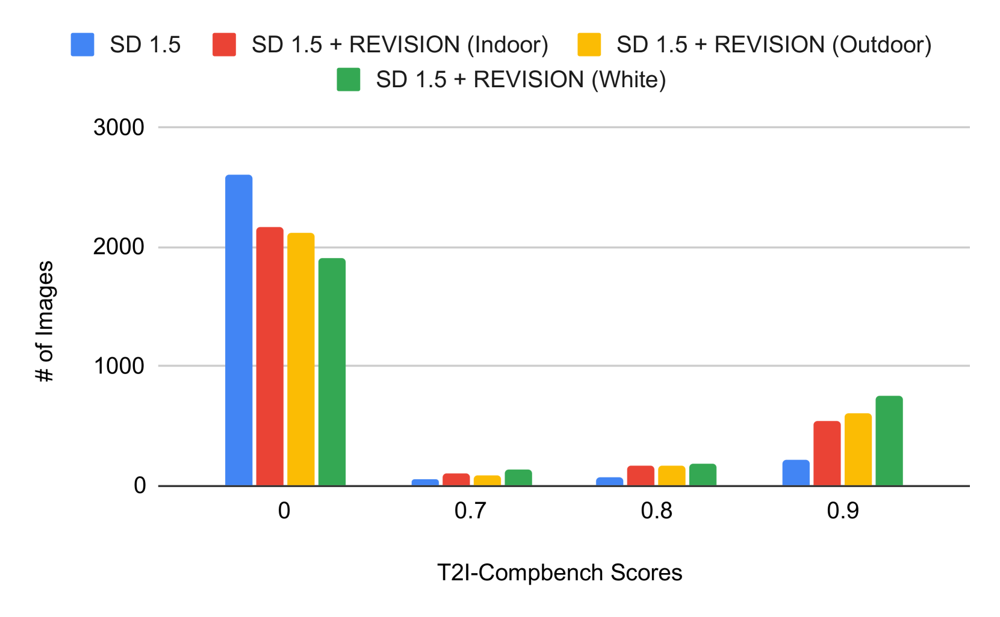

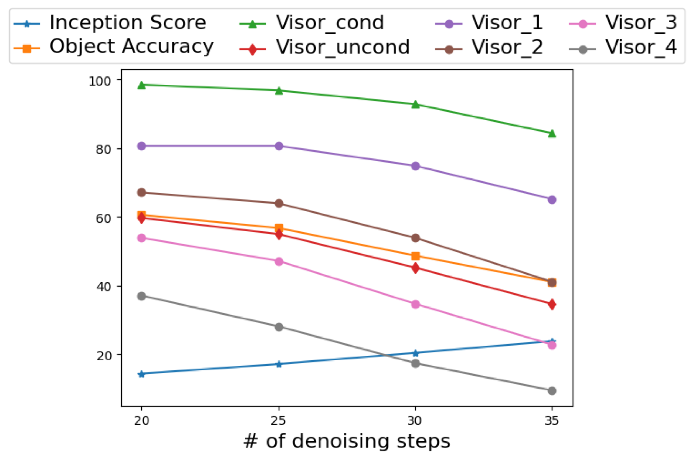

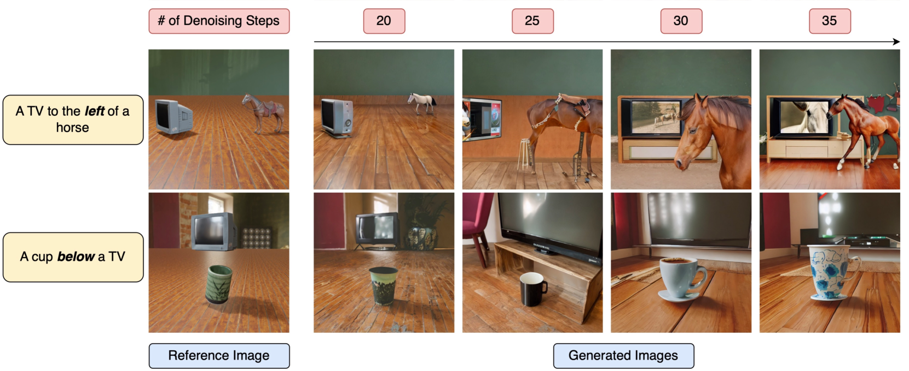

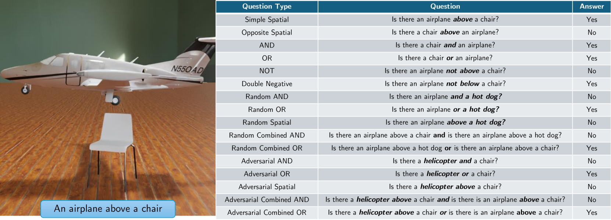

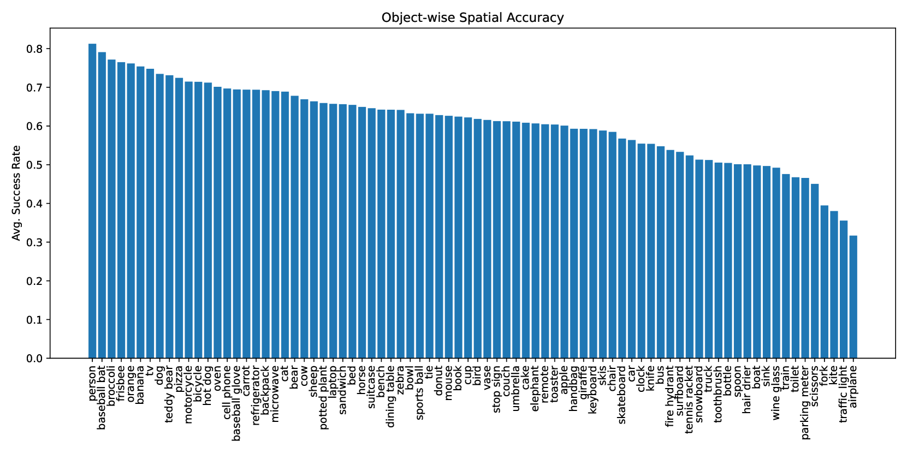

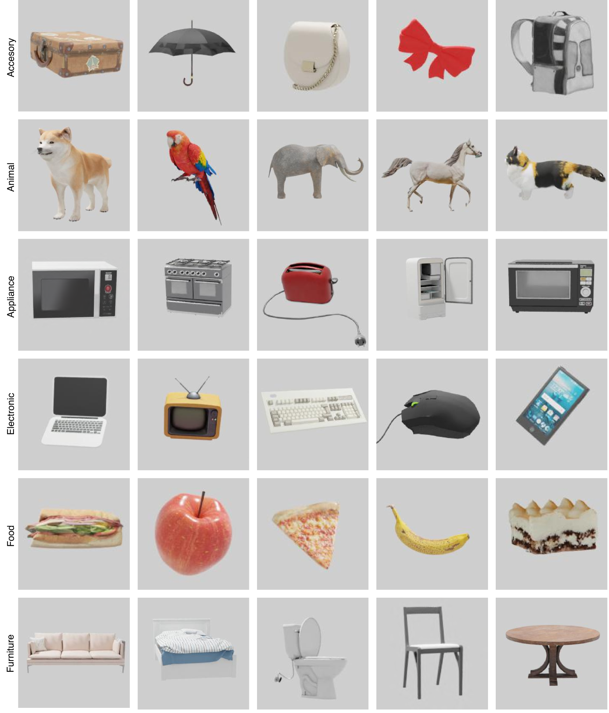

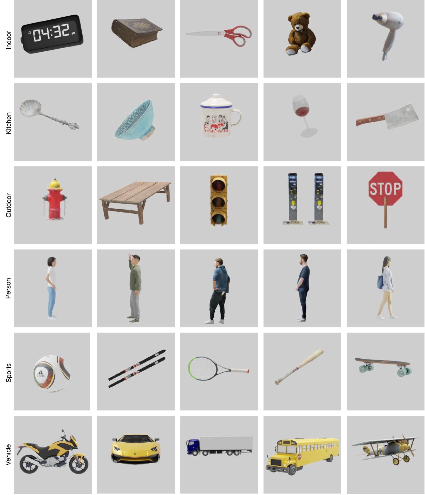

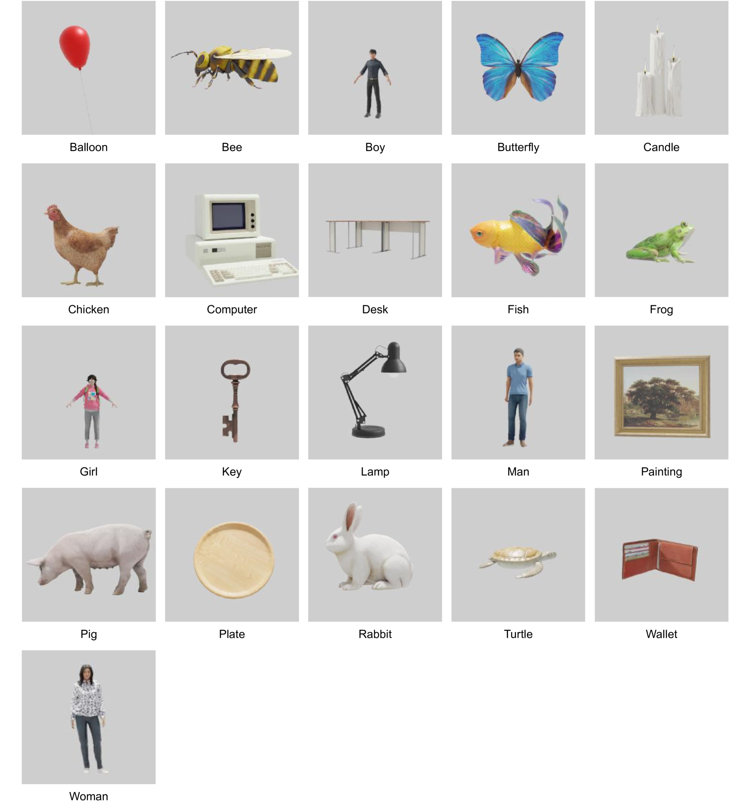

[Arxiv](https://arxiv.org/abs/2408.02231)