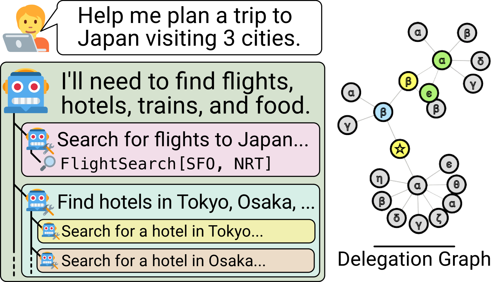
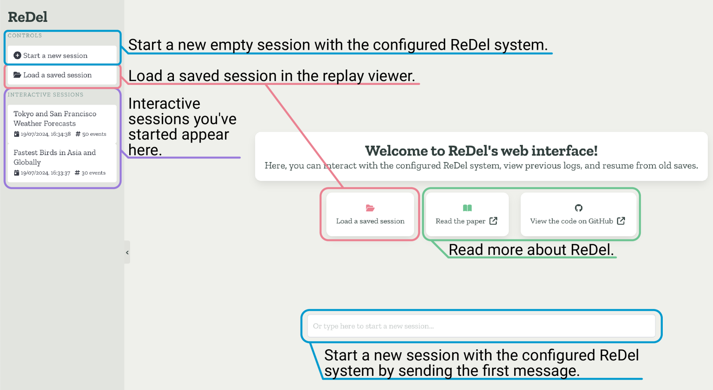
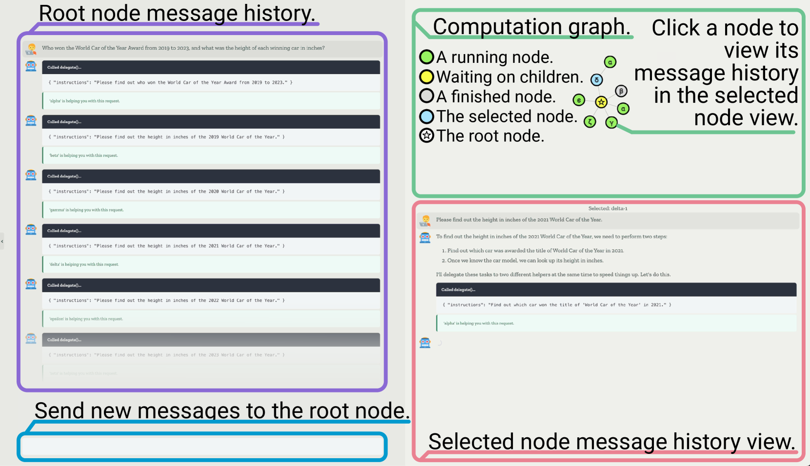
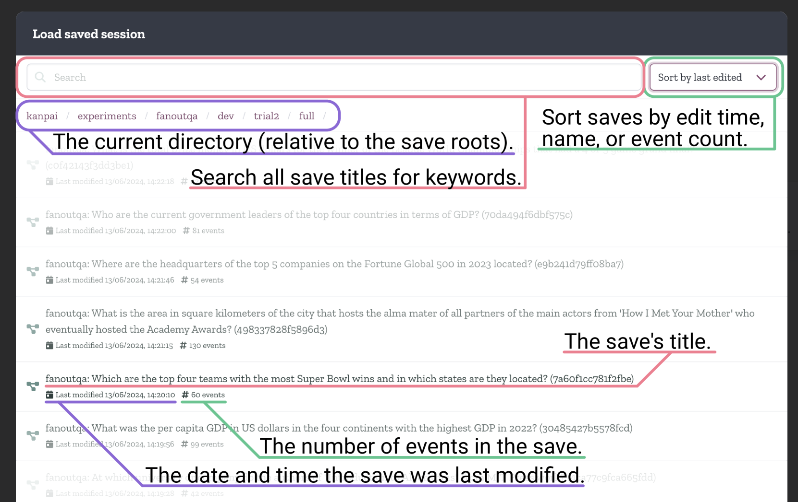
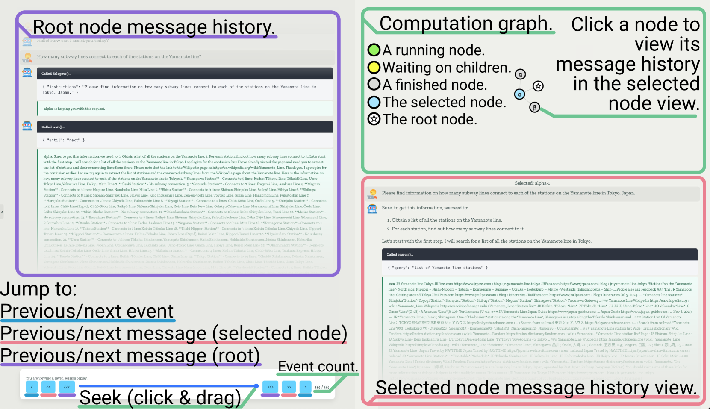
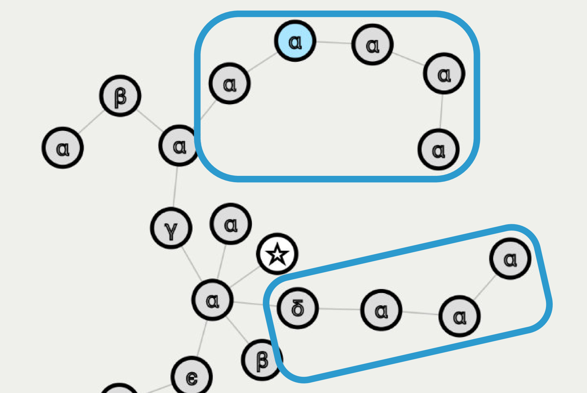

# ReDel：一款专为 LLM 驱动的递归多智能体系统设计的工具包

发布时间：2024年08月05日

`Agent` `人工智能` `软件开发`

> ReDel: A Toolkit for LLM-Powered Recursive Multi-Agent Systems

# 摘要

> 近期，利用大型语言模型（LLMs）构建复杂的多智能体系统，以完成文献综述、消费者报告起草及假期规划等任务，已成为研究热点。尽管现有工具众多，但无一支持递归多智能体系统，即模型能自主决定任务委派时机及组织结构。为此，我们推出了ReDel工具包，它支持自定义工具使用、委派策略、事件日志及便捷的网页交互重放功能。实践证明，ReDel能大幅提升智能体性能，并通过强大的可视化与调试工具，助力我们迅速定位改进空间。所有代码、文档及PyPI包均已开源，遵循MIT许可免费使用。

> Recently, there has been increasing interest in using Large Language Models (LLMs) to construct complex multi-agent systems to perform tasks such as compiling literature reviews, drafting consumer reports, and planning vacations. Many tools and libraries exist for helping create such systems, however none support recursive multi-agent systems -- where the models themselves flexibly decide when to delegate tasks and how to organize their delegation structure. In this work, we introduce ReDel: a toolkit for recursive multi-agent systems that supports custom tool-use, delegation schemes, event-based logging, and interactive replay in an easy-to-use web interface. We show that, using ReDel, we are able to achieve significant performance gains on agentic benchmarks and easily identify potential areas of improvements through the visualization and debugging tools. Our code, documentation, and PyPI package are open-source and free to use under the MIT license.

[Arxiv](https://arxiv.org/abs/2408.02248)