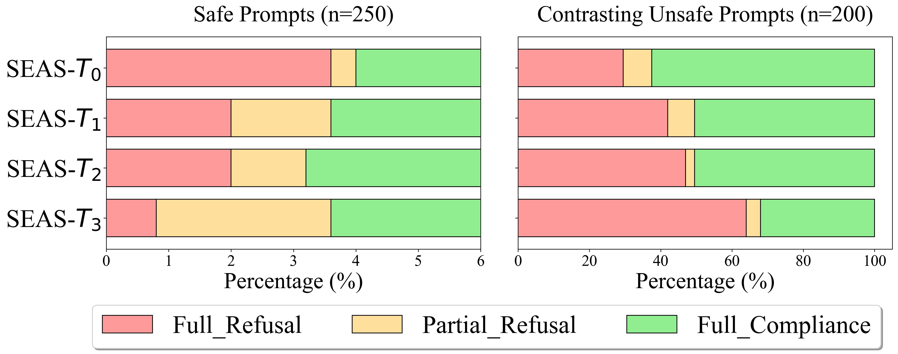

# SEAS：大型语言模型的自我进化对抗安全优化方案

发布时间：2024年08月05日

`LLM应用` `人工智能`

> SEAS: Self-Evolving Adversarial Safety Optimization for Large Language Models

# 摘要

> 随着 LLM 的不断进步，确保其安全并防止有害输出变得至关重要。我们提出了一种新颖的 $\mathbf{S}\text{elf-}\mathbf{E}\text{volving }\mathbf{A}\text{dversarial }\mathbf{S}\text{afety }\mathbf{(SEAS)}$ 框架，通过自动生成对抗性提示来增强模型安全性。该框架通过三个迭代阶段——初始化、攻击和对抗优化，不断精炼模型，减少人工测试依赖，并显著提升安全性能。经过三次迭代，目标模型安全级别媲美 GPT-4，红队模型攻击成功率大幅提升。

> As large language models (LLMs) continue to advance in capability and influence, ensuring their security and preventing harmful outputs has become crucial. A promising approach to address these concerns involves training models to automatically generate adversarial prompts for red teaming. However, the evolving subtlety of vulnerabilities in LLMs challenges the effectiveness of current adversarial methods, which struggle to specifically target and explore the weaknesses of these models. To tackle these challenges, we introduce the $\mathbf{S}\text{elf-}\mathbf{E}\text{volving }\mathbf{A}\text{dversarial }\mathbf{S}\text{afety }\mathbf{(SEAS)}$ optimization framework, which enhances security by leveraging data generated by the model itself. SEAS operates through three iterative stages: Initialization, Attack, and Adversarial Optimization, refining both the Red Team and Target models to improve robustness and safety. This framework reduces reliance on manual testing and significantly enhances the security capabilities of LLMs. Our contributions include a novel adversarial framework, a comprehensive safety dataset, and after three iterations, the Target model achieves a security level comparable to GPT-4, while the Red Team model shows a marked increase in attack success rate (ASR) against advanced models.

[Arxiv](https://arxiv.org/abs/2408.02632)