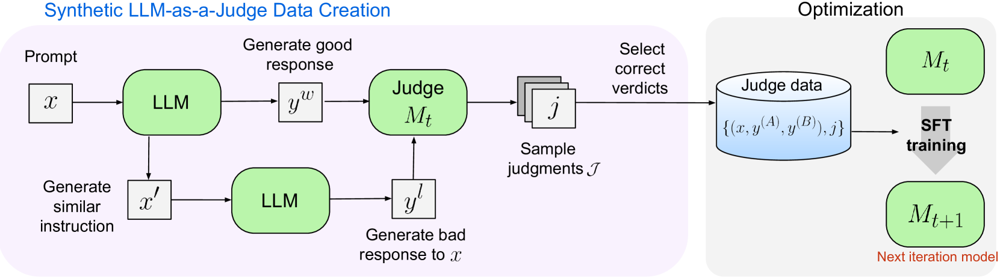
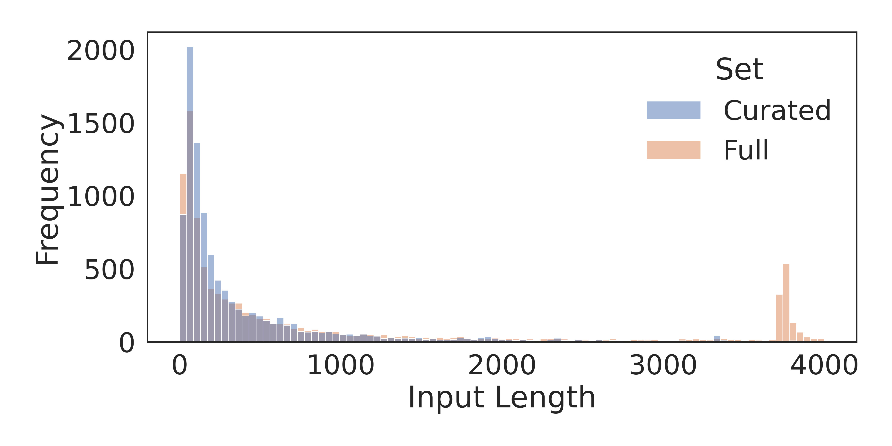
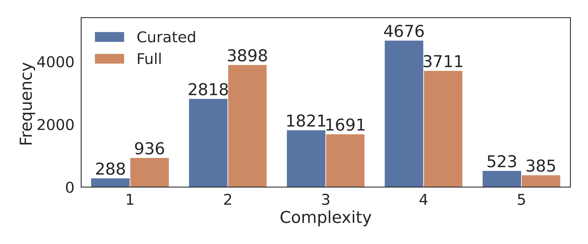
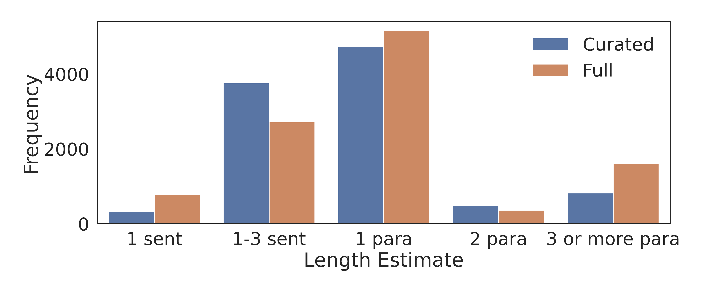
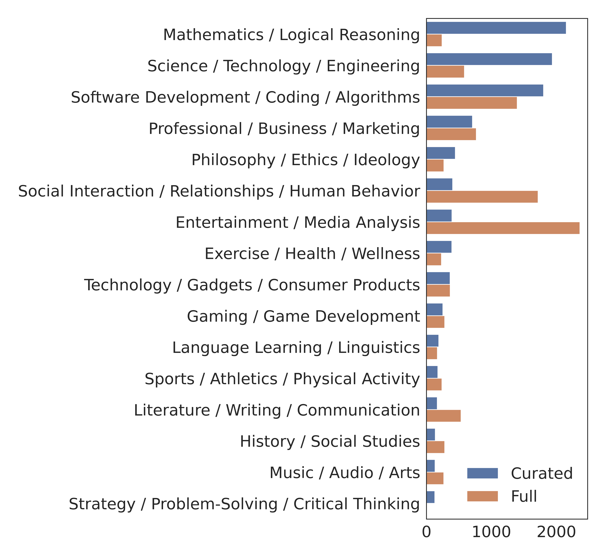

# 自学成才的评判者

发布时间：2024年08月05日

`LLM应用` `人工智能` `机器学习`

> Self-Taught Evaluators

# 摘要

> 成功的模型开发离不开基于模型的评估，它既作为训练的奖励模型，也替代了人类评估。传统上，训练这类评估者需要大量的人类偏好判断，成本高且数据易过时。我们提出了一种新方法，仅用合成数据就能提升评估者，无需人工标注。从无标签指令出发，通过迭代自我改进，生成对比输出并训练LLM作为法官，不断优化预测。在没有标记数据的情况下，我们的自学评估者显著提升了强大LLM（Llama3-70B-Instruct）在RewardBench上的表现，超越了GPT-4等常用法官，并达到了顶级奖励模型的水平。

> Model-based evaluation is at the heart of successful model development -- as a reward model for training, and as a replacement for human evaluation. To train such evaluators, the standard approach is to collect a large amount of human preference judgments over model responses, which is costly and the data becomes stale as models improve. In this work, we present an approach that aims to im-prove evaluators without human annotations, using synthetic training data only. Starting from unlabeled instructions, our iterative self-improvement scheme generates contrasting model outputs and trains an LLM-as-a-Judge to produce reasoning traces and final judgments, repeating this training at each new iteration using the improved predictions. Without any labeled preference data, our Self-Taught Evaluator can improve a strong LLM (Llama3-70B-Instruct) from 75.4 to 88.3 (88.7 with majority vote) on RewardBench. This outperforms commonly used LLM judges such as GPT-4 and matches the performance of the top-performing reward models trained with labeled examples.

[Arxiv](https://arxiv.org/abs/2408.02666)