# SpecRover：利用 LLM 提取代码意图

发布时间：2024年08月05日

`Agent` `软件开发` `人工智能`

> SpecRover: Code Intent Extraction via LLMs

# 摘要

> 自主程序改进，即自动生成错误修复和新功能，可通过结合大型语言模型（LLM）和程序分析的LLM代理实现。规范推理对于生成高质量补丁至关重要。我们探索了在LLM代理内进行迭代规范推理的高效低成本流程。面对GitHub问题，我们通过迭代代码搜索与规范推理，从项目结构和行为中推断意图，并由审查代理评估补丁信心。SpecRover（基于AutoCodeRover）在2294个GitHub问题的评估中效能提升50%，解决单个问题成本仅0.65美元，通过解释增强开发者对补丁的信心。SpecRover强调了规范推理在LLM时代自动化程序修复中的重要性。

> Autonomous program improvement typically involves automatically producing bug fixes and feature additions. Such program improvement can be accomplished by a combination of large language model (LLM) and program analysis capabilities, in the form of an LLM agent. Since program repair or program improvement typically requires a specification of intended behavior - specification inference can be useful for producing high quality program patches. In this work, we examine efficient and low-cost workflows for iterative specification inference within an LLM agent. Given a GitHub issue to be resolved in a software project, our goal is to conduct iterative code search accompanied by specification inference - thereby inferring intent from both the project structure and behavior. The intent thus captured is examined by a reviewer agent with the goal of vetting the patches as well as providing a measure of confidence in the vetted patches. Our approach SpecRover (AutoCodeRover-v2) is built on the open-source LLM agent AutoCodeRover. In an evaluation on the full SWE-Bench consisting of 2294 GitHub issues, it shows more than 50% improvement in efficacy over AutoCodeRover. Compared to the open-source agents available, our work shows modest cost ($0.65 per issue) in resolving an average GitHub issue in SWE-Bench lite. The production of explanation by SpecRover allows for a better "signal" to be given to the developer, on when the suggested patches can be accepted with confidence. SpecRover also seeks to demonstrate the continued importance of specification inference in automated program repair, even as program repair technologies enter the LLM era.

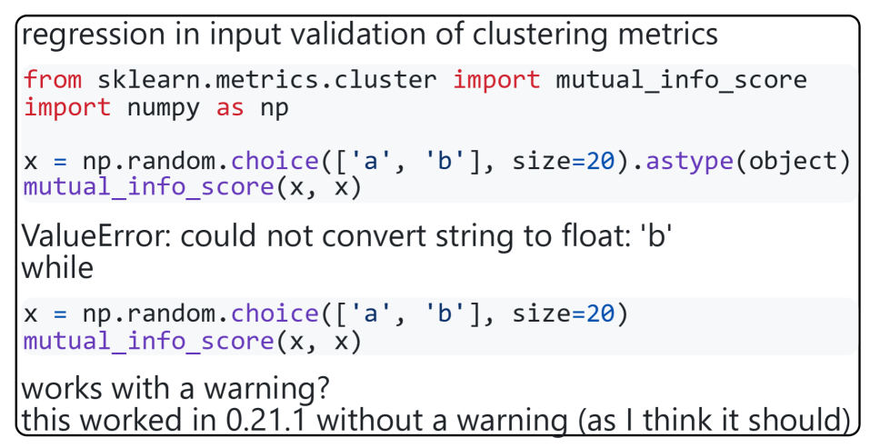

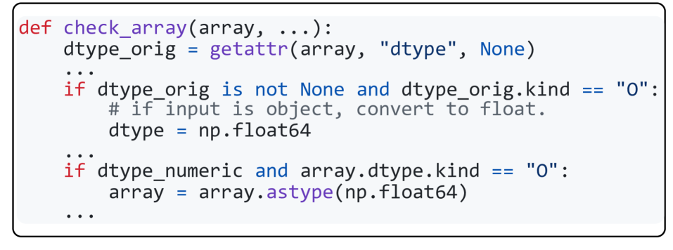

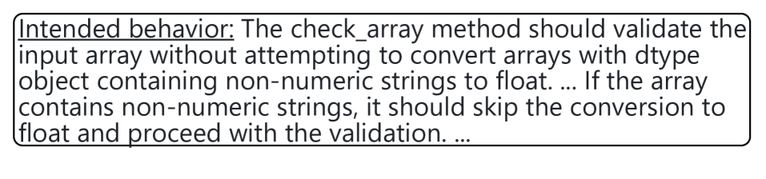

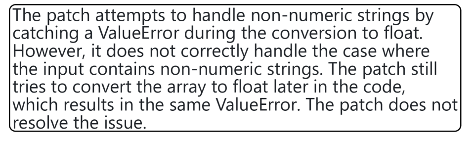

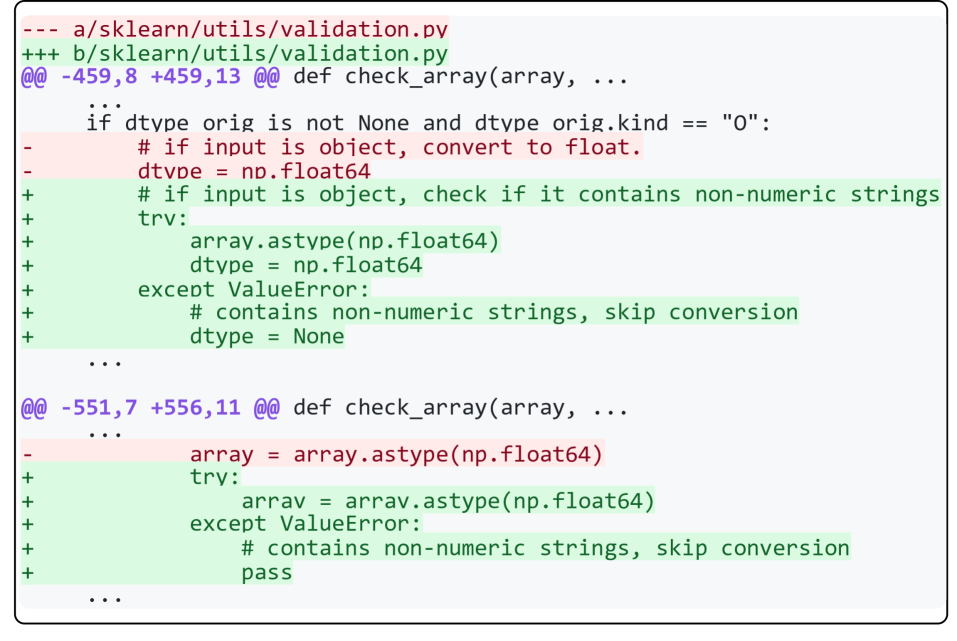

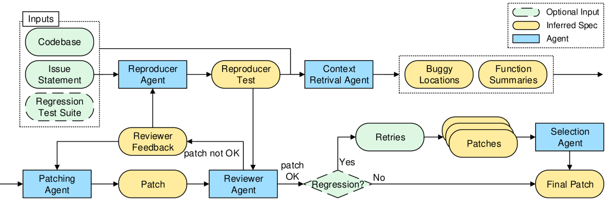

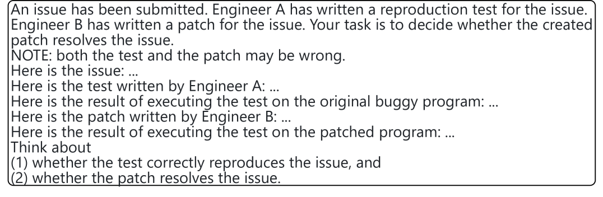

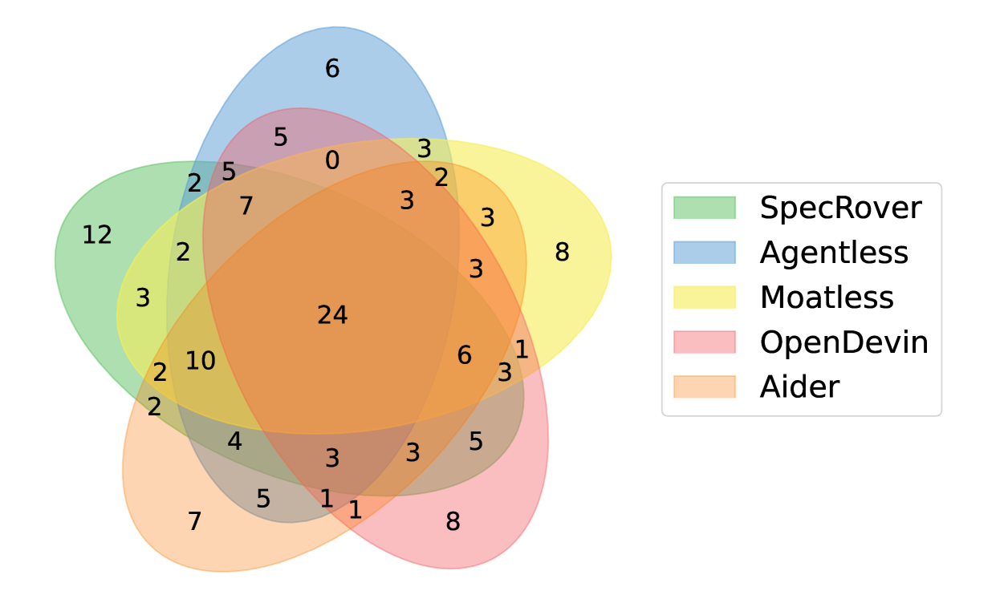

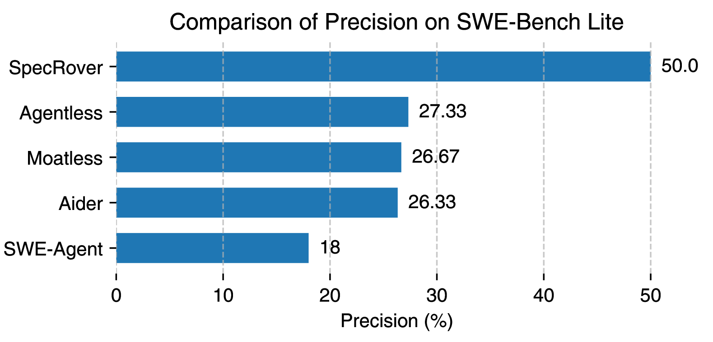

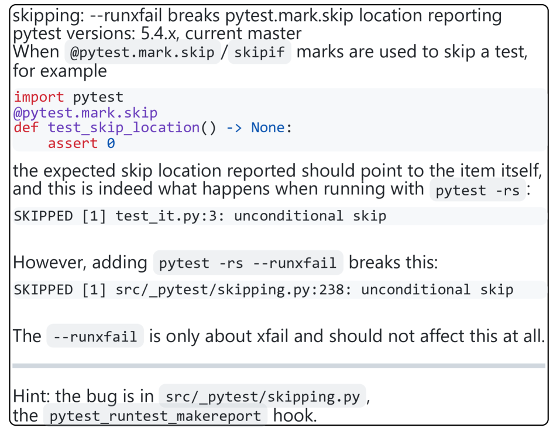

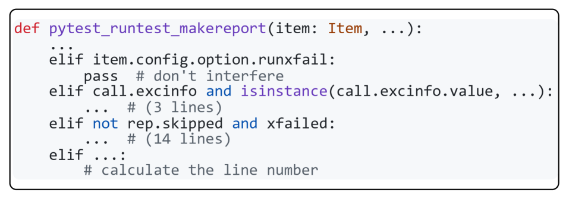

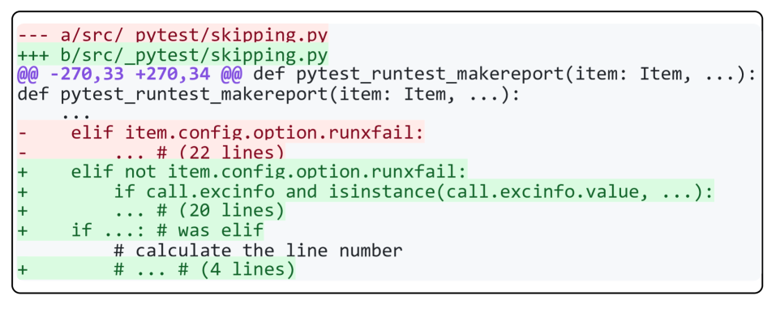

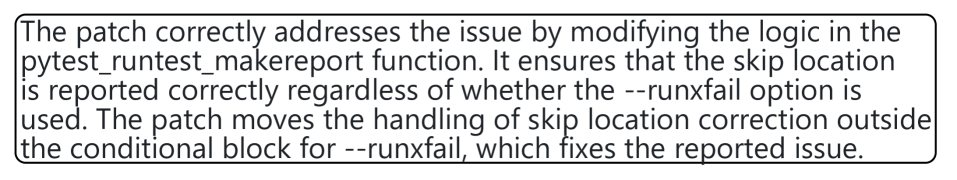

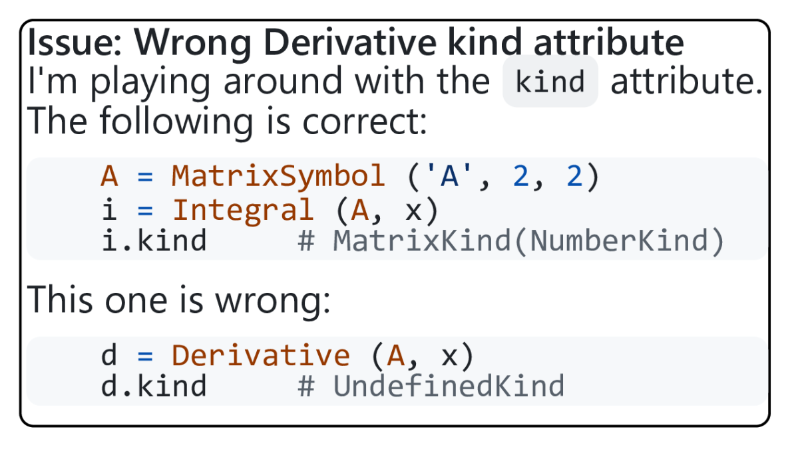

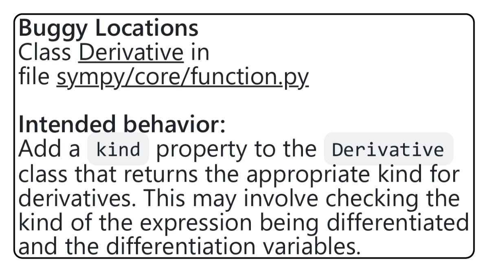

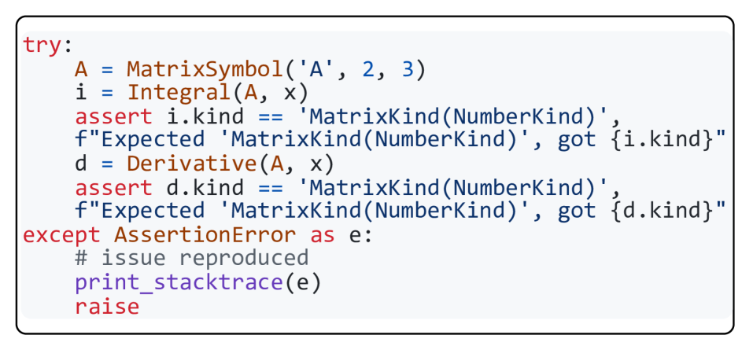

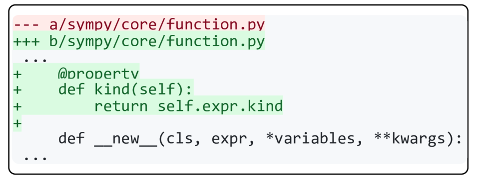

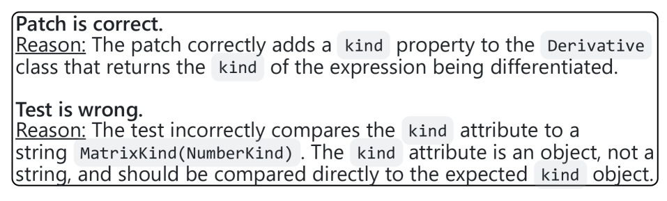

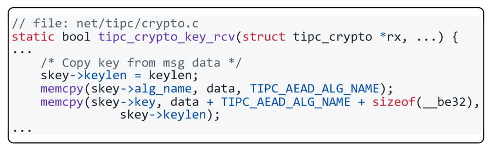

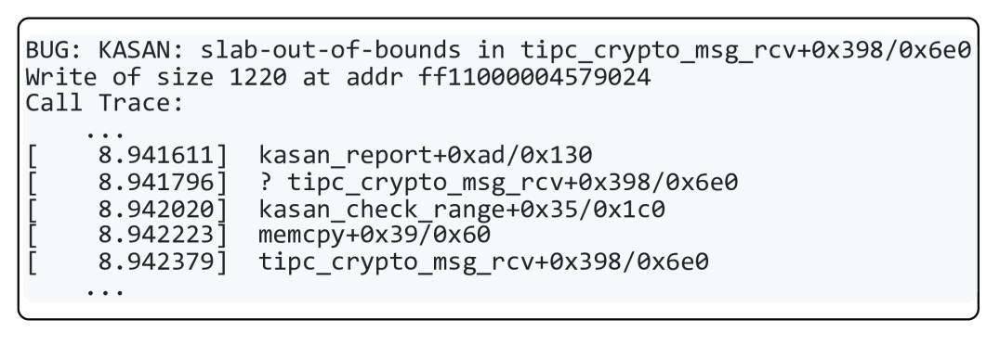

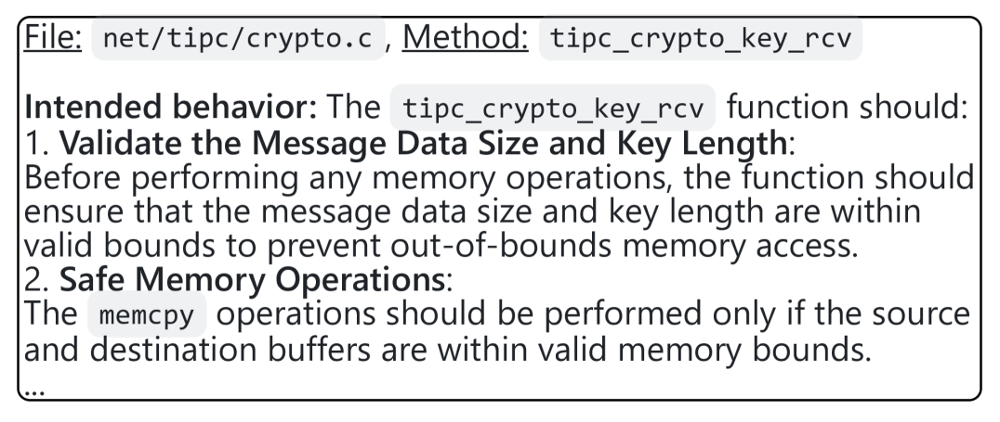

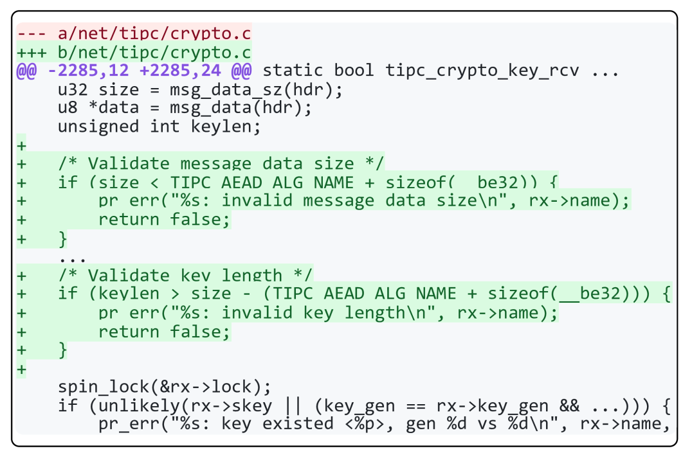

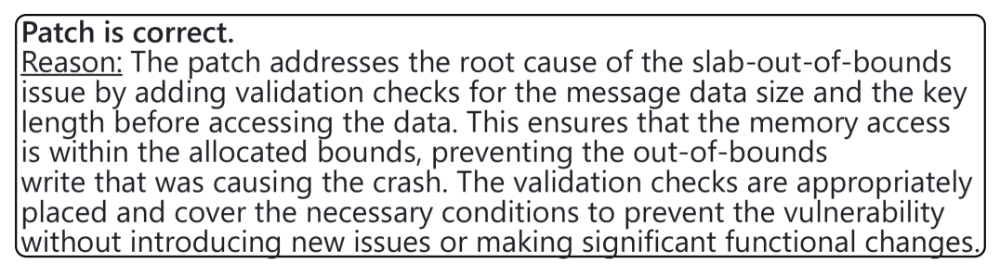

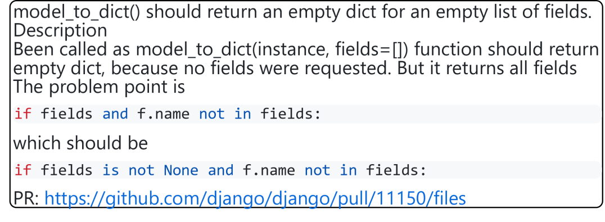

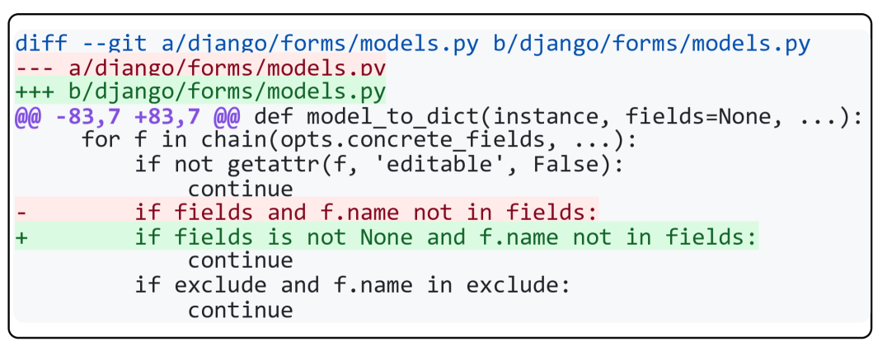

[Arxiv](https://arxiv.org/abs/2408.02232)