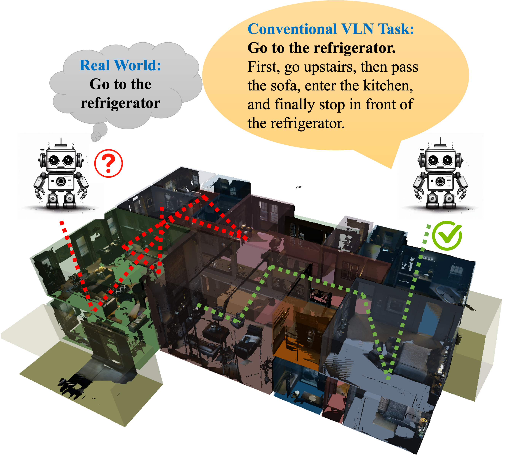
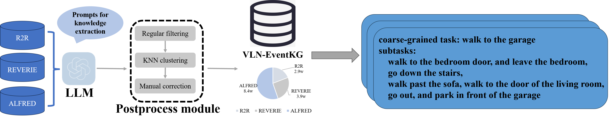
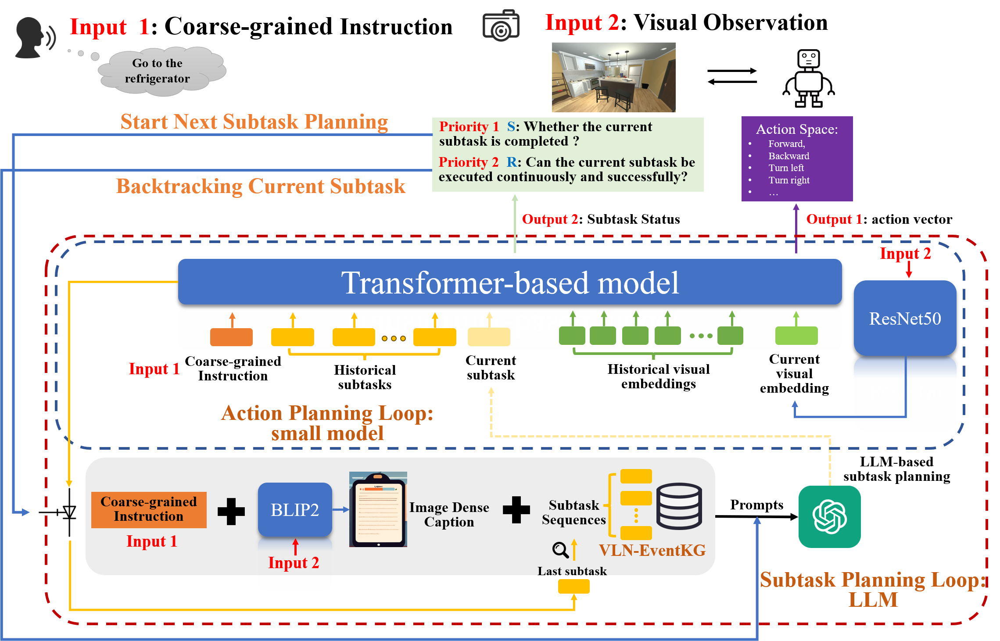
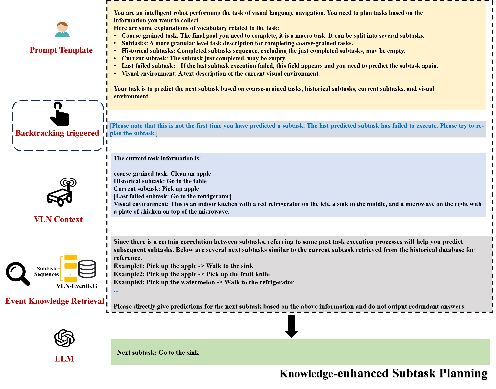
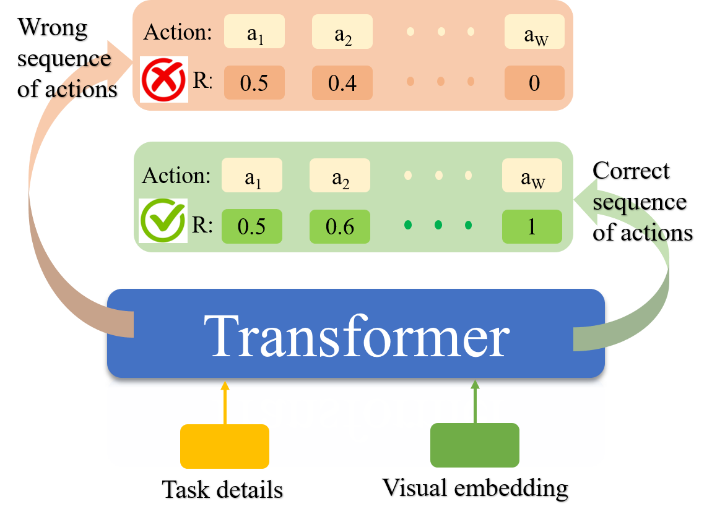
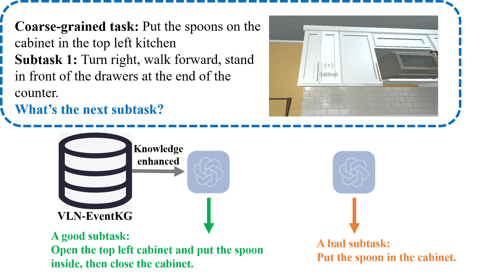

# 借助事件知识图，提升粗粒度视觉语言导航任务的规划效率

发布时间：2024年08月05日

`Agent` `人工智能` `机器人导航`

> Towards Coarse-grained Visual Language Navigation Task Planning Enhanced by Event Knowledge Graph

# 摘要

> 视觉语言导航（VLN）是具身AI领域的一项关键研究，旨在训练智能体理解和执行导航任务。VLN指令分为粗粒度和细粒度两种，后者详细描述任务步骤，而前者提供更符合人类习惯的抽象描述。当前研究多聚焦于细粒度指令，忽略了日常生活中的粗粒度指令。为此，我们通过事件知识增强，探索了VLN中的粗粒度指令处理。我们设计了一个基于提示的框架，从多源数据集中构建了一个名为VLN-EventKG的事件知识图。结合小型和大型语言模型的优势，我们开发了EventNav，一种针对粗粒度指令的知识增强导航规划系统。同时，我们引入了动态历史回溯模块，实时修正潜在的导航错误。实验表明，我们的方法在处理粗粒度指令的VLN任务中表现优异，成功率提升超过5%。项目详情请访问：https://sites.google.com/view/vln-eventkg。

> Visual language navigation (VLN) is one of the important research in embodied AI. It aims to enable an agent to understand the surrounding environment and complete navigation tasks. VLN instructions could be categorized into coarse-grained and fine-grained commands. Fine-grained command describes a whole task with subtasks step-by-step. In contrast, coarse-grained command gives an abstract task description, which more suites human habits. Most existing work focuses on the former kind of instruction in VLN tasks, ignoring the latter abstract instructions belonging to daily life scenarios. To overcome the above challenge in abstract instruction, we attempt to consider coarse-grained instruction in VLN by event knowledge enhancement. Specifically, we first propose a prompt-based framework to extract an event knowledge graph (named VLN-EventKG) for VLN integrally over multiple mainstream benchmark datasets. Through small and large language model collaboration, we realize knowledge-enhanced navigation planning (named EventNav) for VLN tasks with coarse-grained instruction input. Additionally, we design a novel dynamic history backtracking module to correct potential error action planning in real time. Experimental results in various public benchmarks show our knowledge-enhanced method has superiority in coarse-grained-instruction VLN using our proposed VLN-EventKG with over $5\%$ improvement in success rate. Our project is available at https://sites.google.com/view/vln-eventkg

[Arxiv](https://arxiv.org/abs/2408.02535)