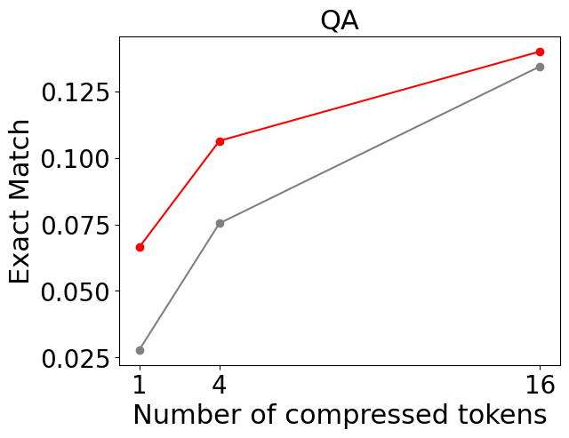
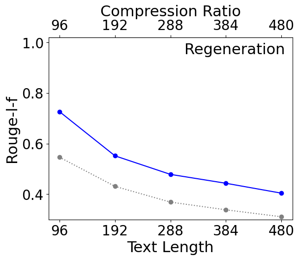
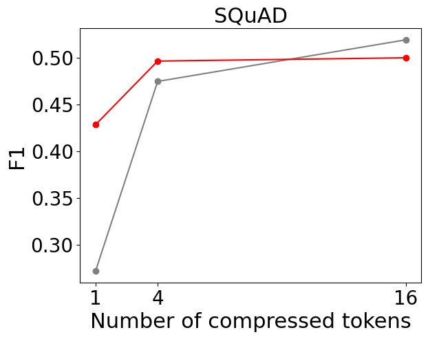

# 500xCompressor：专为大型语言模型设计的通用提示压缩工具

发布时间：2024年08月06日

`LLM应用` `信息技术`

> 500xCompressor: Generalized Prompt Compression for Large Language Models

# 摘要

> 提示压缩技术对于提升推理效率、削减成本及优化用户体验至关重要。然而，现有方法在压缩比低和评估时可能的数据泄露方面存在挑战。为此，我们创新性地提出了500xCompressor，一种能将庞大自然语言上下文精简至单个特殊标记的先进方法。该方法仅增加约0.3%的参数，却能实现惊人的6至480倍压缩比。500xCompressor不仅适用于各类文本压缩与问答，还能直接与原始大型语言模型（LLM）协同工作，无需额外微调。经过在Arxiv语料库上的预训练与ArxivQA数据集的微调，并在未见及经典问答数据集上的严格评估，结果表明，LLM在采用压缩提示时仍能保留62.26%至72.89%的原有性能。此外，研究揭示并非所有压缩标记均被同等利用，且在高压缩比情境下，K V值在信息保留方面展现出优于嵌入的显著优势。自然语言提示的高度压缩潜力，尤其是针对细粒度复杂信息，为未来应用及新型LLM语言的研发开辟了令人期待的新篇章。

> Prompt compression is crucial for enhancing inference speed, reducing costs, and improving user experience. However, current methods face challenges such as low compression ratios and potential data leakage during evaluation. To address these issues, we propose 500xCompressor, a method that compresses extensive natural language contexts into a minimum of one single special token. The 500xCompressor introduces approximately 0.3% additional parameters and achieves compression ratios ranging from 6x to 480x. It is designed to compress any text, answer various types of questions, and could be utilized by the original large language model (LLM) without requiring fine-tuning. Initially, 500xCompressor was pretrained on the Arxiv Corpus, followed by fine-tuning on the ArxivQA dataset, and subsequently evaluated on strictly unseen and classical question answering (QA) datasets. The results demonstrate that the LLM retained 62.26-72.89% of its capabilities compared to using non-compressed prompts. This study also shows that not all the compressed tokens are equally utilized and that K V values have significant advantages over embeddings in preserving information at high compression ratios. The highly compressive nature of natural language prompts, even for fine-grained complex information, suggests promising potential for future applications and further research into developing a new LLM language.

[Arxiv](https://arxiv.org/abs/2408.03094)