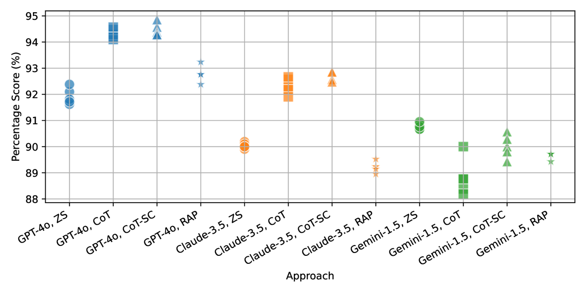
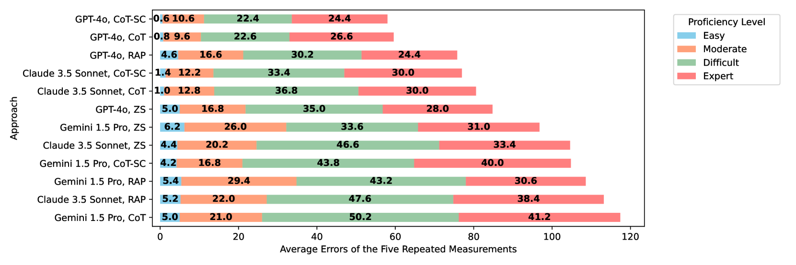
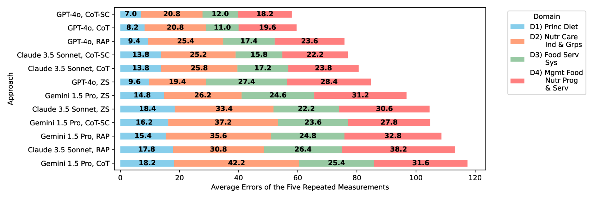
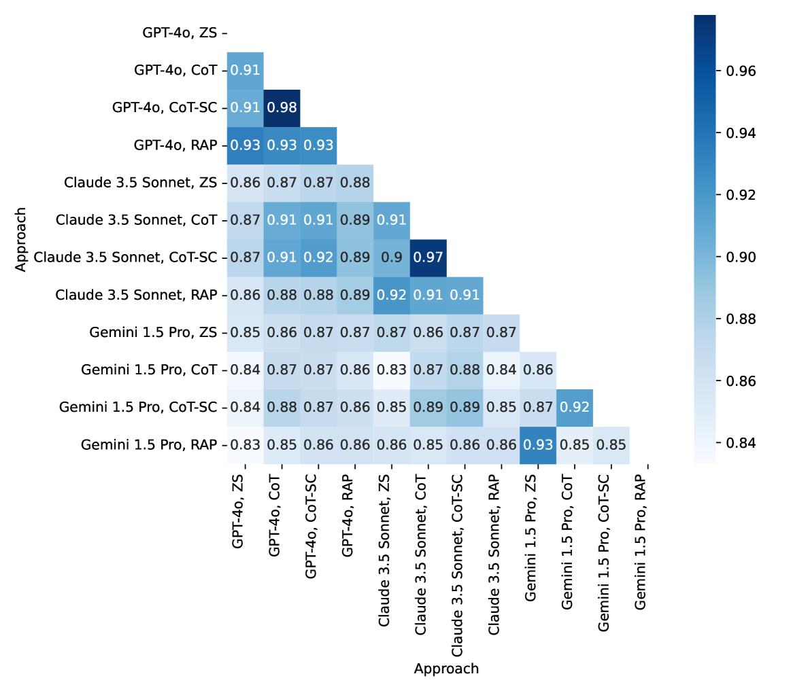
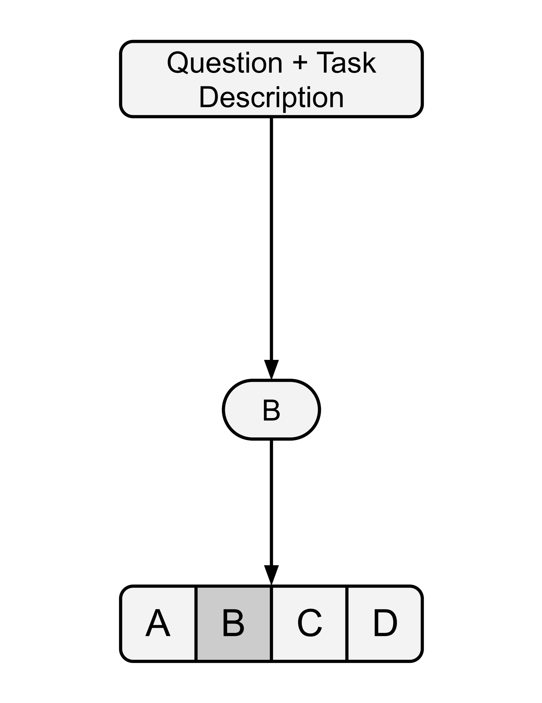
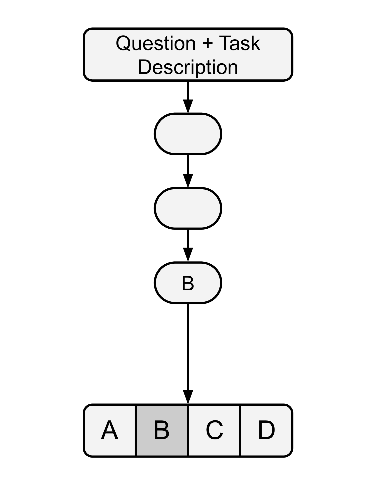
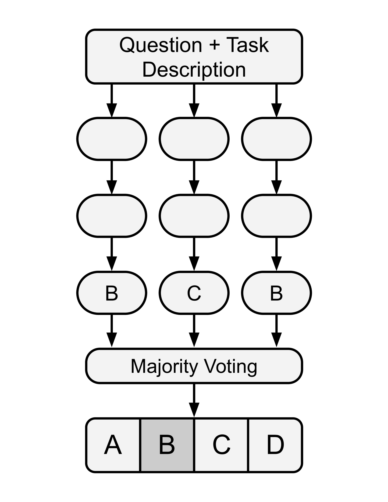
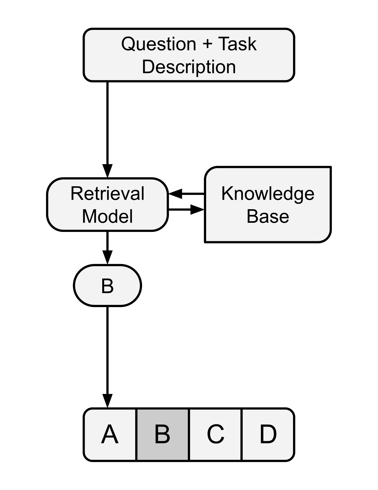

# LLM在注册营养师考试中的表现，受提示工程与知识检索策略的影响，关乎其准确性与一致性。

发布时间：2024年08月06日

`LLM应用` `营养学`

> Accuracy and Consistency of LLMs in the Registered Dietitian Exam: The Impact of Prompt Engineering and Knowledge Retrieval

# 摘要

> 大型语言模型（LLM）正深刻影响健康与福祉领域的人类应用，如提升患者互动、加速临床决策及促进医学教育。尽管顶尖LLM在多轮对话中表现卓越，但在营养与饮食领域的评估尚显不足。本文提出采用注册营养师（RD）考试，对GPT-4o、Claude 3.5 Sonnet及Gemini 1.5 Pro等先进LLM进行全面评估，聚焦于营养咨询的准确性与一致性。我们涵盖了1050道RD考题，涉及多个营养主题与难度层次。同时，首次探讨了零-Shot（ZS）、思维链（CoT）、思维链结合自我一致性（CoT-SC）及检索增强提示（RAP）对回答质量的影响。研究发现，这些LLM虽整体表现可圈可点，但不同提示与问题领域下表现差异显著。GPT-4o搭配CoT-SC提示表现最佳，而Gemini 1.5 Pro在ZS下展现最高一致性。CoT提升GPT-4o与Claude 3.5的准确性，CoT-SC则同时增强准确性与一致性。RAP对GPT-4o解答高难度问题尤为有效。因此，针对特定需求选择合适的LLM与提示策略，能有效降低营养咨询机器人的错误与风险。

> Large language models (LLMs) are fundamentally transforming human-facing applications in the health and well-being domains: boosting patient engagement, accelerating clinical decision-making, and facilitating medical education. Although state-of-the-art LLMs have shown superior performance in several conversational applications, evaluations within nutrition and diet applications are still insufficient. In this paper, we propose to employ the Registered Dietitian (RD) exam to conduct a standard and comprehensive evaluation of state-of-the-art LLMs, GPT-4o, Claude 3.5 Sonnet, and Gemini 1.5 Pro, assessing both accuracy and consistency in nutrition queries. Our evaluation includes 1050 RD exam questions encompassing several nutrition topics and proficiency levels. In addition, for the first time, we examine the impact of Zero-Shot (ZS), Chain of Thought (CoT), Chain of Thought with Self Consistency (CoT-SC), and Retrieval Augmented Prompting (RAP) on both accuracy and consistency of the responses. Our findings revealed that while these LLMs obtained acceptable overall performance, their results varied considerably with different prompts and question domains. GPT-4o with CoT-SC prompting outperformed the other approaches, whereas Gemini 1.5 Pro with ZS recorded the highest consistency. For GPT-4o and Claude 3.5, CoT improved the accuracy, and CoT-SC improved both accuracy and consistency. RAP was particularly effective for GPT-4o to answer Expert level questions. Consequently, choosing the appropriate LLM and prompting technique, tailored to the proficiency level and specific domain, can mitigate errors and potential risks in diet and nutrition chatbots.

[Arxiv](https://arxiv.org/abs/2408.02964)