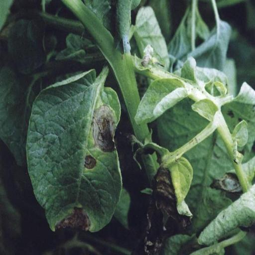
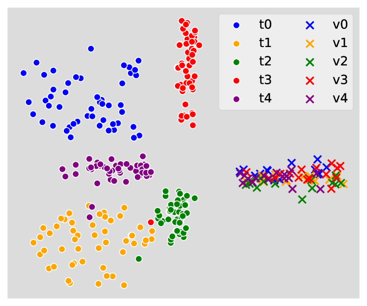

# 野外多模态疾病识别的基准测试与多功能基线研究

发布时间：2024年08月06日

`LLM应用` `植物病害识别`

> Benchmarking In-the-wild Multimodal Disease Recognition and A Versatile Baseline

# 摘要

> 现有的植物病害分类模型在实验室环境下表现出色，但在野外环境中的表现却大打折扣。我们发现，野外植物图像中不同疾病的外观可能相似，而同一疾病的外观却可能大相径庭。基于这一发现，我们创建了一个包含最多疾病类别并附有文本描述的野外多模态植物病害识别数据集。这些文本描述旨在通过文字提供丰富信息，助力解决野外病害分类中的小类间差异和大类内变异问题。因此，我们的数据集成为评估现实世界病害识别方法的理想平台。此外，我们还提出了一种结合文本和视觉数据的多原型基线模型，通过融合多模态原型的贡献，有效应对上述挑战。该模型不仅能进行疾病分类，还能在少样本或无需训练的情况下识别疾病。广泛的测试结果显示，我们的数据集为植物病害识别任务带来了新的挑战，未来研究大有可为。

> Existing plant disease classification models have achieved remarkable performance in recognizing in-laboratory diseased images. However, their performance often significantly degrades in classifying in-the-wild images. Furthermore, we observed that in-the-wild plant images may exhibit similar appearances across various diseases (i.e., small inter-class discrepancy) while the same diseases may look quite different (i.e., large intra-class variance). Motivated by this observation, we propose an in-the-wild multimodal plant disease recognition dataset that contains the largest number of disease classes but also text-based descriptions for each disease. Particularly, the newly provided text descriptions are introduced to provide rich information in textual modality and facilitate in-the-wild disease classification with small inter-class discrepancy and large intra-class variance issues. Therefore, our proposed dataset can be regarded as an ideal testbed for evaluating disease recognition methods in the real world. In addition, we further present a strong yet versatile baseline that models text descriptions and visual data through multiple prototypes for a given class. By fusing the contributions of multimodal prototypes in classification, our baseline can effectively address the small inter-class discrepancy and large intra-class variance issues. Remarkably, our baseline model can not only classify diseases but also recognize diseases in few-shot or training-free scenarios. Extensive benchmarking results demonstrate that our proposed in-the-wild multimodal dataset sets many new challenges to the plant disease recognition task and there is a large space to improve for future works.

[Arxiv](https://arxiv.org/abs/2408.03120)