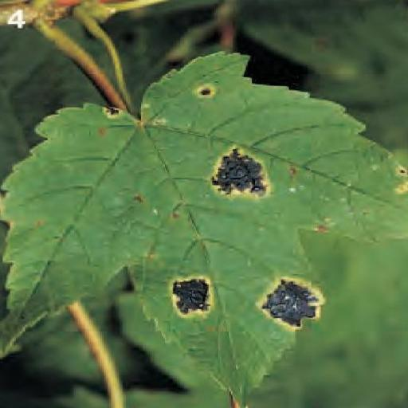

# 野外多模态疾病识别的基准测试与多功能基线研究

发布时间：2024年08月06日

`LLM应用` `植物病害识别`

> Benchmarking In-the-wild Multimodal Disease Recognition and A Versatile Baseline

# 摘要

> 现有的植物病害分类模型在实验室环境中表现出色，但在野外图像分类中性能大打折扣。我们发现，野外植物图像的疾病间相似度高（小类间差异），而同一疾病的外观差异大（大类内变异）。为此，我们创建了一个包含最多疾病类别及详细文本描述的野外多模态数据集，旨在通过文本信息辅助解决上述分类难题。该数据集成为现实世界病害识别方法的理想测试场。我们还设计了一个结合文本与视觉数据的基线模型，通过多原型融合有效应对类间差异小和类内变异大的挑战，不仅适用于常规分类，还能在少样本或无训练场景中识别疾病。基准测试显示，我们的数据集为植物病害识别带来了新挑战，未来研究大有可为。

> Existing plant disease classification models have achieved remarkable performance in recognizing in-laboratory diseased images. However, their performance often significantly degrades in classifying in-the-wild images. Furthermore, we observed that in-the-wild plant images may exhibit similar appearances across various diseases (i.e., small inter-class discrepancy) while the same diseases may look quite different (i.e., large intra-class variance). Motivated by this observation, we propose an in-the-wild multimodal plant disease recognition dataset that contains the largest number of disease classes but also text-based descriptions for each disease. Particularly, the newly provided text descriptions are introduced to provide rich information in textual modality and facilitate in-the-wild disease classification with small inter-class discrepancy and large intra-class variance issues. Therefore, our proposed dataset can be regarded as an ideal testbed for evaluating disease recognition methods in the real world. In addition, we further present a strong yet versatile baseline that models text descriptions and visual data through multiple prototypes for a given class. By fusing the contributions of multimodal prototypes in classification, our baseline can effectively address the small inter-class discrepancy and large intra-class variance issues. Remarkably, our baseline model can not only classify diseases but also recognize diseases in few-shot or training-free scenarios. Extensive benchmarking results demonstrate that our proposed in-the-wild multimodal dataset sets many new challenges to the plant disease recognition task and there is a large space to improve for future works.

[Arxiv](https://arxiv.org/abs/2408.03120)