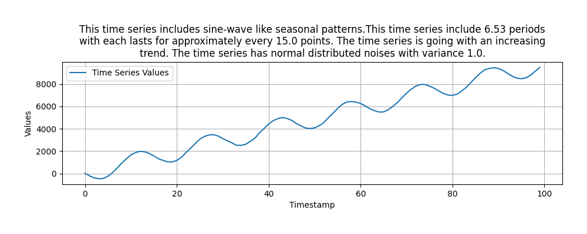
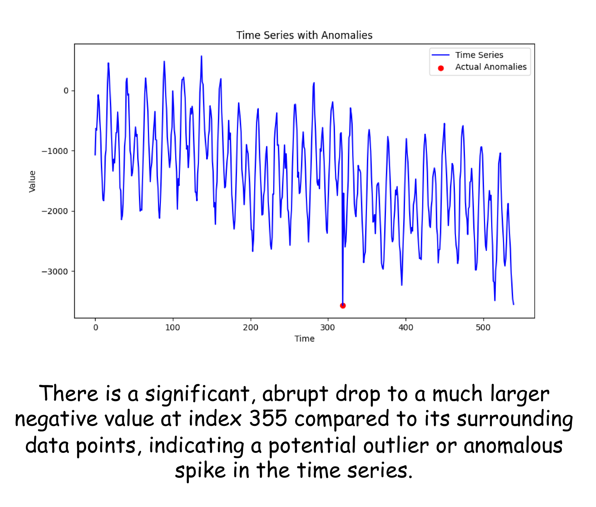
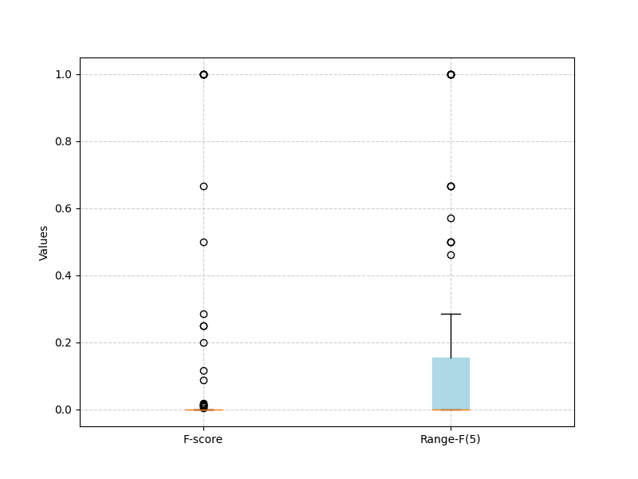
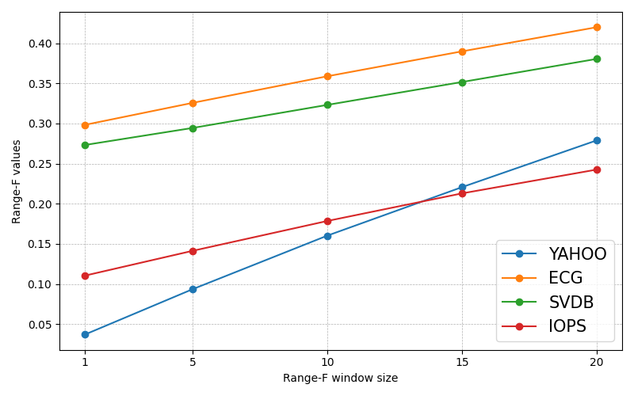

# 大型语言模型能否胜任时间序列异常检测？

发布时间：2024年08月06日

`LLM应用` `时间序列分析` `异常检测`

> Can LLMs Serve As Time Series Anomaly Detectors?

# 摘要

> 大型语言模型（LLM）正逐渐应用于时间序列预测，捕捉其主流和可模式化的特征。然而，一个较少探讨且更具挑战性的问题是，LLM能否识别并解释时间序列中的异常，这在众多实际应用中至关重要。本文聚焦于GPT-4和LLaMA3，探讨它们在时间序列异常检测与解释中的能力。研究发现：1）LLM无法直接用于异常检测；2）通过精心设计的提示策略，如情境学习与思维链提示，GPT-4能有效识别异常，性能媲美传统方法；3）我们构建了一个综合数据集，自动生成异常并提供解释，通过指令微调，LLaMA3在异常检测任务中表现更佳。综上所述，我们的研究揭示了LLM在时间序列异常检测领域的广阔前景。

> An emerging topic in large language models (LLMs) is their application to time series forecasting, characterizing mainstream and patternable characteristics of time series. A relevant but rarely explored and more challenging question is whether LLMs can detect and explain time series anomalies, a critical task across various real-world applications. In this paper, we investigate the capabilities of LLMs, specifically GPT-4 and LLaMA3, in detecting and explaining anomalies in time series. Our studies reveal that: 1) LLMs cannot be directly used for time series anomaly detection. 2) By designing prompt strategies such as in-context learning and chain-of-thought prompting, GPT-4 can detect time series anomalies with results competitive to baseline methods. 3) We propose a synthesized dataset to automatically generate time series anomalies with corresponding explanations. By applying instruction fine-tuning on this dataset, LLaMA3 demonstrates improved performance in time series anomaly detection tasks. In summary, our exploration shows the promising potential of LLMs as time series anomaly detectors.

[Arxiv](https://arxiv.org/abs/2408.03475)