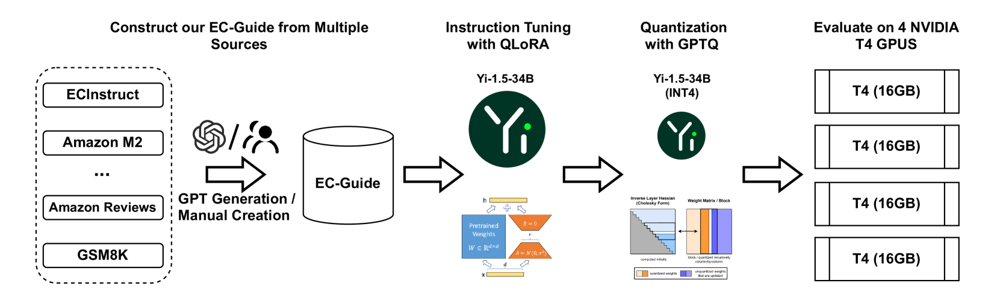

# EC-Guide：一本详尽的电子商务指南，专为指令调整与量化而设计

发布时间：2024年08月06日

`LLM应用` `电子商务` `人工智能`

> EC-Guide: A Comprehensive E-Commerce Guide for Instruction Tuning and Quantization

# 摘要

> 大型语言模型（LLMs）凭借其在指令调优和量化方面的进步，为多领域的挑战提供了成本效益高的解决方案，备受瞩目。电子商务因其复杂性和广泛的用户交互，成为LLMs的理想应用场景。然而，该领域特有的概念和知识对通用LLMs的适应性提出了挑战。为此，我们推出了EC-Guide，一个专为LLMs指令调优和量化设计的全面电子商务指南。我们还巧妙地引入了思维链（CoT）以增强算术表现。在亚马逊KDD Cup'24中，我们的方法在第二赛道荣获亚军，在第五赛道位列第五。值得一提的是，我们的解决方案具有模型无关性，可在大规模系统中实现高效扩展。

> Large language models (LLMs) have attracted considerable attention in various fields for their cost-effective solutions to diverse challenges, especially with advancements in instruction tuning and quantization. E-commerce, with its complex tasks and extensive product-user interactions, presents a promising application area for LLMs. However, the domain-specific concepts and knowledge inherent in e-commerce pose significant challenges for adapting general LLMs. To address this issue, we developed EC-Guide \href{https://github.com/fzp0424/EC-Guide-KDDUP-2024}, a comprehensive e-commerce guide for instruction tuning and quantization of LLMs. We also heuristically integrated Chain-of-Thought (CoT) during inference to enhance arithmetic performance. Our approach achieved the 2nd place in Track 2 and 5th place in Track 5 at the Amazon KDD Cup'24 \href{https://www.aicrowd.com/challenges/amazon-kdd-cup-2024-multi-task-online-shopping-challenge-for-llms}. Additionally, our solution is model-agnostic, enabling effective scalability across larger systems.

[Arxiv](https://arxiv.org/abs/2408.02970)