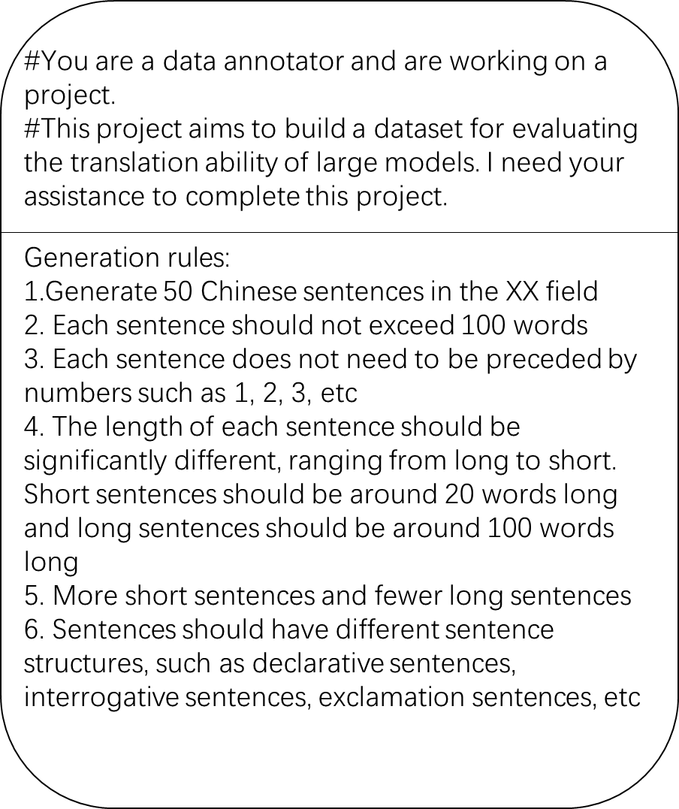
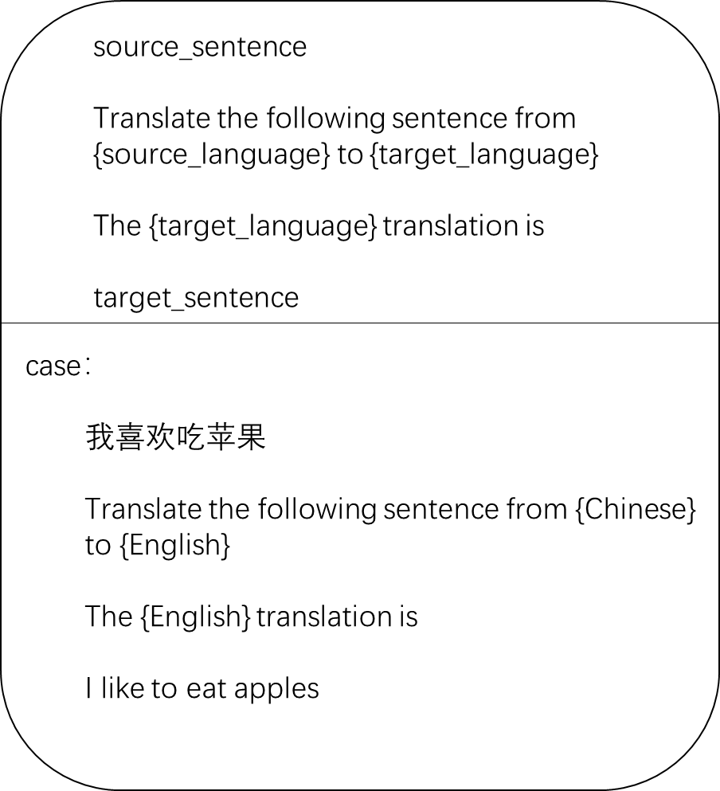
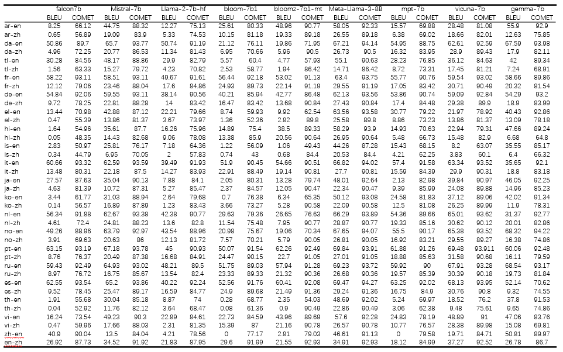
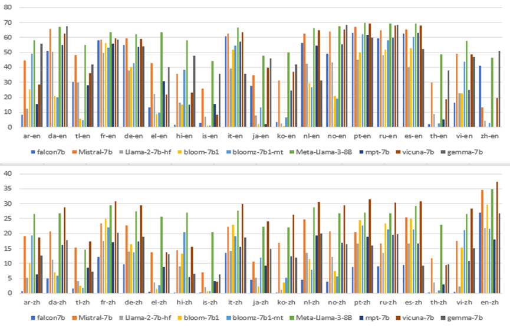
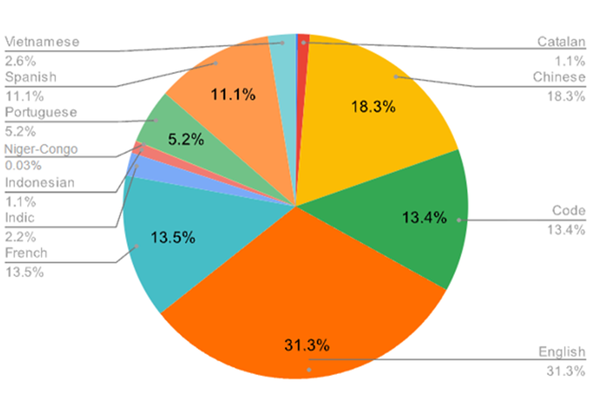

# 基于 Euas-20 标准，评估大型语言模型的翻译表现

发布时间：2024年08月06日

`LLM应用` `机器翻译`

> Evaluating the Translation Performance of Large Language Models Based on Euas-20

# 摘要

> 随着深度学习的飞速进步，BERT和GPT等大型语言模型在自然语言处理领域大放异彩。机器翻译作为该领域的核心任务，同样得益于这些模型的助力，实现了质的提升。然而，尽管翻译性能大幅提升，机器翻译仍有不少难题待解。为此，我们精心构建了Euas-20数据集，旨在全面评估大型语言模型在翻译任务中的表现，探究不同语言的翻译能力，并分析预训练数据对LLMs翻译能力的影响，以期为研究者和开发者提供有力支持。

> In recent years, with the rapid development of deep learning technology, large language models (LLMs) such as BERT and GPT have achieved breakthrough results in natural language processing tasks. Machine translation (MT), as one of the core tasks of natural language processing, has also benefited from the development of large language models and achieved a qualitative leap. Despite the significant progress in translation performance achieved by large language models, machine translation still faces many challenges. Therefore, in this paper, we construct the dataset Euas-20 to evaluate the performance of large language models on translation tasks, the translation ability on different languages, and the effect of pre-training data on the translation ability of LLMs for researchers and developers.

[Arxiv](https://arxiv.org/abs/2408.03119)