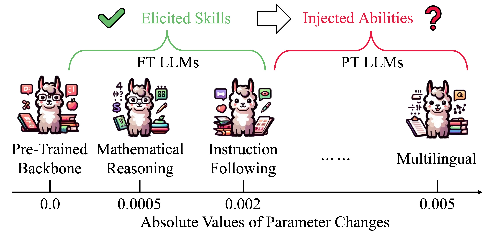
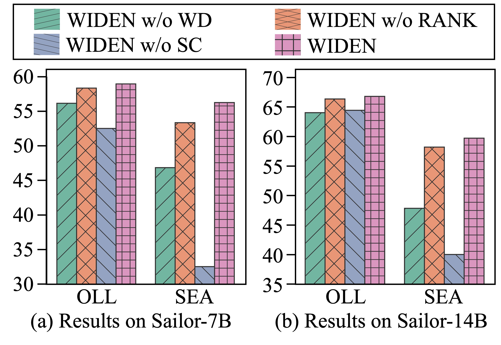
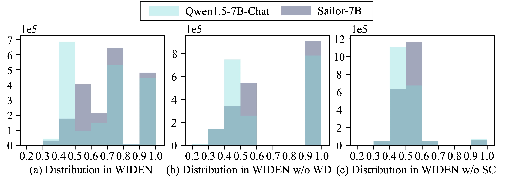

# 借助权重解耦技术，我们将模型合并的范围从微调扩展至预训练的大型语言模型。

发布时间：2024年08月06日

`LLM理论` `人工智能` `语言模型`

> Extend Model Merging from Fine-Tuned to Pre-Trained Large Language Models via Weight Disentanglement

# 摘要

> 合并大型语言模型 (LLM) 的目标是将多个同源 LLM 融合为一个全能模型。理论上，共享相同骨干的 LLM 无论经过微调 (FT) 还是预训练 (PT)，都应可合并。但现有方法常需手动设定模型重要性，仅适用于参数变化相似的 LLM。本文首次尝试将合并技术从 FT 扩展到 PT LLM，评估了当前方法在合并 FT 和 PT LLM 中的有效性，发现它们难以处理 PT LLM。为此，我们引入了基于权重解纠缠 (WIDEN) 的方法，通过分解模型权重并进行自适应融合，有效扩展了合并范围。实验中，我们将 Qwen1.5-Chat 与 Sailor 合并，结果显示：现有解决方案在合并 Sailor 时通常失败；而 WIDEN 不仅成功注入了 Sailor 的多语言能力，还使 Qwen1.5-Chat 精通东南亚语言，提升了基本能力。此外，我们还合并了多个 13B FT LLM，WIDEN 实现了指令遵循、数学推理和代码生成技能的平衡融合。

> Merging Large Language Models (LLMs) aims to amalgamate multiple homologous LLMs into one with all the capabilities. Ideally, any LLMs sharing the same backbone should be mergeable, irrespective of whether they are Fine-Tuned (FT) with minor parameter changes or Pre-Trained (PT) with substantial parameter shifts. However, existing methods often manually assign the model importance, rendering them feasible only for LLMs with similar parameter alterations, such as multiple FT LLMs. The diverse parameter changed ranges between FT and PT LLMs pose challenges for current solutions in empirically determining the optimal combination. In this paper, we make a pioneering effort to broaden the applicability of merging techniques from FT to PT LLMs. We initially examine the efficacy of current methods in merging FT and PT LLMs, discovering that they struggle to deal with PT LLMs. Subsequently, we introduce an approach based on WeIght DisENtanglement (WIDEN) to effectively extend the merging scope, which first disentangles model weights into magnitude and direction components, and then performs adaptive fusion by considering their respective contributions. In the experiments, we merge Qwen1.5-Chat (an FT LLM with instruction-following skills) with Sailor (a PT LLM with multilingual abilities) across 7B and 14B model scales. Results reveal that: (1) existing solutions usually fail when merging Sailor, either losing both abilities or only retaining instruction-following skills; (2) WIDEN successfully injects the multilingual abilities of Sailor into Qwen1.5-Chat and make it proficient in Southeast Asian languages, achieving enhancements in the fundamental capabilities. In light of previous research, we also merge multiple 13B FT LLMs and observe that WIDEN achieves a balanced amalgamation of instruction following, mathematical reasoning, and code generation skills.

[Arxiv](https://arxiv.org/abs/2408.03092)