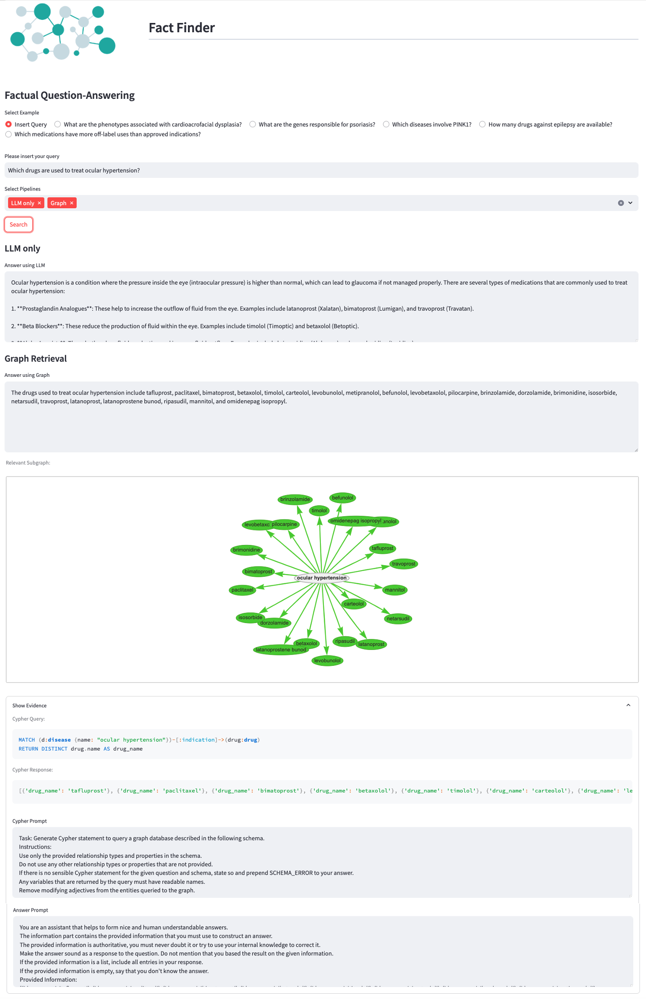

# Fact Finder：融合知识图谱，提升大型语言模型的领域专长

发布时间：2024年08月06日

`LLM应用` `生物科技`

> Fact Finder -- Enhancing Domain Expertise of Large Language Models by Incorporating Knowledge Graphs

# 摘要

> 大型语言模型 (LLM) 在自然语言查询回答方面表现出色，但受限于领域特定知识，其回答的可靠性受到质疑。为此，我们设计了一个结合领域知识图谱 (KG) 的混合系统，通过基于 KG 的检索方法提升事实准确性。我们以医疗领域为例，展示了包括预处理、Cypher 查询生成、处理、KG 检索及 LLM 增强响应生成在内的方法。在 69 个样本的评估中，系统达到了 78% 的检索准确率，且通过 LLM-as-a-Judge 方法验证，其在准确性和完整性上优于单一 LLM。该系统适用于需要高度准确性和完整性的应用，如生物实体识别，同时其快速准确的响应能力也使其成为时间敏感研究环境的理想选择。我们还公开了源代码、数据集及提示模板。

> Recent advancements in Large Language Models (LLMs) have showcased their proficiency in answering natural language queries. However, their effectiveness is hindered by limited domain-specific knowledge, raising concerns about the reliability of their responses. We introduce a hybrid system that augments LLMs with domain-specific knowledge graphs (KGs), thereby aiming to enhance factual correctness using a KG-based retrieval approach. We focus on a medical KG to demonstrate our methodology, which includes (1) pre-processing, (2) Cypher query generation, (3) Cypher query processing, (4) KG retrieval, and (5) LLM-enhanced response generation. We evaluate our system on a curated dataset of 69 samples, achieving a precision of 78\% in retrieving correct KG nodes. Our findings indicate that the hybrid system surpasses a standalone LLM in accuracy and completeness, as verified by an LLM-as-a-Judge evaluation method. This positions the system as a promising tool for applications that demand factual correctness and completeness, such as target identification -- a critical process in pinpointing biological entities for disease treatment or crop enhancement. Moreover, its intuitive search interface and ability to provide accurate responses within seconds make it well-suited for time-sensitive, precision-focused research contexts. We publish the source code together with the dataset and the prompt templates used.

[Arxiv](https://arxiv.org/abs/2408.03010)