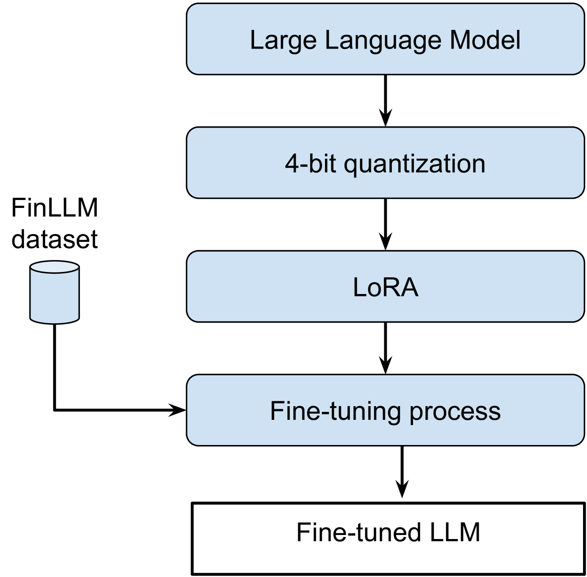

# L3iTC 在 FinLLM 挑战中：量化技术助力金融文本分类与摘要

发布时间：2024年08月06日

`LLM应用` `文本处理`

> L3iTC at the FinLLM Challenge Task: Quantization for Financial Text Classification & Summarization

# 摘要

> 本文详述了我们团队（L3iTC）在2024年FinLLM挑战赛中的表现，特别聚焦于金融文本分类和摘要两大任务。为应对这些挑战，我们对多个大型语言模型进行了精细调整，采用4位量化和LoRA技术，以低精度训练特定模型层，不仅加快了微调速度，还实现了在低GPU内存环境下的模型运行。最终，我们的微调模型在金融文本分类任务中以0.7543的F1分数位列第三，并在金融文本摘要任务中跻身第六。

> This article details our participation (L3iTC) in the FinLLM Challenge Task 2024, focusing on two key areas: Task 1, financial text classification, and Task 2, financial text summarization. To address these challenges, we fine-tuned several large language models (LLMs) to optimize performance for each task. Specifically, we used 4-bit quantization and LoRA to determine which layers of the LLMs should be trained at a lower precision. This approach not only accelerated the fine-tuning process on the training data provided by the organizers but also enabled us to run the models on low GPU memory. Our fine-tuned models achieved third place for the financial classification task with an F1-score of 0.7543 and secured sixth place in the financial summarization task on the official test datasets.

[Arxiv](https://arxiv.org/abs/2408.03033)