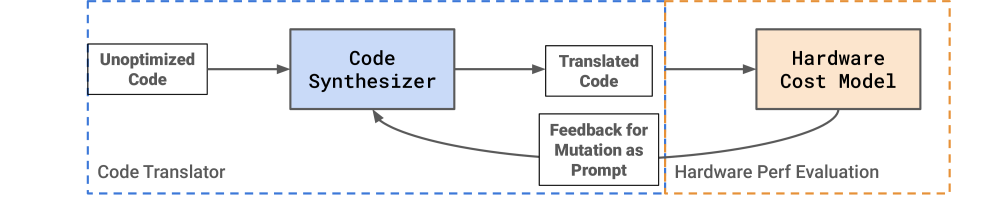

# LLM 助力张量加速器编译

发布时间：2024年08月06日

`LLM应用` `半导体` `人工智能`

> LLM-Aided Compilation for Tensor Accelerators

# 摘要

> 硬件加速器，尤其是针对张量处理的加速器，拥有广泛的应用潜力。然而，当前它们在软件基础设施方面尚不足以支持深度学习之外的多数领域。我们探讨了如何利用大型语言模型（LLMs）构建一个能够灵活适应应用和硬件变化的编译器，从而推动加速器设计的敏捷性和性能优化。具体而言，我们展示了GPT-4在代码翻译至Gemmini加速器时的高效能，并提出了一种将翻译任务细化为更适于LLM处理的小步骤的技术。此外，我们还设计了一个两阶段流程，利用LLMs生成针对硬件优化的代码，以期进一步提升硬件性能。

> Hardware accelerators, in particular accelerators for tensor processing, have many potential application domains. However, they currently lack the software infrastructure to support the majority of domains outside of deep learning. Furthermore, a compiler that can easily be updated to reflect changes at both application and hardware levels would enable more agile development and design space exploration of accelerators, allowing hardware designers to realize closer-to-optimal performance. In this work, we discuss how large language models (LLMs) could be leveraged to build such a compiler. Specifically, we demonstrate the ability of GPT-4 to achieve high pass rates in translating code to the Gemmini accelerator, and prototype a technique for decomposing translation into smaller, more LLM-friendly steps. Additionally, we propose a 2-phase workflow for utilizing LLMs to generate hardware-optimized code.

[Arxiv](https://arxiv.org/abs/2408.03408)