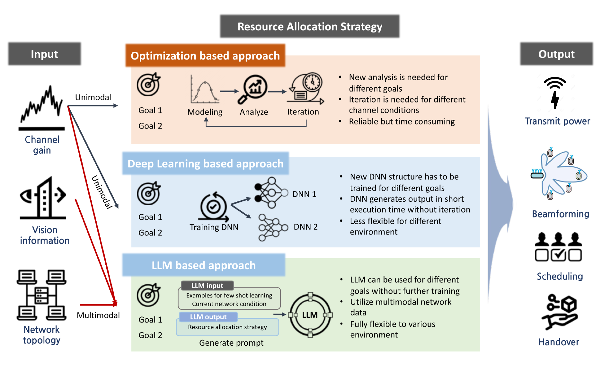
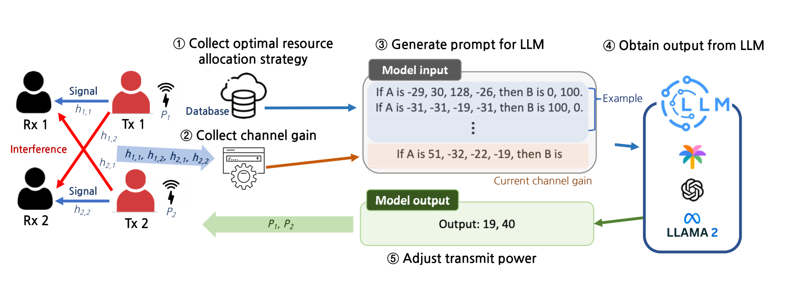
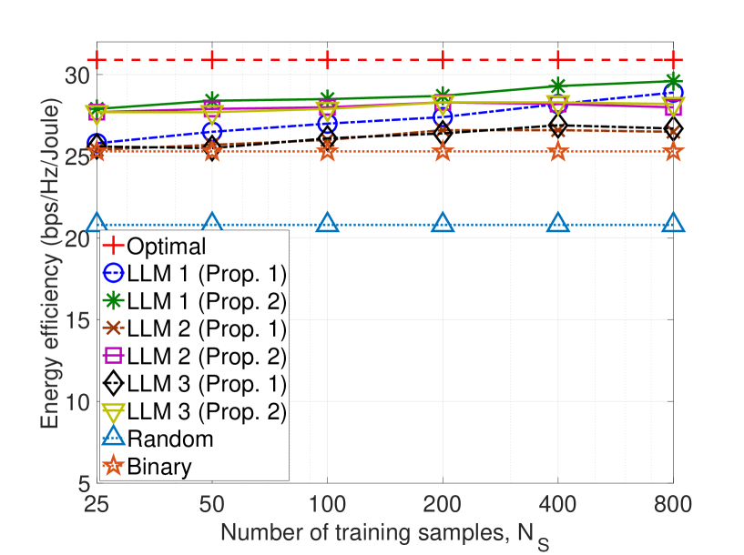
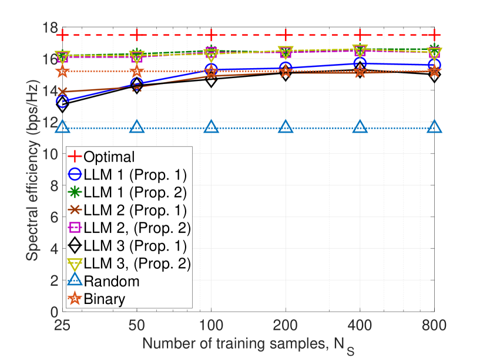
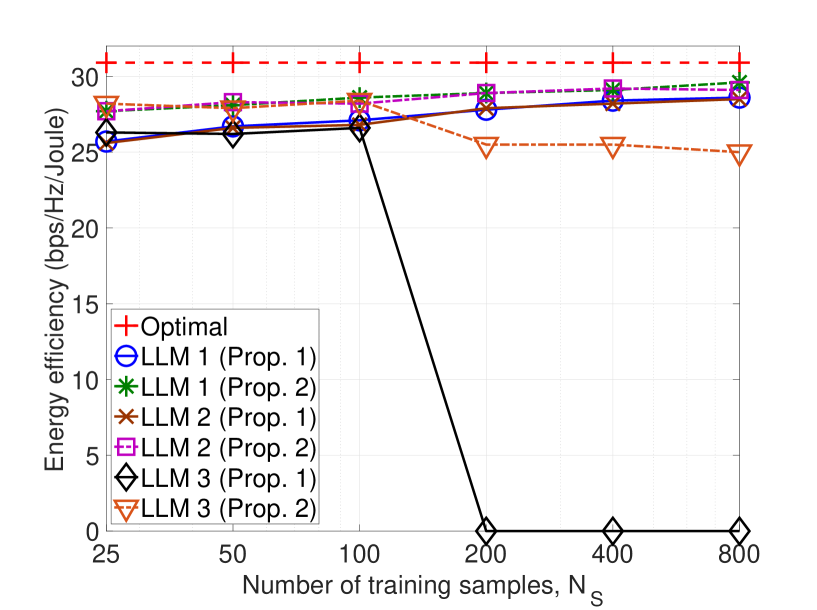
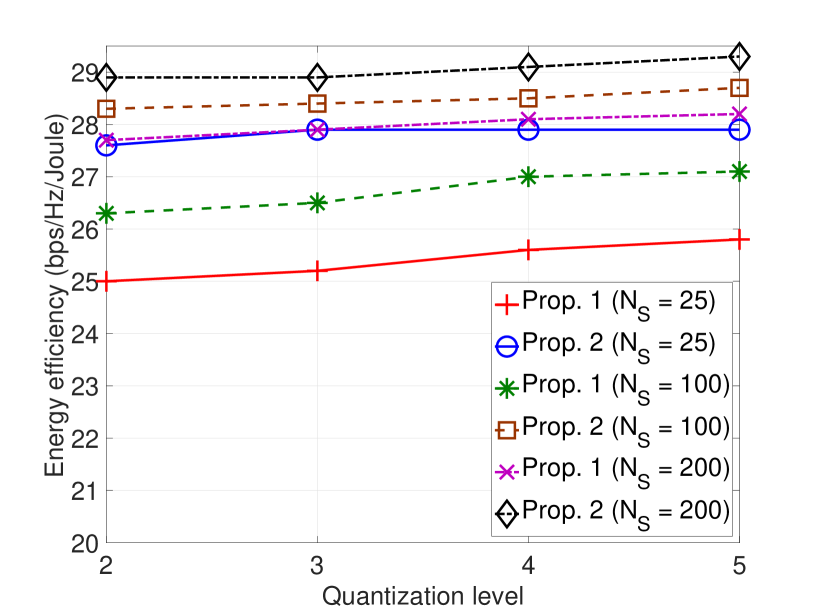

# 基于LLM的无线通信系统资源分配

发布时间：2024年08月06日

`LLM应用` `无线通信` `能源效率`

> LLM-Empowered Resource Allocation in Wireless Communications Systems

# 摘要

> 大型语言模型（LLM）的最新进展已推动其在多领域的应用，特别是在无线通信系统中的整合。本文探讨了基于LLM的无线通信资源分配方案，通过优化能量与频谱效率，结合低复杂度技术以增强可靠性。在验证其可行性后，我们进一步剖析了LLM实际应用中的技术难题。

> The recent success of large language models (LLMs) has spurred their application in various fields. In particular, there have been efforts to integrate LLMs into various aspects of wireless communication systems. The use of LLMs in wireless communication systems has the potential to realize artificial general intelligence (AGI)-enabled wireless networks. In this paper, we investigate an LLM-based resource allocation scheme for wireless communication systems. Specifically, we formulate a simple resource allocation problem involving two transmit pairs and develop an LLM-based resource allocation approach that aims to maximize either energy efficiency or spectral efficiency. Additionally, we consider the joint use of low-complexity resource allocation techniques to compensate for the reliability shortcomings of the LLM-based scheme. After confirming the applicability and feasibility of LLM-based resource allocation, we address several key technical challenges that remain in applying LLMs in practice.

[Arxiv](https://arxiv.org/abs/2408.02944)