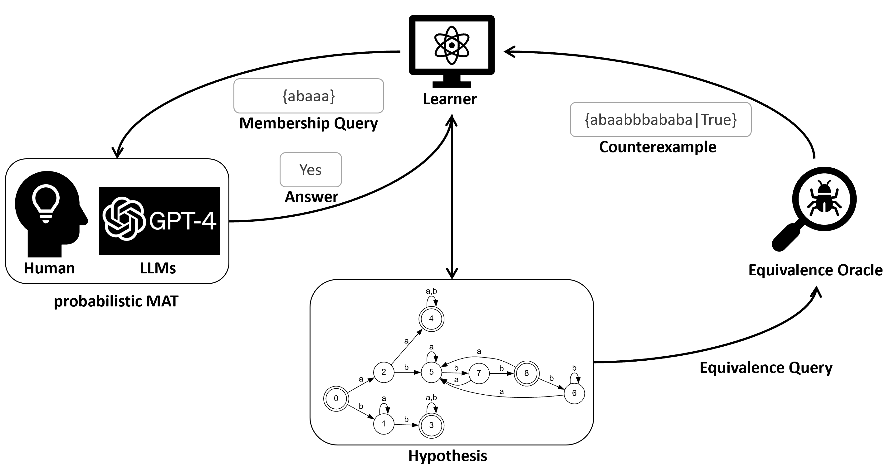
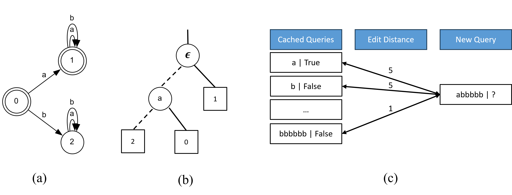
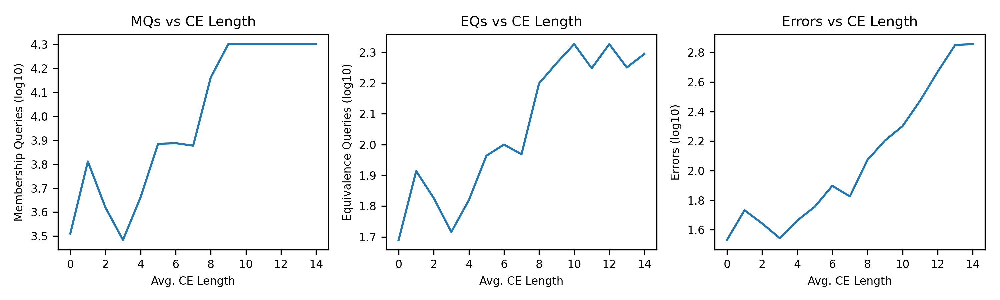
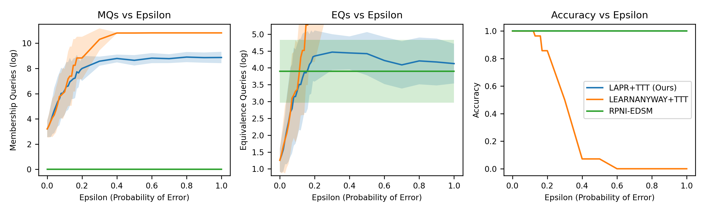
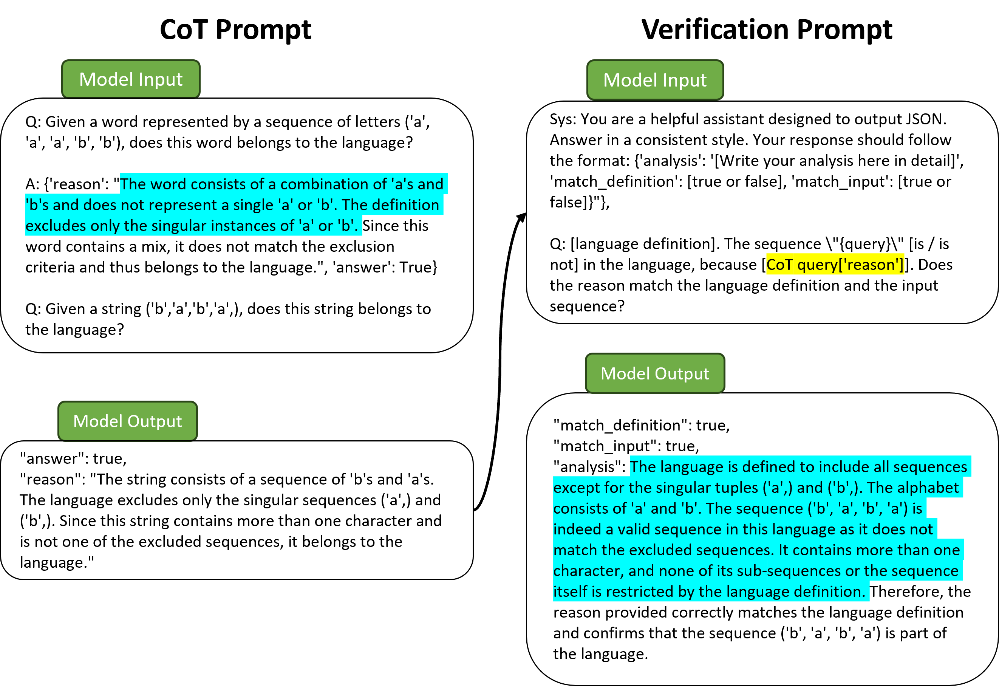

# LLM 作为概率最小充分教师，用于 DFA 学习

发布时间：2024年08月06日

`LLM应用` `自动化` `机器学习`

> LLMs as Probabilistic Minimally Adequate Teachers for DFA Learning

# 摘要

> 大型语言模型 (LLM) 的智能涌现，激发了将其融入自动机学习的探索。本文引入了概率最小充分教师 (pMAT) 模型，该模型利用概率预言机，在处理确定性有限自动机 (DFA) 学习的成员查询时可能随机产生持续错误。针对 LLM 易产生幻觉内容的问题，我们研发了提升答案准确性并确保学习自动机正确性的技术。我们设计了 $\mathtt{Discrimination}$ 和 $\mathtt{Verification}$ 提示，并验证了它们相较于传统提示的优势。同时，我们对比了 TTT 算法与常见主动学习算法在 DFA 学习性能上的差异。为应对持续错误的指数级增长，我们实施了动态查询缓存优化算法，通过融合主动与被动学习策略，有效识别并修正冲突查询。实证研究显示，我们的方法兼具鲁棒性与高效性，为 LLM 参与的自动机学习奠定了坚实的理论基础。

> The emergence of intelligence in large language models (LLMs) has inspired investigations into their integration into automata learning. This paper introduces the probabilistic Minimally Adequate Teacher (pMAT) formulation, which leverages a probabilistic oracle that could give persistent errors randomly during answering the membership queries for deterministic finite automata (DFA) learning. Given the tendency of LLMs to produce hallucinatory content, we have developed techniques to improve answer accuracy and ensure the correctness of the learned automata. We propose the $\mathtt{Discrimination}$ prompt as well as the $\mathtt{Verification}$ prompt and explore their advantages over common prompts. Additionally, we compare DFA learning performance between the TTT algorithm and common active learning algorithms. To address the exponential number of persistent errors, we implement a dynamic query cache refinement algorithm that identifies and corrects conflicting queries by combining the active and passive learning algorithms. The empirical results demonstrate the robustness and efficiency of our approach, providing a theoretical foundation for automata learning with LLMs in the loop.

[Arxiv](https://arxiv.org/abs/2408.02999)