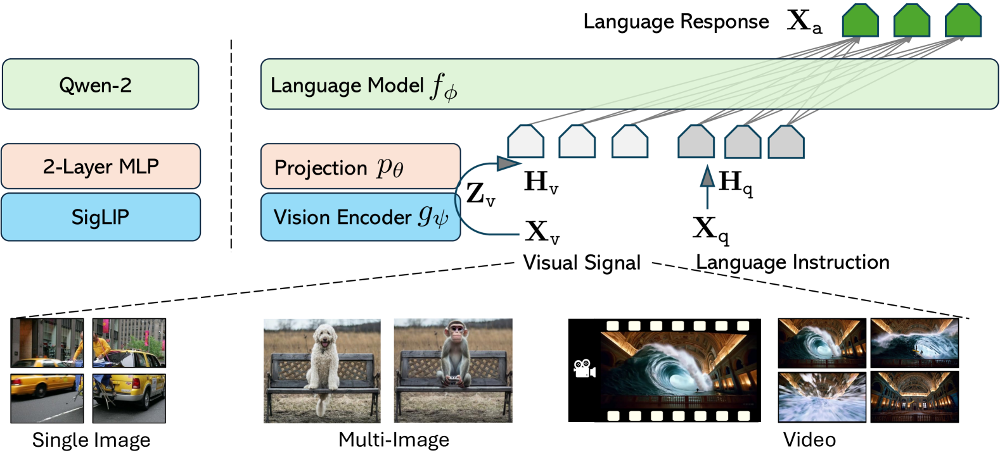
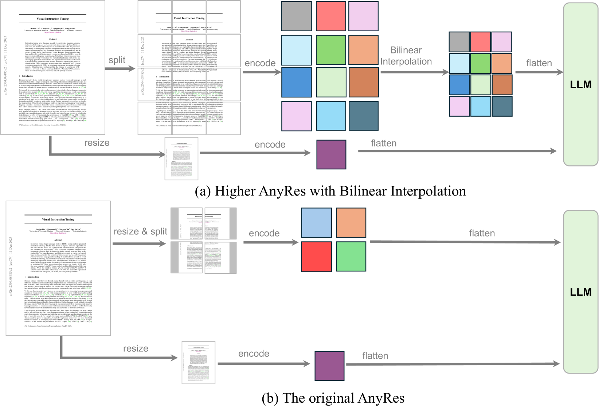
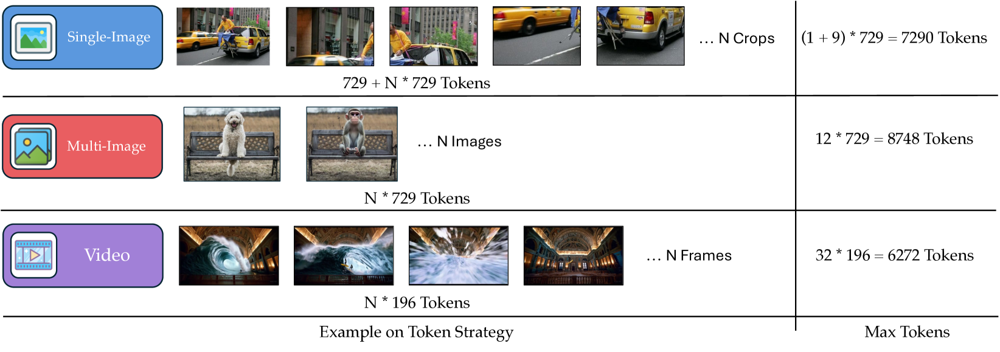
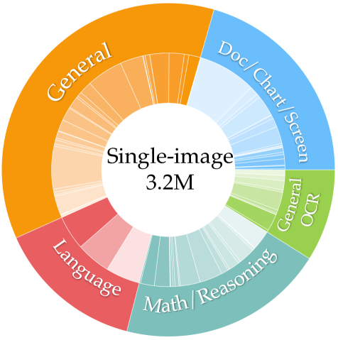
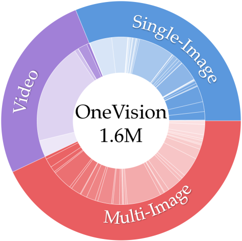

# LLaVA-OneVision：实现视觉任务的轻松迁移

发布时间：2024年08月06日

`LLM应用` `计算机视觉` `视频处理`

> LLaVA-OneVision: Easy Visual Task Transfer

# 摘要

> 我们推出的 LLaVA-OneVision 系列，是基于 LLaVA-NeXT 博客系列中对数据、模型和视觉表示的深入见解而开发的大型多模态模型。实验显示，LLaVA-OneVision 不仅是首个在单图像、多图像和视频三大计算机视觉领域同时突破性能界限的模型，其设计还支持跨模态和场景的强大迁移学习，带来新的能力。尤其在视频理解和跨场景应用上，通过图像到视频的任务迁移，展现了卓越性能。

> We present LLaVA-OneVision, a family of open large multimodal models (LMMs) developed by consolidating our insights into data, models, and visual representations in the LLaVA-NeXT blog series. Our experimental results demonstrate that LLaVA-OneVision is the first single model that can simultaneously push the performance boundaries of open LMMs in three important computer vision scenarios: single-image, multi-image, and video scenarios. Importantly, the design of LLaVA-OneVision allows strong transfer learning across different modalities/scenarios, yielding new emerging capabilities. In particular, strong video understanding and cross-scenario capabilities are demonstrated through task transfer from images to videos.

[Arxiv](https://arxiv.org/abs/2408.03326)