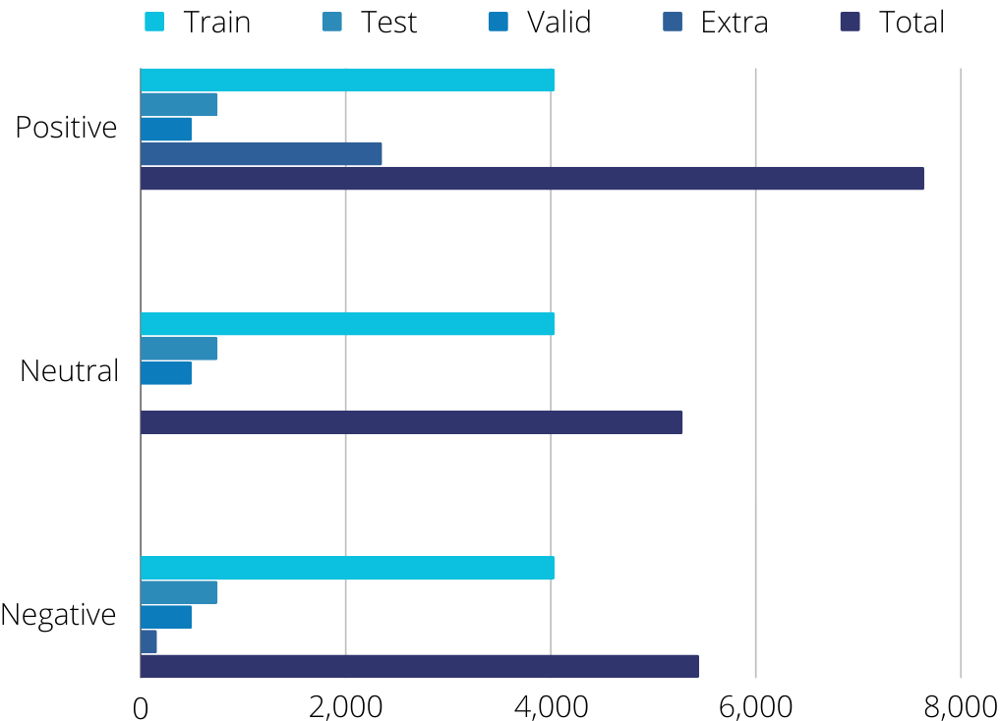
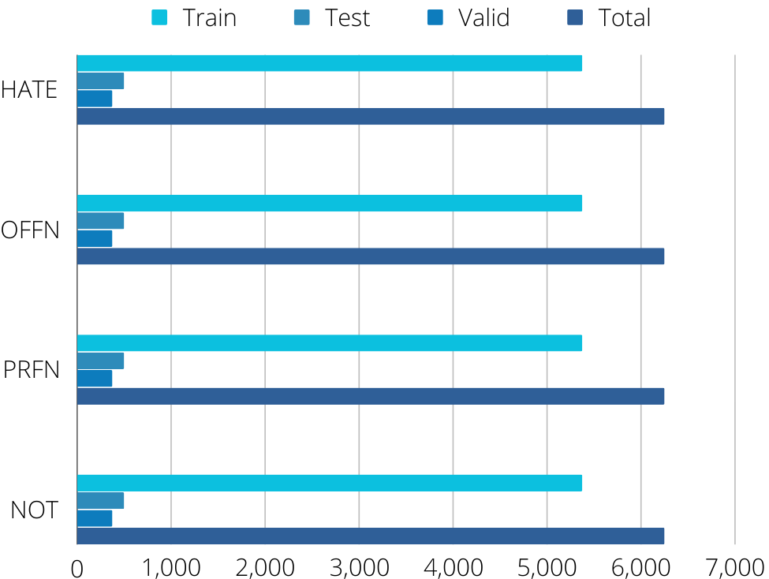
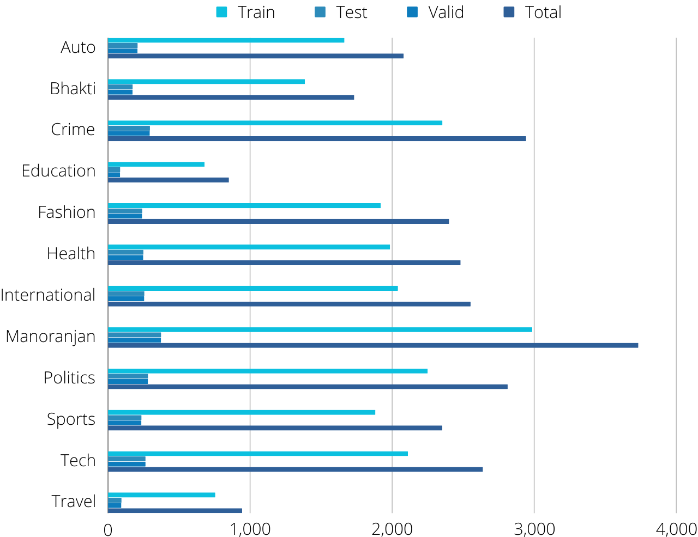
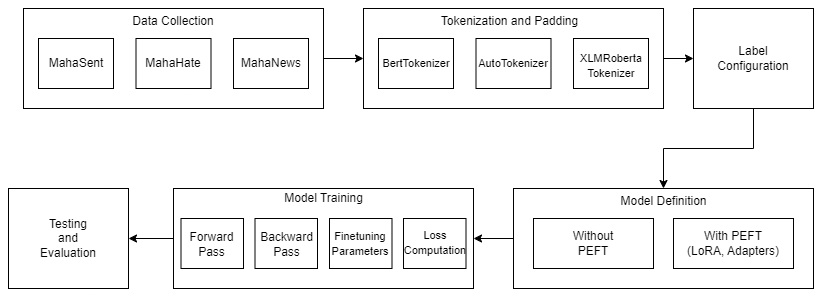
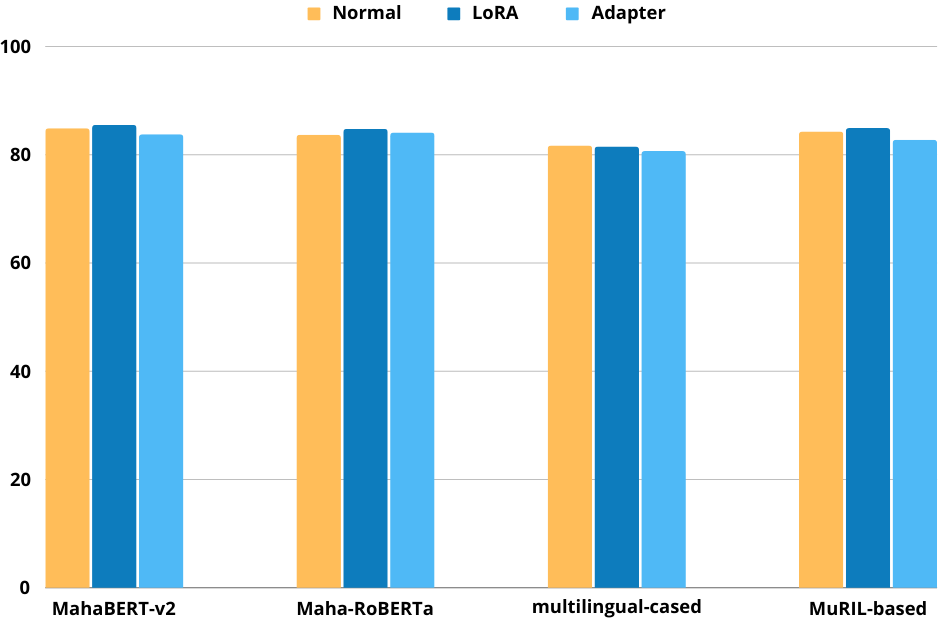
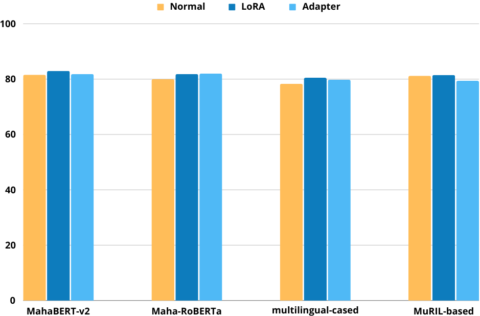
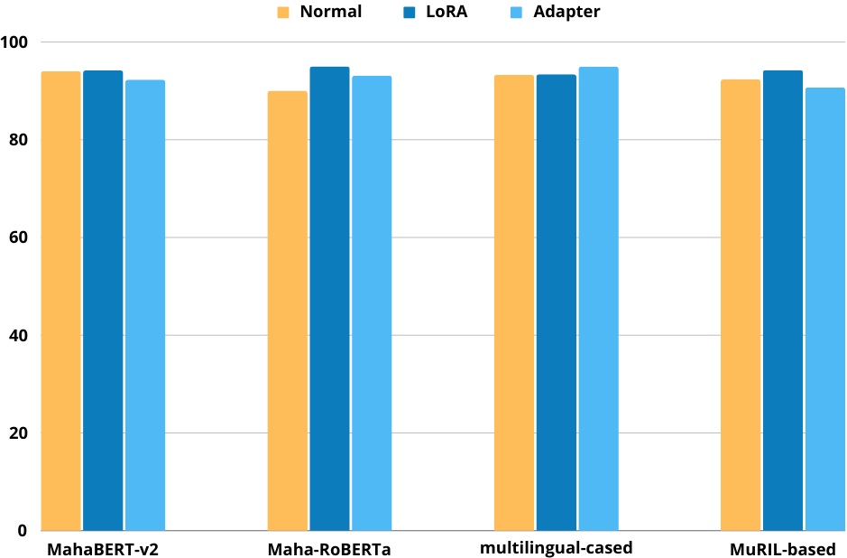

# 本研究通过马拉地语案例，探讨了如何运用参数高效训练方法提升低资源环境下的文本分类效率。

发布时间：2024年08月06日

`LLM应用` `低资源语言`

> Leveraging Parameter Efficient Training Methods for Low Resource Text Classification: A Case Study in Marathi

# 摘要

> 随着低资源语言数字内容的激增，对适用于这些语言的高级自然语言处理技术的需求日益增长。BERT作为众多NLP架构和语言模型的基础框架，越来越多地被用于开发低资源NLP模型。参数高效微调（PEFT）是一种用于微调大型语言模型并减少训练参数以降低模型训练所需的计算成本，并实现与完全微调模型相媲比的结果的方法。在这项工作中，我们针对印度低资源语言马拉地语的PEFT方法进行了一项研究。我们对应用于各种单语和多语种马拉地语BERT模型的PEFT方法进行了全面分析，并在著名的文本分类数据集上进行了评估。PEFT技术的引入显著加快了模型的训练速度，解决了模型开发和部署中的一个关键问题。在本研究中，我们探索了大型语言模型的低秩适应和适配器方法用于低资源文本分类，展示了这些方法与完全微调相竞争，并且可以在不损失准确性的情况下使用。本研究为马拉地语BERT模型的有效性提供了宝贵的见解，为马拉地语及类似印度语言的NLP能力持续进步奠定了基础。

> With the surge in digital content in low-resource languages, there is an escalating demand for advanced Natural Language Processing (NLP) techniques tailored to these languages. BERT (Bidirectional Encoder Representations from Transformers), serving as the foundational framework for numerous NLP architectures and language models, is increasingly employed for the development of low-resource NLP models. Parameter Efficient Fine-Tuning (PEFT) is a method for fine-tuning Large Language Models (LLMs) and reducing the training parameters to some extent to decrease the computational costs needed for training the model and achieve results comparable to a fully fine-tuned model. In this work, we present a study of PEFT methods for the Indic low-resource language Marathi. We conduct a comprehensive analysis of PEFT methods applied to various monolingual and multilingual Marathi BERT models. These approaches are evaluated on prominent text classification datasets like MahaSent, MahaHate, and MahaNews. The incorporation of PEFT techniques is demonstrated to significantly expedite the training speed of the models, addressing a critical aspect of model development and deployment. In this study, we explore Low-Rank Adaptation of Large Language Models (LoRA) and adapter methods for low-resource text classification. We show that these methods are competitive with full fine-tuning and can be used without loss in accuracy. This study contributes valuable insights into the effectiveness of Marathi BERT models, offering a foundation for the continued advancement of NLP capabilities in Marathi and similar Indic languages.

[Arxiv](https://arxiv.org/abs/2408.03172)