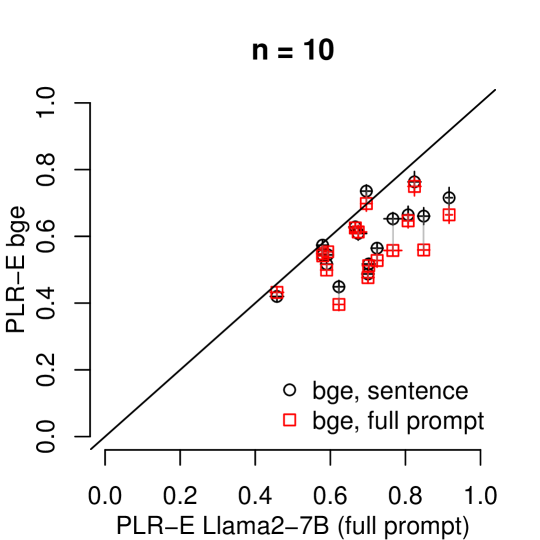
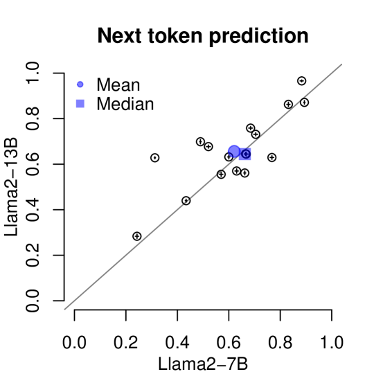
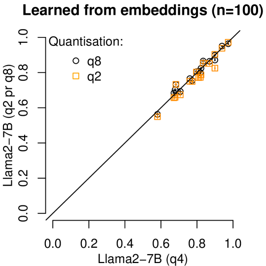
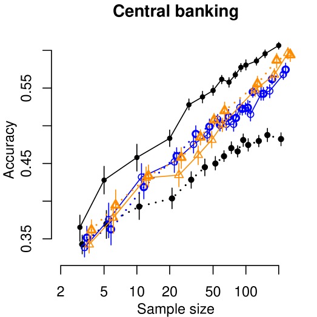
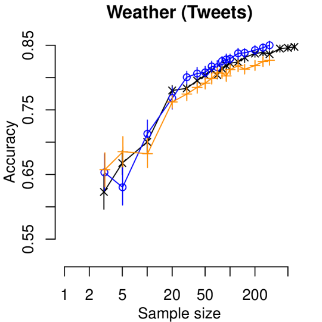
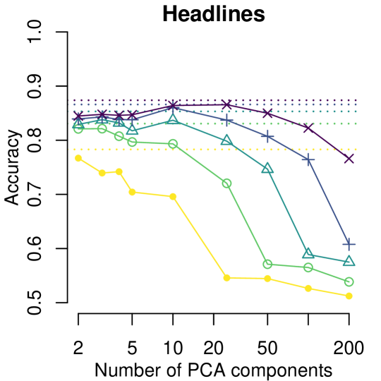
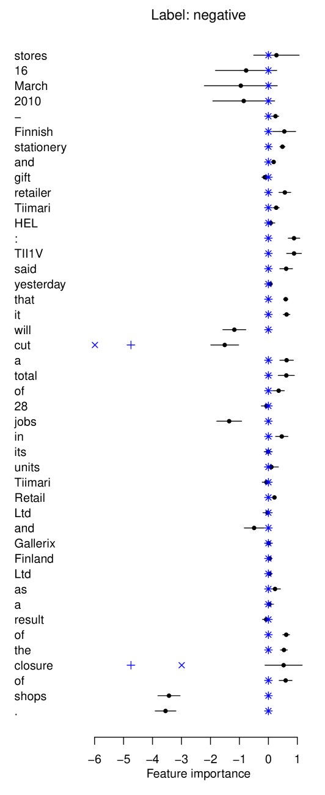

# 逻辑回归赋予小型 LLM 强大的“数十-shot”分类能力，并使其过程透明可解释。

发布时间：2024年08月06日

`LLM应用` `人工智能`

> Logistic Regression makes small LLMs strong and explainable "tens-of-shot" classifiers

# 摘要

> 在简单分类任务中，用户可利用小型本地生成语言模型的优势，无需牺牲性能或增加标签成本，从而避免依赖大型商业模型。这些优势涵盖隐私、可用性、成本及可解释性，对商业应用及AI民主化至关重要。实验显示，小型LLM嵌入上的惩罚逻辑回归在“数十-shot”场景下与大型LLM性能相当甚至更优，且解释分类决策时能提供稳定合理的依据。

> For simple classification tasks, we show that users can benefit from the advantages of using small, local, generative language models instead of large commercial models without a trade-off in performance or introducing extra labelling costs. These advantages, including those around privacy, availability, cost, and explainability, are important both in commercial applications and in the broader democratisation of AI. Through experiments on 17 sentence classification tasks (2-4 classes), we show that penalised logistic regression on the embeddings from a small LLM equals (and usually betters) the performance of a large LLM in the "tens-of-shot" regime. This requires no more labelled instances than are needed to validate the performance of the large LLM. Finally, we extract stable and sensible explanations for classification decisions.

[Arxiv](https://arxiv.org/abs/2408.03414)