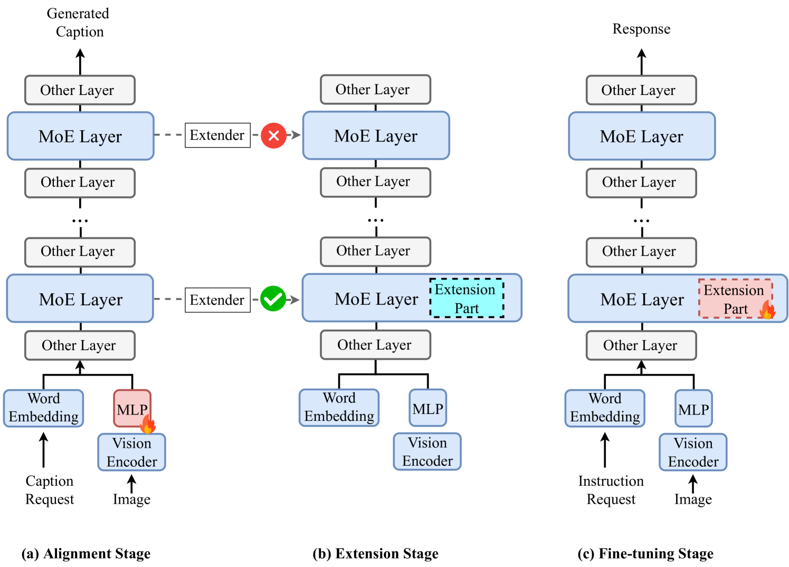
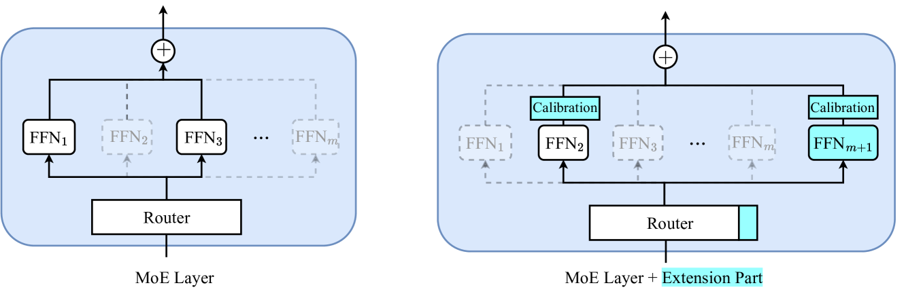
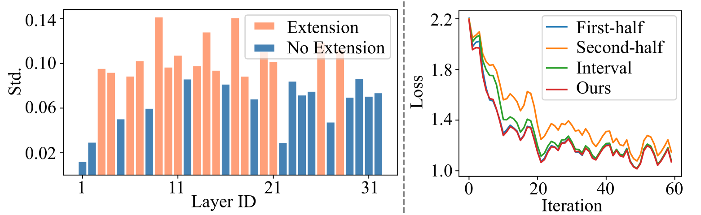
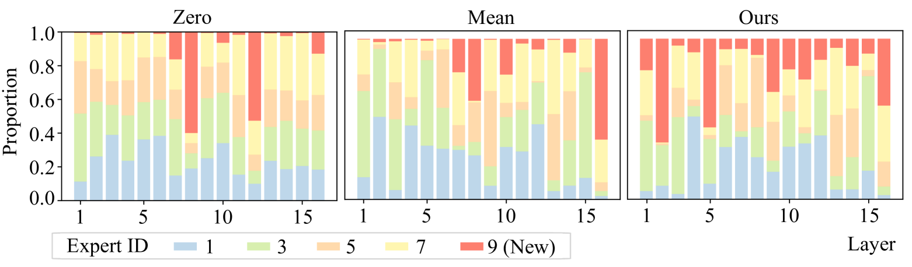
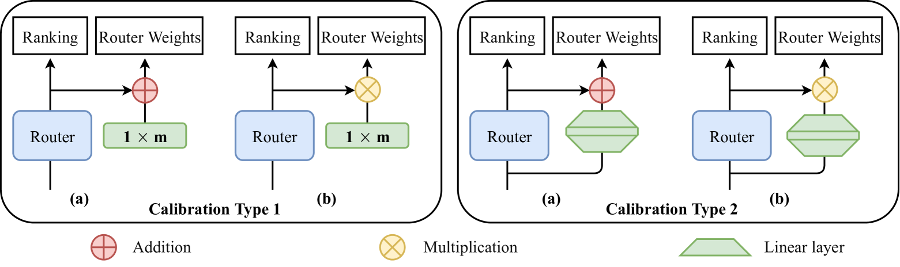

# MoExtend：针对模态与任务扩展，精心调校新专家

发布时间：2024年08月06日

`LLM应用` `人工智能` `多模态学习`

> MoExtend: Tuning New Experts for Modality and Task Extension

# 摘要

> 大型语言模型（LLM）虽在多任务中表现卓越，但受限于文本数据训练，应用范围有限。为拓展其视觉-语言理解能力，我们面临从零开始训练多模态数据的挑战与高成本。现有方法如LLAVA通过全微调连接视觉编码器与LLM，但易导致灾难性遗忘及高昂训练成本。为此，我们推出MoExtend框架，专为简化MoE模型模态适应与扩展设计。MoExtend能无缝融入新专家至预训练MoE，赋予新知而不需调整原模型，实现对新模态数据或任务的快速适应与扩展，有效应对LLM中新模态融合难题，并避免灾难性遗忘风险。实验证实MoExtend在提升LLM多模态能力上高效且有效，助力多模态AI研究进步。代码链接：https://github.com/zhongshsh/MoExtend。

> Large language models (LLMs) excel in various tasks but are primarily trained on text data, limiting their application scope. Expanding LLM capabilities to include vision-language understanding is vital, yet training them on multimodal data from scratch is challenging and costly. Existing instruction tuning methods, e.g., LLAVA, often connects a pretrained CLIP vision encoder and LLMs via fully fine-tuning LLMs to bridge the modality gap. However, full fine-tuning is plagued by catastrophic forgetting, i.e., forgetting previous knowledge, and high training costs particularly in the era of increasing tasks and modalities. To solve this issue, we introduce MoExtend, an effective framework designed to streamline the modality adaptation and extension of Mixture-of-Experts (MoE) models. MoExtend seamlessly integrates new experts into pre-trained MoE models, endowing them with novel knowledge without the need to tune pretrained models such as MoE and vision encoders. This approach enables rapid adaptation and extension to new modal data or tasks, effectively addressing the challenge of accommodating new modalities within LLMs. Furthermore, MoExtend avoids tuning pretrained models, thus mitigating the risk of catastrophic forgetting. Experimental results demonstrate the efficacy and efficiency of MoExtend in enhancing the multimodal capabilities of LLMs, contributing to advancements in multimodal AI research. Code: https://github.com/zhongshsh/MoExtend.

[Arxiv](https://arxiv.org/abs/2408.03511)