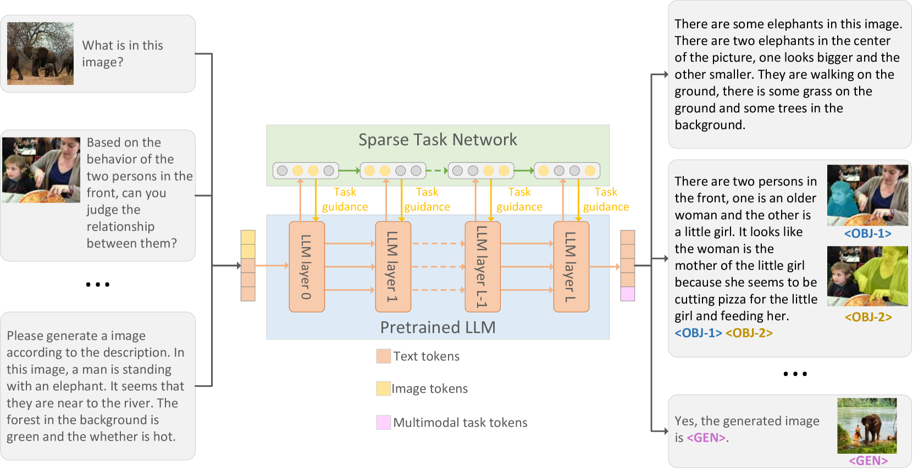
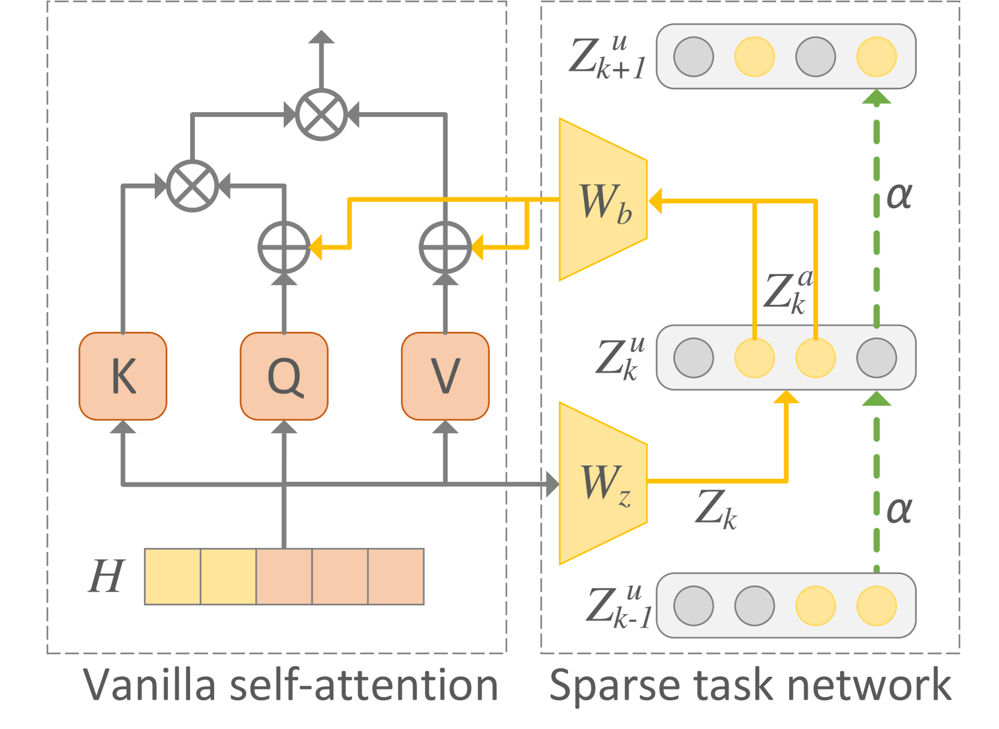
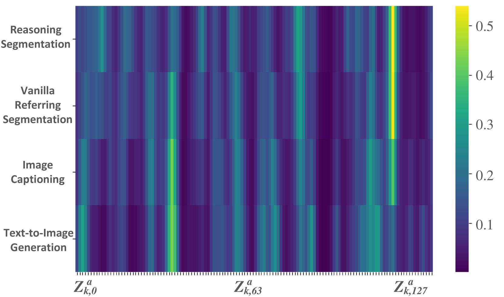
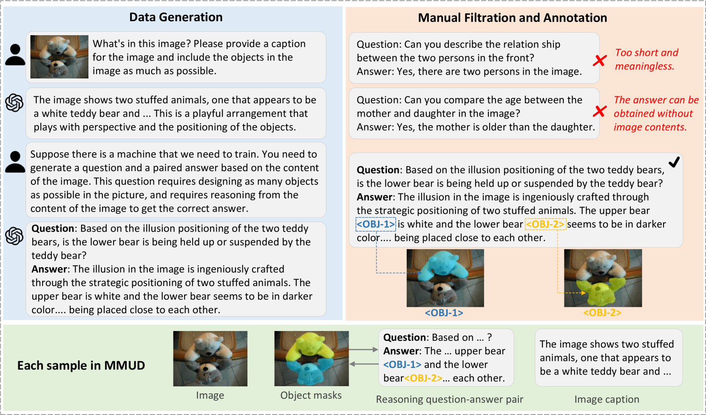
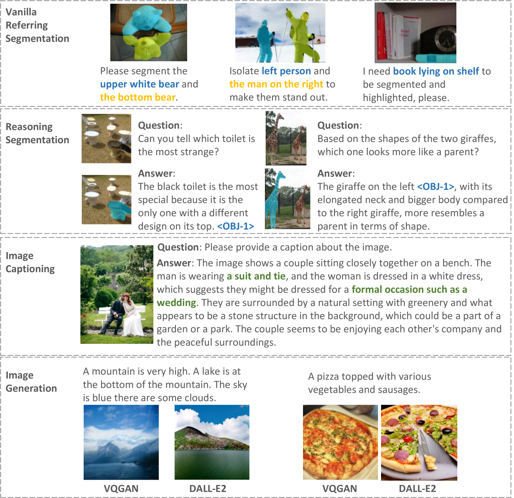

# 大型模型的多任务与多模态神经调谐

发布时间：2024年08月06日

`LLM应用` `人工智能` `计算机视觉`

> Multitask and Multimodal Neural Tuning for Large Models

# 摘要

> 近年来，大规模多模态模型在多个领域展现出卓越能力，但如何让这些模型同时高效执行多项多模态任务仍是一大挑战。为此，我们创新性地提出了神经调谐方法，该方法能够同时处理推理分割、引用分割、图像描述及文本到图像生成等多样化任务，模拟人脑中特定任务激活特定神经元的机制。同时，我们推出了MMUD新基准，每样本附带多任务标签，通过在此基准上应用神经调谐于预训练模型，实现了任务处理的简洁高效。研究成果包括模型、代码及数据集，将在发表后公开，助力该领域研究与开发的进一步推进。

> In recent years, large-scale multimodal models have demonstrated impressive capabilities across various domains. However, enabling these models to effectively perform multiple multimodal tasks simultaneously remains a significant challenge. To address this, we introduce a novel tuning method called neural tuning, designed to handle diverse multimodal tasks concurrently, including reasoning segmentation, referring segmentation, image captioning, and text-to-image generation. Neural tuning emulates sparse distributed representation in human brain, where only specific subsets of neurons are activated for each task. Additionally, we present a new benchmark, MMUD, where each sample is annotated with multiple task labels. By applying neural tuning to pretrained large models on the MMUD benchmark, we achieve simultaneous task handling in a streamlined and efficient manner. All models, code, and datasets will be publicly available after publication, facilitating further research and development in this field.

[Arxiv](https://arxiv.org/abs/2408.03001)