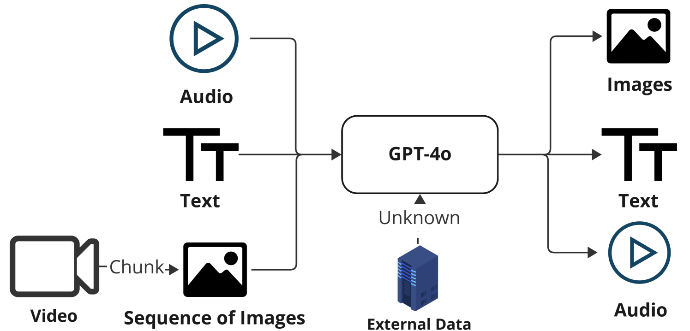
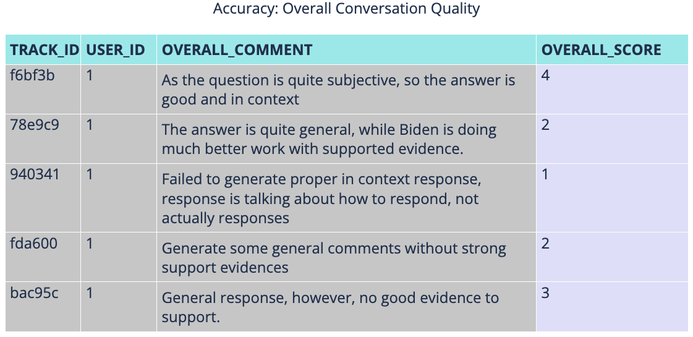

# OpenOmni：携手共创，未来对话代理的开源利器

发布时间：2024年08月06日

`Agent` `人机交互` `开源软件`

> OpenOmni: A Collaborative Open Source Tool for Building Future-Ready Multimodal Conversational Agents

# 摘要

> 多模态对话代理因其自然且人性化的交互而备受青睐，但目前缺乏支持协作开发和基准测试的全面端到端解决方案。尽管GPT-4o和Gemini等专有系统在音频、视频和文本集成方面表现出色，响应时间仅为200-250毫秒，但在平衡延迟、准确性、成本和数据隐私方面仍面临挑战。为此，我们开发了OpenOmni，一个开源的端到端基准测试工具，集成了语音转文本、情感检测、检索增强生成和大型语言模型等先进技术，并支持定制模型的集成。OpenOmni支持本地和云部署，确保数据隐私，同时进行延迟和准确性基准测试。这一灵活框架使研究人员能够定制管道，聚焦实际瓶颈，加速概念验证的开发。OpenOmni有望显著提升室内辅助等应用，推动人机交互的进步。演示视频、在线演示和代码分别可在YouTube、OpenOmni官网和GitHub上获取。

> Multimodal conversational agents are highly desirable because they offer natural and human-like interaction. However, there is a lack of comprehensive end-to-end solutions to support collaborative development and benchmarking. While proprietary systems like GPT-4o and Gemini demonstrating impressive integration of audio, video, and text with response times of 200-250ms, challenges remain in balancing latency, accuracy, cost, and data privacy. To better understand and quantify these issues, we developed OpenOmni, an open-source, end-to-end pipeline benchmarking tool that integrates advanced technologies such as Speech-to-Text, Emotion Detection, Retrieval Augmented Generation, Large Language Models, along with the ability to integrate customized models. OpenOmni supports local and cloud deployment, ensuring data privacy and supporting latency and accuracy benchmarking. This flexible framework allows researchers to customize the pipeline, focusing on real bottlenecks and facilitating rapid proof-of-concept development. OpenOmni can significantly enhance applications like indoor assistance for visually impaired individuals, advancing human-computer interaction. Our demonstration video is available https://www.youtube.com/watch?v=zaSiT3clWqY, demo is available via https://openomni.ai4wa.com, code is available via https://github.com/AI4WA/OpenOmniFramework.

[Arxiv](https://arxiv.org/abs/2408.03047)