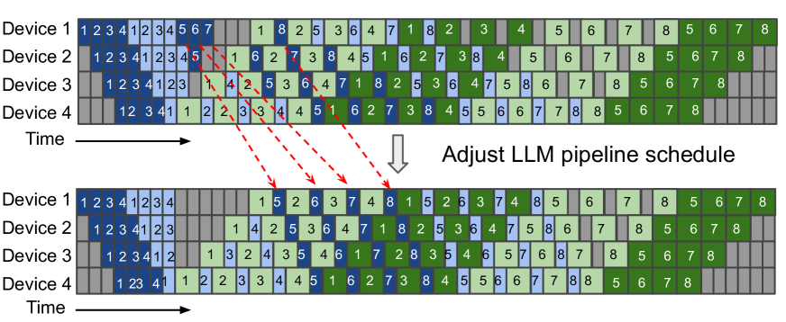

# Optimus：利用气泡技术，加速大规模多模态 LLM 训练进程

发布时间：2024年08月06日

`LLM应用` `人工智能` `计算机视觉`

> Optimus: Accelerating Large-Scale Multi-Modal LLM Training by Bubble Exploitation

# 摘要

> 多模态大型语言模型（MLLMs）已成功将大型语言模型（LLMs）的应用扩展至图像、文本和音频等多种数据类型，显著提升了多模态翻译、视觉问答及内容生成等领域的性能。然而，现有系统因异构模态模型及3D并行中的复杂数据依赖导致的GPU资源浪费，训练MLLMs效率不高。为此，我们提出Optimus系统，通过优化编码器计算调度，有效缩短MLLM训练时间。Optimus通过为编码器和LLM设计独立并行方案，并运用气泡调度算法，充分利用LLM资源，同时保持MLLM模型数据依赖的完整性。此外，我们将编码器计算细分为多个内核，并针对3D并行中的气泡模式进行精细优化，实现亚毫秒级的高效调度，大幅减少训练时间。实验结果显示，在3072个GPU上，Optimus使ViT-22B和GPT-175B模型的MLLM训练速度提升20.5%-21.3%，超越了现有基线。

> Multimodal large language models (MLLMs) have extended the success of large language models (LLMs) to multiple data types, such as image, text and audio, achieving significant performance in various domains, including multimodal translation, visual question answering and content generation. Nonetheless, existing systems are inefficient to train MLLMs due to substantial GPU bubbles caused by the heterogeneous modality models and complex data dependencies in 3D parallelism. This paper proposes Optimus, a distributed MLLM training system that reduces end-to-end MLLM training time. Optimus is based on our principled analysis that scheduling the encoder computation within the LLM bubbles can reduce bubbles in MLLM training. To make scheduling encoder computation possible for all GPUs, Optimus searches the separate parallel plans for encoder and LLM, and adopts a bubble scheduling algorithm to enable exploiting LLM bubbles without breaking the original data dependencies in the MLLM model architecture. We further decompose encoder layer computation into a series of kernels, and analyze the common bubble pattern of 3D parallelism to carefully optimize the sub-millisecond bubble scheduling, minimizing the overall training time. Our experiments in a production cluster show that Optimus accelerates MLLM training by 20.5%-21.3% with ViT-22B and GPT-175B model over 3072 GPUs compared to baselines.

[Arxiv](https://arxiv.org/abs/2408.03505)