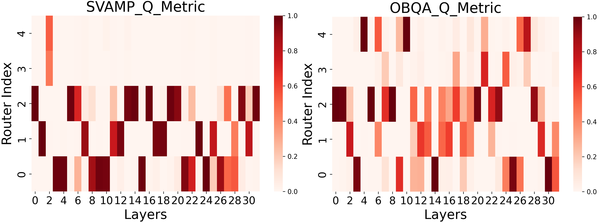

# SARA：一种基于奇异值的自适应低秩调整方法

发布时间：2024年08月06日

`LLM理论` `人工智能` `机器学习`

> SARA: Singular-Value Based Adaptive Low-Rank Adaption

# 摘要

> 随着预训练模型参数的增多，LoRA这一高效的微调方法因其不增加推理负担而广受欢迎。LoRA假设微调中的权重变化可用低秩矩阵近似，但秩的选择需人工匹配不同任务，且无法适应各层重要性的差异。我们通过SVD分析层性能与秩的关系，进而设计了SARA，它能自适应地利用预训练权重的SVD在初始阶段确定秩。此外，Mo-SARA通过精细调控多组并行奇异值，大幅降低了参数量。实验表明，我们的方法简洁高效，能自适应地为各层找到最佳秩，适用于多样复杂的任务。

> With the increasing number of parameters in large pre-trained models, LoRA as a parameter-efficient fine-tuning(PEFT) method is widely used for not adding inference overhead. The LoRA method assumes that weight changes during fine-tuning can be approximated by low-rank matrices. However, the rank values need to be manually verified to match different downstream tasks, and they cannot accommodate the varying importance of different layers in the model. In this work, we first analyze the relationship between the performance of different layers and their ranks using SVD. Based on this, we design the Singular-Value Based Adaptive Low-Rank Adaption(SARA), which adaptively finds the rank during initialization by performing SVD on the pre-trained weights. Additionally, we explore the Mixture-of-SARA(Mo-SARA), which significantly reduces the number of parameters by fine-tuning only multiple parallel sets of singular values controlled by a router. Extensive experiments on various complex tasks demonstrate the simplicity and parameter efficiency of our methods. They can effectively and adaptively find the most suitable rank for each layer of each model.

[Arxiv](https://arxiv.org/abs/2408.03290)