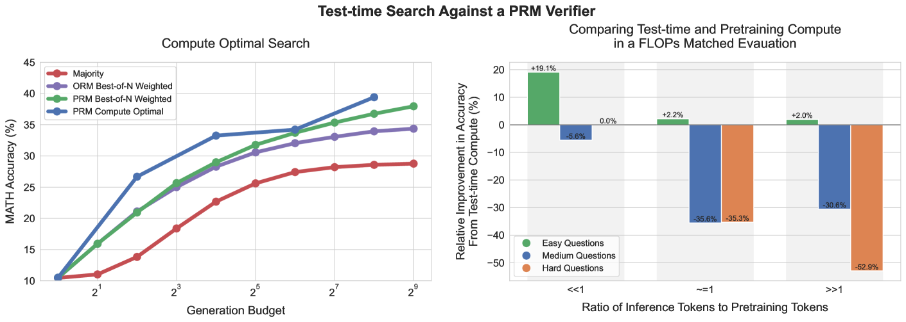

# 在大型语言模型（LLM）中，优化测试时的计算扩展可能比单纯增加模型参数更为高效。

发布时间：2024年08月06日

`LLM理论` `人工智能` `计算资源优化`

> Scaling LLM Test-Time Compute Optimally can be More Effective than Scaling Model Parameters

# 摘要

> 本文探讨了大型语言模型（LLMs）在推理阶段通过增加计算量来提升性能的可能性。我们关注的核心问题是：在允许LLMs使用一定量的推理计算时，它们能在复杂任务上取得多大的进步？这一问题的答案不仅关乎LLMs的性能极限，也影响着未来LLM的预训练策略及计算资源的分配。尽管这一议题至关重要，但相关研究尚显不足，且现有研究多呈现负面结果。我们深入分析了两种扩展推理计算的方法：一是通过密集的验证模型进行搜索，二是根据实时提示动态调整模型输出分布。研究发现，这些方法的效果很大程度上取决于任务的难度。基于此，我们提出了一种“计算最优”策略，该策略能根据不同任务灵活分配计算资源，从而将推理效率提升至最佳N基线的四倍以上。此外，在计算量匹配的测试中，我们发现，即便基础模型较小，通过优化推理计算，也能在某些任务上超越比其大14倍的模型。

> Enabling LLMs to improve their outputs by using more test-time computation is a critical step towards building generally self-improving agents that can operate on open-ended natural language. In this paper, we study the scaling of inference-time computation in LLMs, with a focus on answering the question: if an LLM is allowed to use a fixed but non-trivial amount of inference-time compute, how much can it improve its performance on a challenging prompt? Answering this question has implications not only on the achievable performance of LLMs, but also on the future of LLM pretraining and how one should tradeoff inference-time and pre-training compute. Despite its importance, little research attempted to understand the scaling behaviors of various test-time inference methods. Moreover, current work largely provides negative results for a number of these strategies. In this work, we analyze two primary mechanisms to scale test-time computation: (1) searching against dense, process-based verifier reward models; and (2) updating the model's distribution over a response adaptively, given the prompt at test time. We find that in both cases, the effectiveness of different approaches to scaling test-time compute critically varies depending on the difficulty of the prompt. This observation motivates applying a "compute-optimal" scaling strategy, which acts to most effectively allocate test-time compute adaptively per prompt. Using this compute-optimal strategy, we can improve the efficiency of test-time compute scaling by more than 4x compared to a best-of-N baseline. Additionally, in a FLOPs-matched evaluation, we find that on problems where a smaller base model attains somewhat non-trivial success rates, test-time compute can be used to outperform a 14x larger model.

[Arxiv](https://arxiv.org/abs/2408.03314)