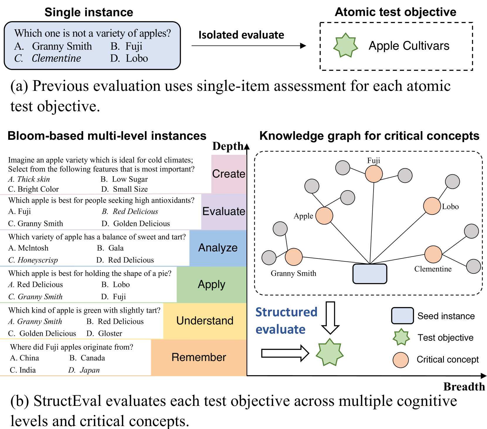
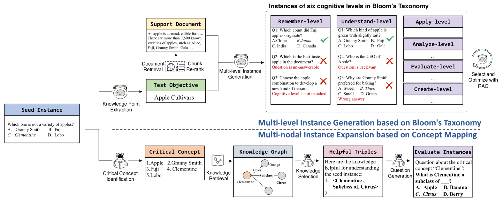
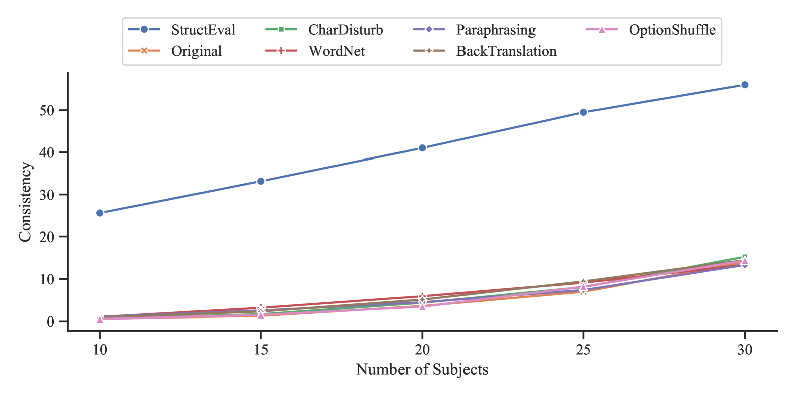
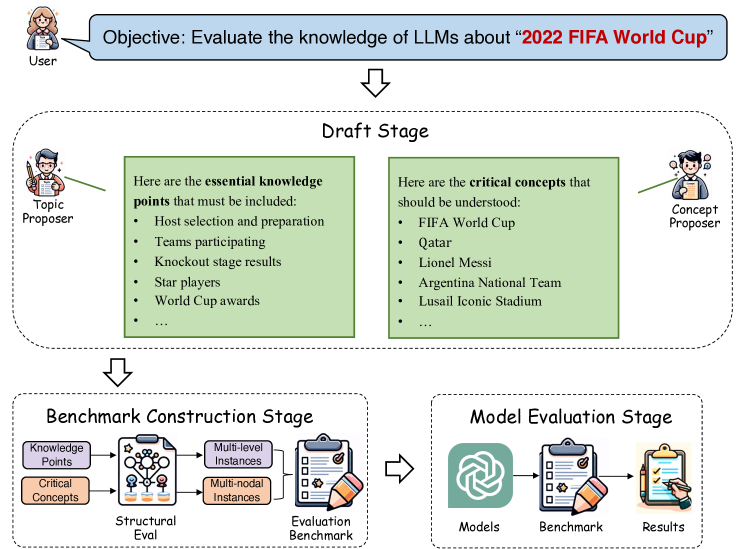
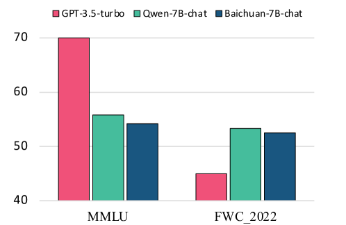
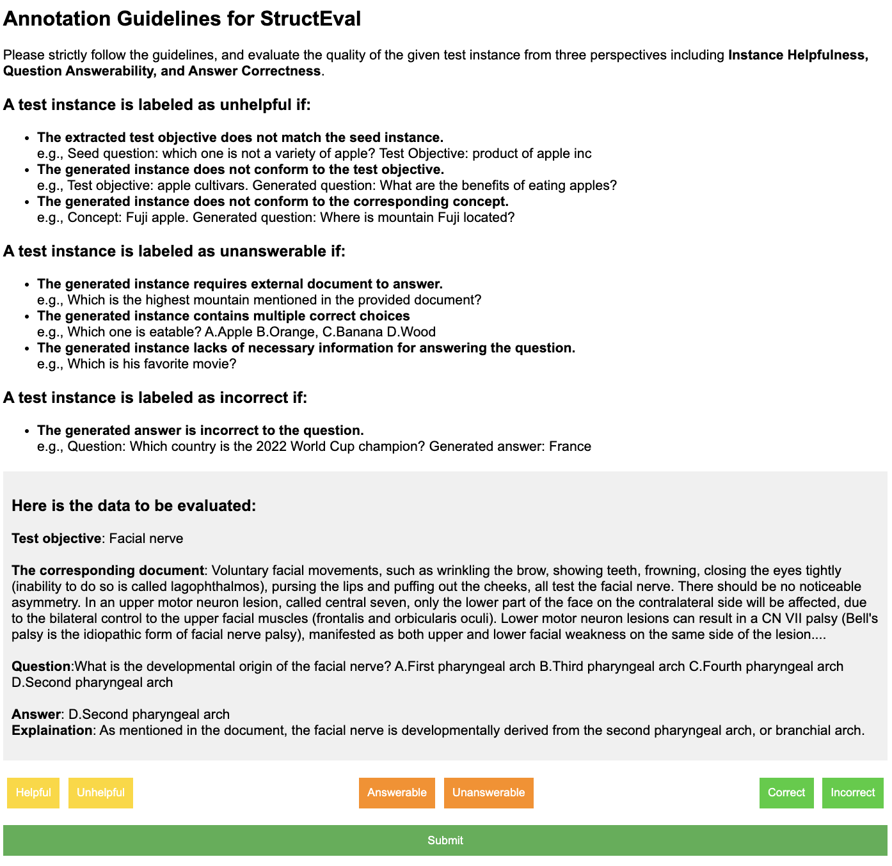

# StructEval：借助结构化评估，深化并扩展对大型语言模型的全面评估。

发布时间：2024年08月06日

`LLM理论` `人工智能` `教育评估`

> StructEval: Deepen and Broaden Large Language Model Assessment via Structured Evaluation

# 摘要

> 评估是推动大型语言模型进步的关键。现有的评估方法往往局限于单一项目的测试，难以区分模型是真正掌握了技能，还是仅仅机械地记忆或猜测答案。为此，我们引入了StructEval这一创新评估框架。该框架从基础测试目标出发，通过跨多个认知层面和关键概念的结构化评估，全面、稳健且一致地衡量了LLMs的能力。实验结果显示，StructEval有效抵御了数据污染和偏差干扰，为模型能力的评估提供了更为可靠和一致的结论。此外，我们的框架还为未来设计更为合理和可信的LLM评估体系提供了思路。

> Evaluation is the baton for the development of large language models. Current evaluations typically employ a single-item assessment paradigm for each atomic test objective, which struggles to discern whether a model genuinely possesses the required capabilities or merely memorizes/guesses the answers to specific questions. To this end, we propose a novel evaluation framework referred to as StructEval. Starting from an atomic test objective, StructEval deepens and broadens the evaluation by conducting a structured assessment across multiple cognitive levels and critical concepts, and therefore offers a comprehensive, robust and consistent evaluation for LLMs. Experiments on three widely-used benchmarks demonstrate that StructEval serves as a reliable tool for resisting the risk of data contamination and reducing the interference of potential biases, thereby providing more reliable and consistent conclusions regarding model capabilities. Our framework also sheds light on the design of future principled and trustworthy LLM evaluation protocols.

[Arxiv](https://arxiv.org/abs/2408.03281)