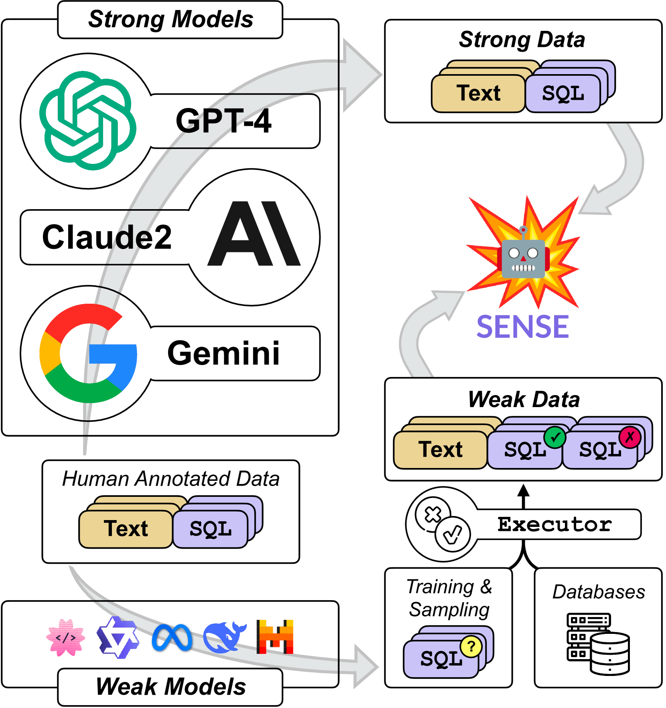
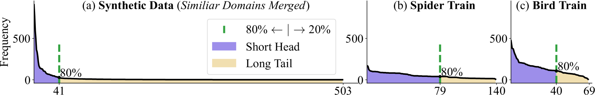
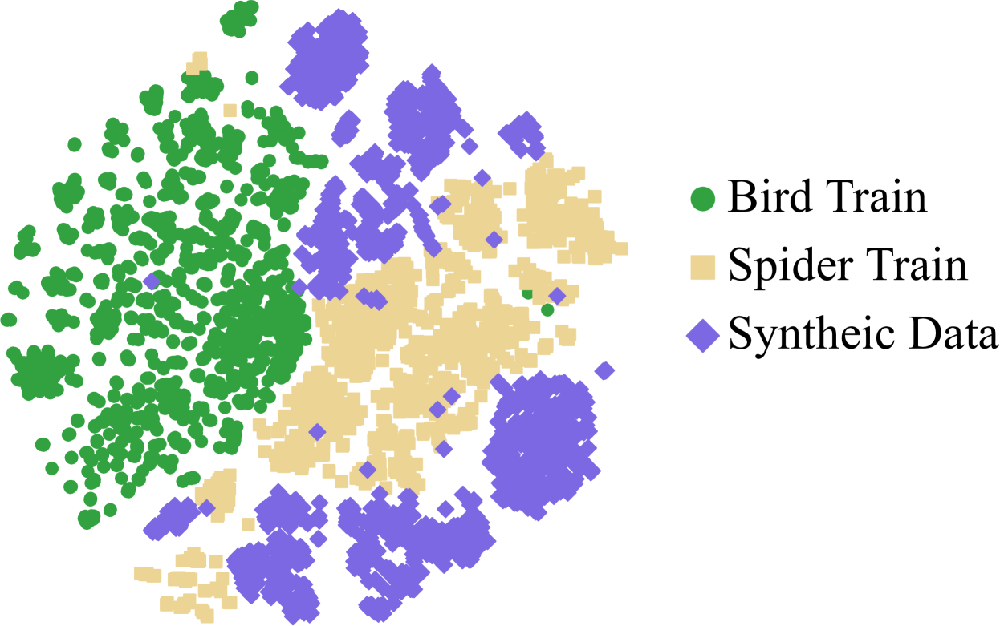
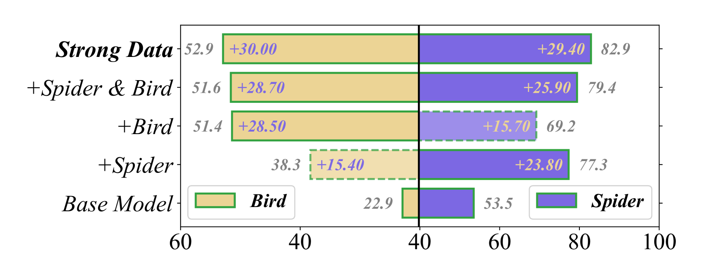
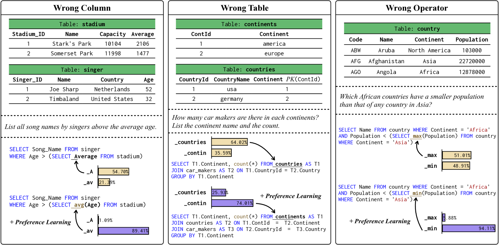

# 从弱与强LLM中合成文本至SQL数据

发布时间：2024年08月06日

`LLM应用` `软件开发` `数据库`

> Synthesizing Text-to-SQL Data from Weak and Strong LLMs

# 摘要

> 在文本到 SQL 任务中，开源与闭源 LLM 的能力差距仍待解决。本文提出一种合成数据法，融合强模型的高质量数据与弱模型的错误信息，不仅提升模型泛化性，还挖掘错误数据监督的潜力。通过此法调优开源 LLM，我们开发了专用模型 SENSE，其卓越表现在 SPIDER 和 BIRD 基准测试中显著，有效弥合了开源与闭源模型间的性能鸿沟。

> The capability gap between open-source and closed-source large language models (LLMs) remains a challenge in text-to-SQL tasks. In this paper, we introduce a synthetic data approach that combines data produced by larger, more powerful models (strong models) with error information data generated by smaller, not well-aligned models (weak models). The method not only enhances the domain generalization of text-to-SQL models but also explores the potential of error data supervision through preference learning. Furthermore, we employ the synthetic data approach for instruction tuning on open-source LLMs, resulting SENSE, a specialized text-to-SQL model. The effectiveness of SENSE is demonstrated through state-of-the-art results on the SPIDER and BIRD benchmarks, bridging the performance gap between open-source models and methods prompted by closed-source models.

[Arxiv](https://arxiv.org/abs/2408.03256)