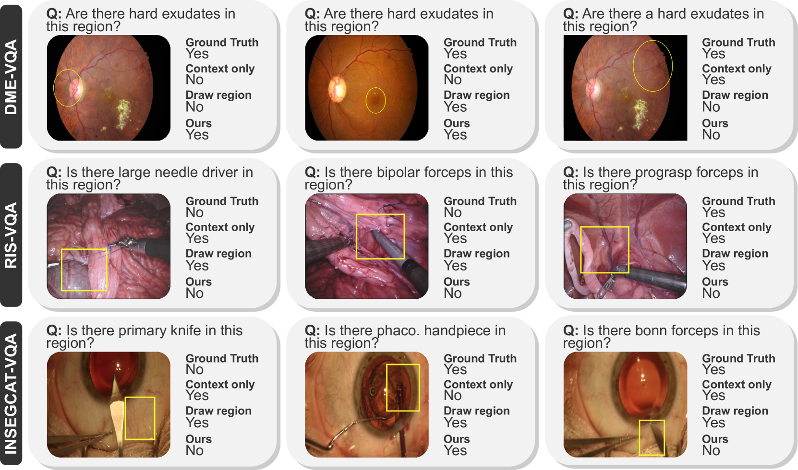

# 医学视觉问答中的定向视觉提示

发布时间：2024年08月06日

`LLM应用` `计算机视觉`

> Targeted Visual Prompting for Medical Visual Question Answering

# 摘要

> 近年来，医学视觉问答 (Med-VQA) 领域迅速发展，多模态大型语言模型 (MLLMs) 成为经典架构的有力竞争者。这些模型通过整合视觉信息，为图像解析带来了新视角。然而，视觉错误的存在质疑了其真正的视觉理解力。为此，基于区域的问题被提出，旨在通过组合评估提升视觉理解。本文创新性地引入了有针对性的视觉提示，赋予 MLLMs 基于区域提问的能力。通过在定制提示中展示区域及其上下文，我们在多个数据集上验证了方法的有效性，并与多个基线模型进行了对比。相关代码和数据已公开，详见 https://github.com/sergiotasconmorales/locvqallm。

> With growing interest in recent years, medical visual question answering (Med-VQA) has rapidly evolved, with multimodal large language models (MLLMs) emerging as an alternative to classical model architectures. Specifically, their ability to add visual information to the input of pre-trained LLMs brings new capabilities for image interpretation. However, simple visual errors cast doubt on the actual visual understanding abilities of these models. To address this, region-based questions have been proposed as a means to assess and enhance actual visual understanding through compositional evaluation. To combine these two perspectives, this paper introduces targeted visual prompting to equip MLLMs with region-based questioning capabilities. By presenting the model with both the isolated region and the region in its context in a customized visual prompt, we show the effectiveness of our method across multiple datasets while comparing it to several baseline models. Our code and data are available at https://github.com/sergiotasconmorales/locvqallm.

[Arxiv](https://arxiv.org/abs/2408.03043)