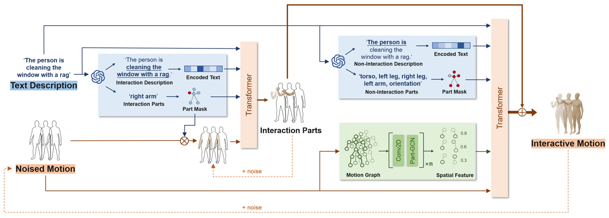

# TextIM：通过文本实现部分感知交互式运动合成

发布时间：2024年08月06日

`LLM应用` `人机交互` `动画制作`

> TextIM: Part-aware Interactive Motion Synthesis from Text

# 摘要

> 我们创新性地提出了 TextIM 框架，专注于通过文本驱动生成精确对齐部分级语义的人类交互动作。传统方法常忽略交互部位的重要性，导致运动不准确。TextIM 通过解耦的条件扩散框架，精细对齐文本与动作语义，利用大型语言模型模拟人脑，深入理解并生成复杂交互动作。在精细部位运动的引导下，TextIM 扩展至全身连贯动作，并通过空间一致性模块确保整体和谐。我们从 HUMANML3D 精选并重新标记数据，构建专用数据集。实验显示，TextIM 不仅生成语义精准的交互动作，更大幅提升其在多变场景中的真实性与实用性，甚至能应对与动态变化物体的交互挑战。

> In this work, we propose TextIM, a novel framework for synthesizing TEXT-driven human Interactive Motions, with a focus on the precise alignment of part-level semantics. Existing methods often overlook the critical roles of interactive body parts and fail to adequately capture and align part-level semantics, resulting in inaccuracies and even erroneous movement outcomes. To address these issues, TextIM utilizes a decoupled conditional diffusion framework to enhance the detailed alignment between interactive movements and corresponding semantic intents from textual descriptions. Our approach leverages large language models, functioning as a human brain, to identify interacting human body parts and to comprehend interaction semantics to generate complicated and subtle interactive motion. Guided by the refined movements of the interacting parts, TextIM further extends these movements into a coherent whole-body motion. We design a spatial coherence module to complement the entire body movements while maintaining consistency and harmony across body parts using a part graph convolutional network. For training and evaluation, we carefully selected and re-labeled interactive motions from HUMANML3D to develop a specialized dataset. Experimental results demonstrate that TextIM produces semantically accurate human interactive motions, significantly enhancing the realism and applicability of synthesized interactive motions in diverse scenarios, even including interactions with deformable and dynamically changing objects.

[Arxiv](https://arxiv.org/abs/2408.03302)