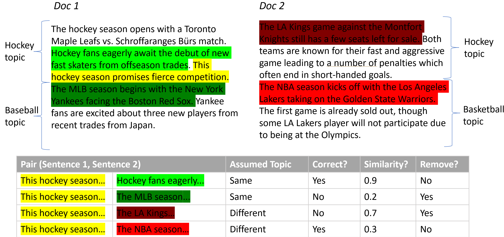

# 通过微调LLM与句子袋技术，实现精准主题建模

发布时间：2024年08月06日

`LLM应用` `文本挖掘` `主题建模`

> Topic Modeling with Fine-tuning LLMs and Bag of Sentences

# 摘要

> 大型语言模型 (LLM) 在主题建模方面正逐渐超越传统模型如 LDA。尽管微调能显著提升 LLM 性能，但人们通常直接使用预训练的 LLM 编码器如 BERT，主要难题在于获取合适的标记数据集。本文中，我们创新地采用句子袋作为主题计算的基本单位，并提出 FT-Topic 方法，通过自动构建训练集的两步过程实现无监督微调：首先，启发式识别主题相关的句子组对；其次，剔除可能错误的标记。微调后的 LLM 编码器可被多种主题建模方法利用。在此基础上，我们进一步开发了 SenClu 这一前沿主题建模技术，它通过期望最大化算法和硬主题分配实现快速推理，并允许用户融入主题-文档分布的先验知识。相关代码已公开在 \url{https://github.com/JohnTailor/FT-Topic}。

> Large language models (LLM)'s are increasingly used for topic modeling outperforming classical topic models such as LDA. Commonly, pre-trained LLM encoders such as BERT are used out-of-the-box despite the fact that fine-tuning is known to improve LLMs considerably. The challenge lies in obtaining a suitable (labeled) dataset for fine-tuning. In this paper, we use the recent idea to use bag of sentences as the elementary unit in computing topics. In turn, we derive an approach FT-Topic to perform unsupervised fine-tuning relying primarily on two steps for constructing a training dataset in an automatic fashion. First, a heuristic method to identifies pairs of sentence groups that are either assumed to be of the same or different topics. Second, we remove sentence pairs that are likely labeled incorrectly. The dataset is then used to fine-tune an encoder LLM, which can be leveraged by any topic modeling approach using embeddings. However, in this work, we demonstrate its effectiveness by deriving a novel state-of-the-art topic modeling method called SenClu, which achieves fast inference through an expectation-maximization algorithm and hard assignments of sentence groups to a single topic, while giving users the possibility to encode prior knowledge on the topic-document distribution. Code is at \url{https://github.com/JohnTailor/FT-Topic}

[Arxiv](https://arxiv.org/abs/2408.03099)