# 揭秘大型语言模型通过知识神经元的实际回忆行为

发布时间：2024年08月06日

`LLM理论` `人工智能` `计算机科学`

> Unveiling Factual Recall Behaviors of Large Language Models through Knowledge Neurons

# 摘要

> 本研究探讨了大型语言模型 (LLM) 在面对推理任务时，是否能有效回忆或检索其内部的事实知识库。通过深入分析 LLM 在推理过程中的知识神经元活动，我们发现 LLM 在特定情况下未能充分利用关键的事实关联，而倾向于采取捷径式的方法解答问题。我们通过手动调整 LLM 的参数化知识回忆过程，证实了优化这一过程能显著提升推理性能，反之则会导致性能下降。此外，我们评估了思维链 (CoT) 提示技术在复杂推理任务中的应用效果，发现 CoT 能通过促进有序和可靠的推理过程，增强 LLM 对事实知识的回忆。最后，我们还研究了上下文冲突对推理过程中事实检索的影响，以全面揭示 LLM 的事实回忆机制。相关代码和数据即将公开。

> In this paper, we investigate whether Large Language Models (LLMs) actively recall or retrieve their internal repositories of factual knowledge when faced with reasoning tasks. Through an analysis of LLMs' internal factual recall at each reasoning step via Knowledge Neurons, we reveal that LLMs fail to harness the critical factual associations under certain circumstances. Instead, they tend to opt for alternative, shortcut-like pathways to answer reasoning questions. By manually manipulating the recall process of parametric knowledge in LLMs, we demonstrate that enhancing this recall process directly improves reasoning performance whereas suppressing it leads to notable degradation. Furthermore, we assess the effect of Chain-of-Thought (CoT) prompting, a powerful technique for addressing complex reasoning tasks. Our findings indicate that CoT can intensify the recall of factual knowledge by encouraging LLMs to engage in orderly and reliable reasoning. Furthermore, we explored how contextual conflicts affect the retrieval of facts during the reasoning process to gain a comprehensive understanding of the factual recall behaviors of LLMs. Code and data will be available soon.

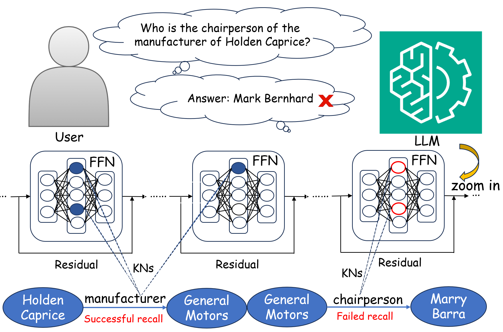

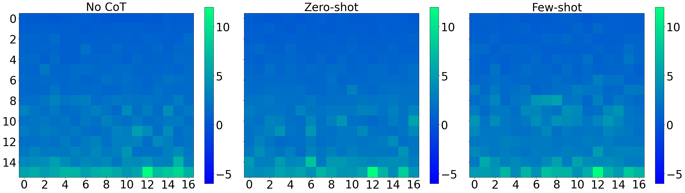

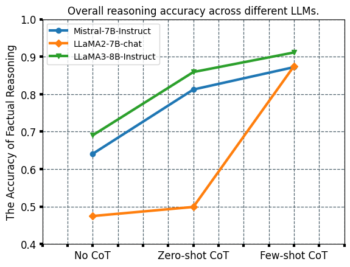

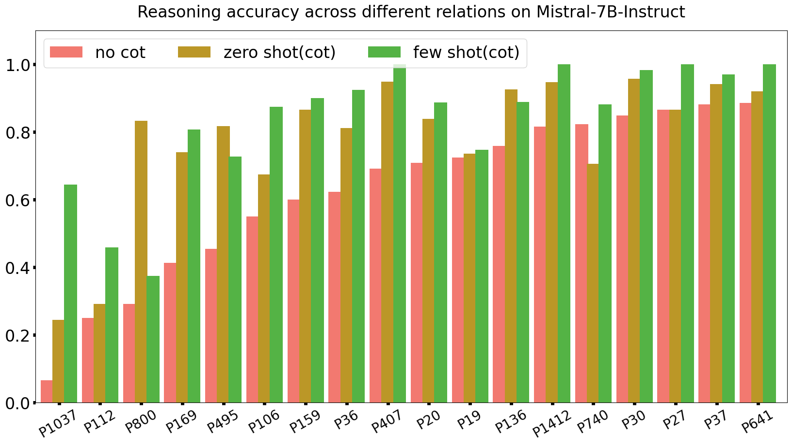

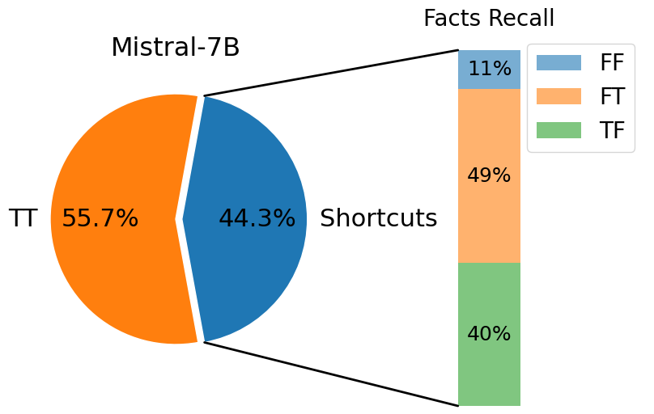

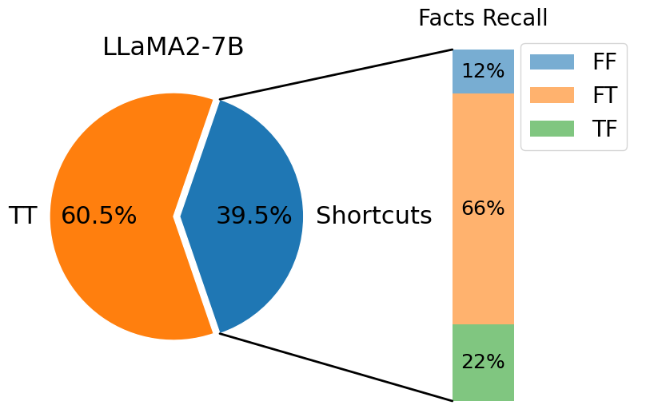

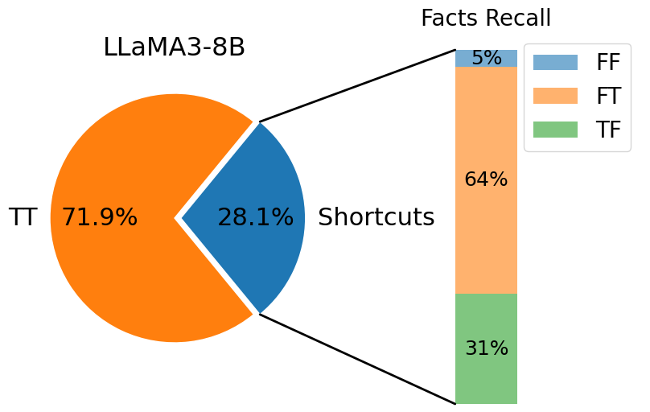

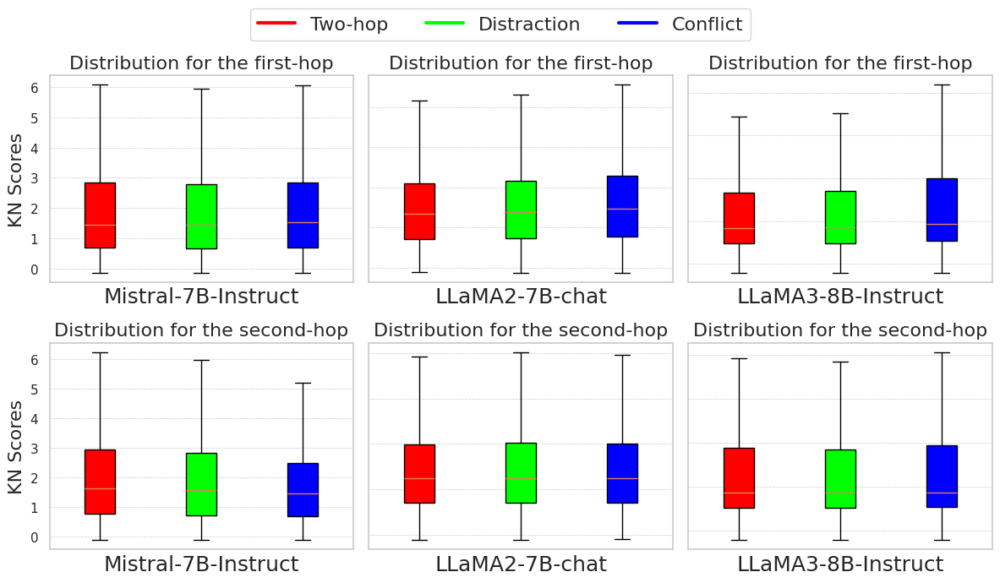

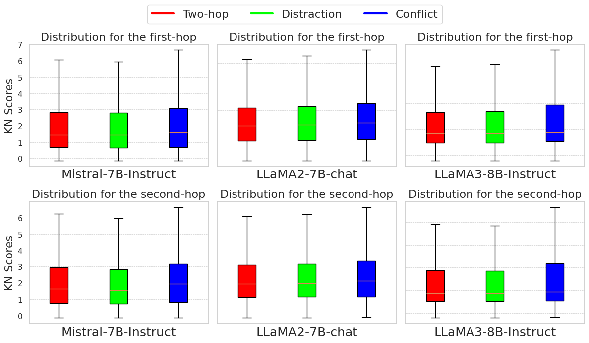

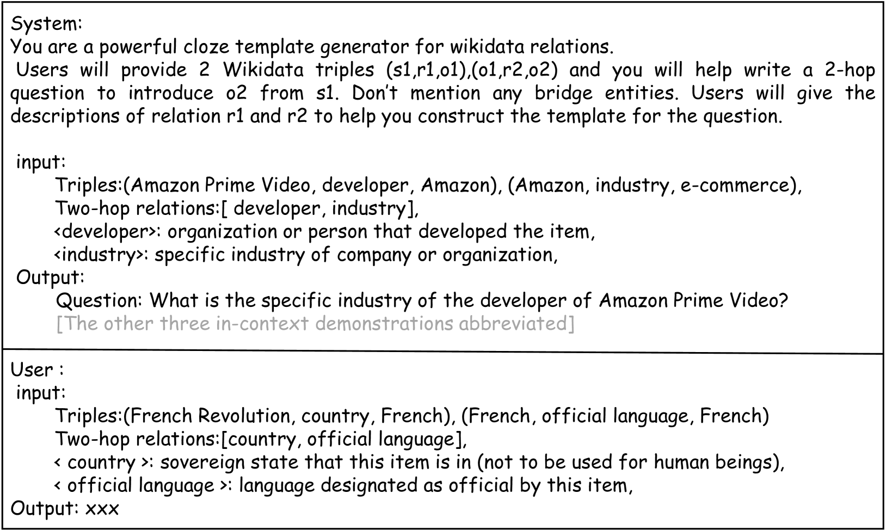

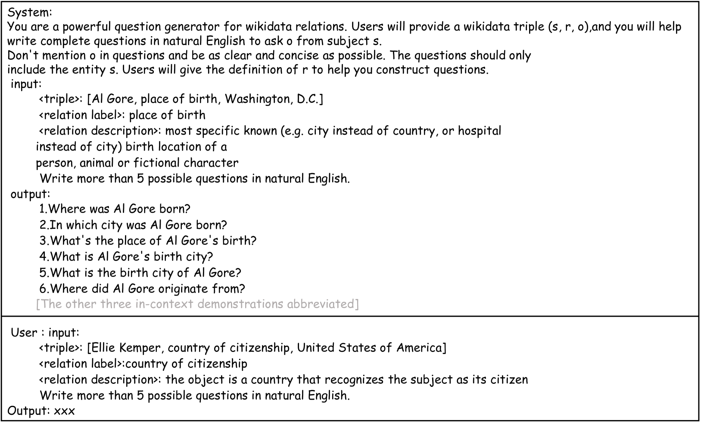

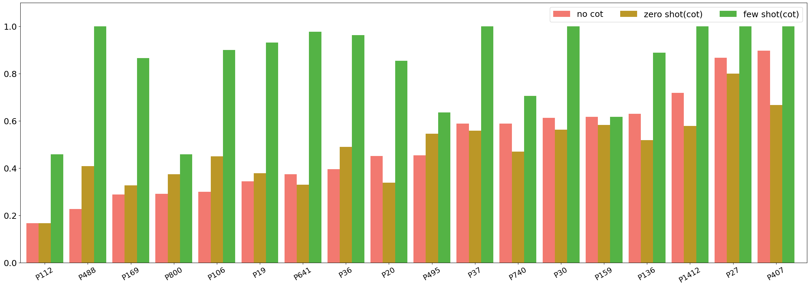

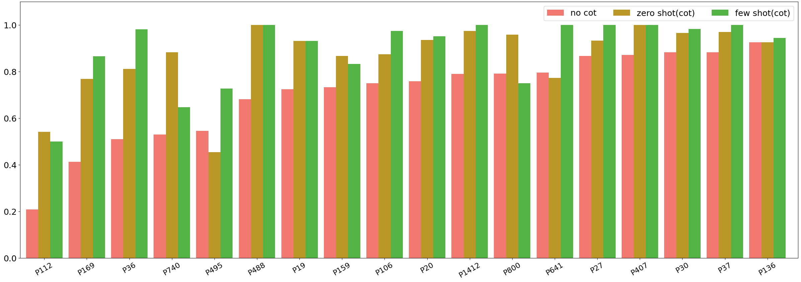

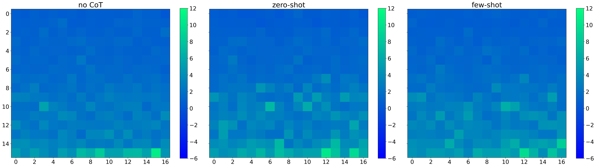

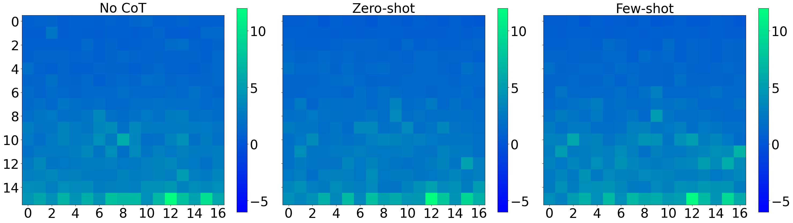

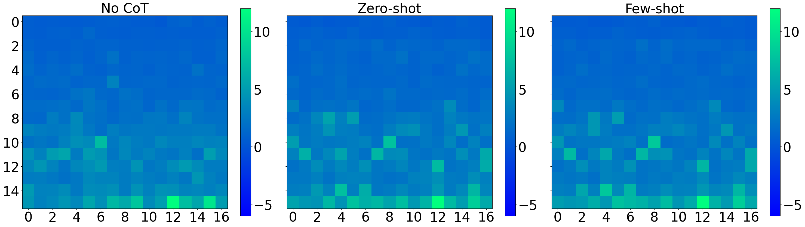

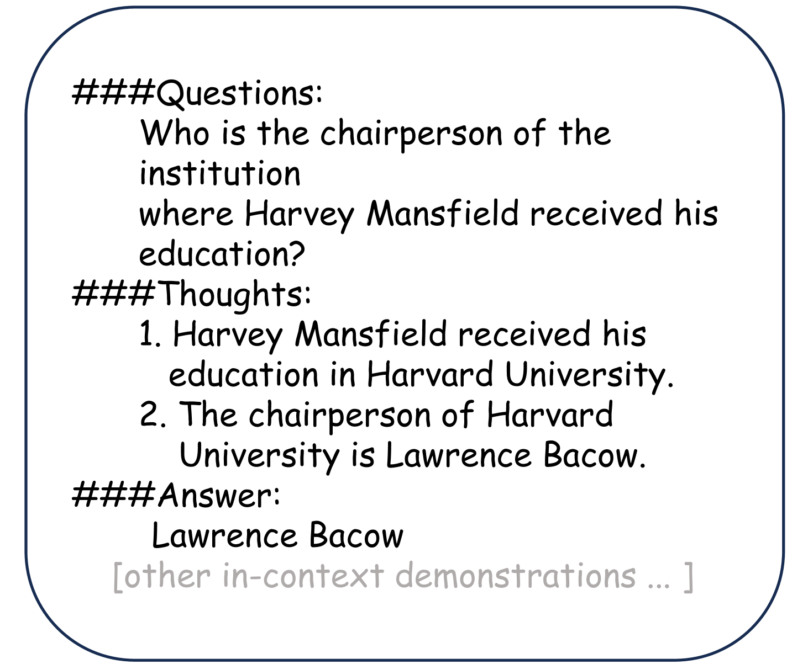

[Arxiv](https://arxiv.org/abs/2408.03247)