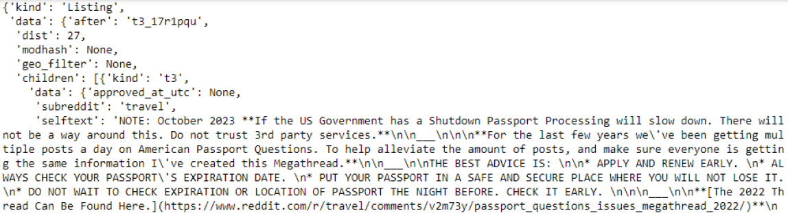
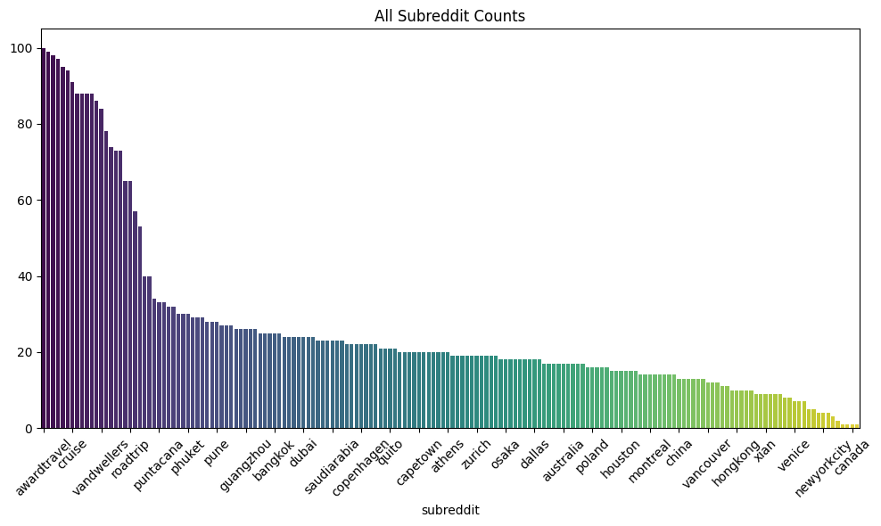
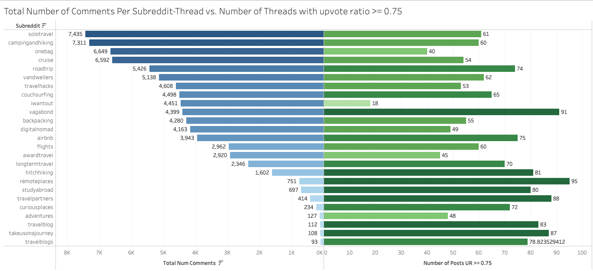

# 旅游聊天机器人用例下的 LLM 微调方法与评估指标比较

发布时间：2024年08月07日

`LLM应用` `人工智能`

> A Comparison of LLM Finetuning Methods & Evaluation Metrics with Travel Chatbot Use Case

# 摘要

> 本研究对比了大型语言模型的微调技术，如QLoRA、RAFT和RLHF，并评估了包括“黄金答案”基准、传统NLP指标、RAG评估、GPT-4指标及人类评价在内的多种评估方法，以旅行聊天机器人为例。我们通过Reddit API收集旅行相关帖子，增强数据集，并使用LLaMa 2 7B和Mistral 7B进行微调实验。结果显示，Mistral RAFT模型在人类和GPT-4评估中表现最佳，经过RLHF训练后成为顶尖模型。研究发现：定量与Ragas指标与人类评价不符，GPT-4评估最贴近人类评价，保持人类参与评估至关重要，传统NLP指标不足，Mistral优于LLaMa，RAFT虽优于QLoRA但需后处理，RLHF大幅提升性能。未来计划提升数据质量、增加数据量、探索RAG方法，并聚焦特定城市数据收集，以精炼数据并打造实用产品。

> This research compares large language model (LLM) fine-tuning methods, including Quantized Low Rank Adapter (QLoRA), Retrieval Augmented fine-tuning (RAFT), and Reinforcement Learning from Human Feedback (RLHF), and additionally compared LLM evaluation methods including End to End (E2E) benchmark method of "Golden Answers", traditional natural language processing (NLP) metrics, RAG Assessment (Ragas), OpenAI GPT-4 evaluation metrics, and human evaluation, using the travel chatbot use case. The travel dataset was sourced from the the Reddit API by requesting posts from travel-related subreddits to get travel-related conversation prompts and personalized travel experiences, and augmented for each fine-tuning method. We used two pretrained LLMs utilized for fine-tuning research: LLaMa 2 7B, and Mistral 7B. QLoRA and RAFT are applied to the two pretrained models. The inferences from these models are extensively evaluated against the aforementioned metrics. The best model according to human evaluation and some GPT-4 metrics was Mistral RAFT, so this underwent a Reinforcement Learning from Human Feedback (RLHF) training pipeline, and ultimately was evaluated as the best model. Our main findings are that: 1) quantitative and Ragas metrics do not align with human evaluation, 2) Open AI GPT-4 evaluation most aligns with human evaluation, 3) it is essential to keep humans in the loop for evaluation because, 4) traditional NLP metrics insufficient, 5) Mistral generally outperformed LLaMa, 6) RAFT outperforms QLoRA, but still needs postprocessing, 7) RLHF improves model performance significantly. Next steps include improving data quality, increasing data quantity, exploring RAG methods, and focusing data collection on a specific city, which would improve data quality by narrowing the focus, while creating a useful product.

[Arxiv](https://arxiv.org/abs/2408.03562)