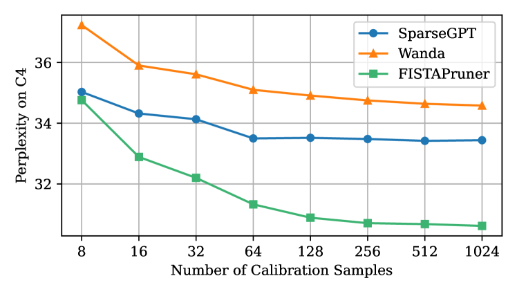

# 大型语言模型的逐层后训练修剪器，基于凸优化技术

发布时间：2024年08月07日

`LLM理论` `计算机科学` `人工智能`

> A Convex-optimization-based Layer-wise Post-training Pruner for Large Language Models

# 摘要

> 剪枝技术是压缩大型语言模型的关键，旨在提升内存效率和计算速度，同时保持性能。然而，现有方法要么需要对庞大的 LLM 进行繁琐的再训练，要么采用可能损害性能的启发式策略。本文提出的 FISTAPruner，作为首个基于凸优化模型的训练后剪枝工具，通过引入 $\ell_1$ 范数和 FISTA 求解器，有效实现了稀疏化。FISTAPruner 还具备层内误差校正和并行剪枝能力，在 OPT、LLaMA 系列模型上的测试表明，它在多种语言任务中均超越了现有顶尖技术。

> Pruning is a critical strategy for compressing trained large language models (LLMs), aiming at substantial memory conservation and computational acceleration without compromising performance. However, existing pruning methods often necessitate inefficient retraining for billion-scale LLMs or rely on heuristic methods such as the optimal brain surgeon framework, which degrade performance. In this paper, we introduce FISTAPruner, the first post-training pruner based on convex optimization models and algorithms. Specifically, we propose a convex optimization model incorporating $\ell_1$ norm to induce sparsity and utilize the FISTA solver for optimization. FISTAPruner incorporates an intra-layer cumulative error correction mechanism and supports parallel pruning. We comprehensively evaluate FISTAPruner on models such as OPT, LLaMA, LLaMA-2, and LLaMA-3 with 125M to 70B parameters under unstructured and 2:4 semi-structured sparsity, demonstrating superior performance over existing state-of-the-art methods across various language benchmarks.

[Arxiv](https://arxiv.org/abs/2408.03728)