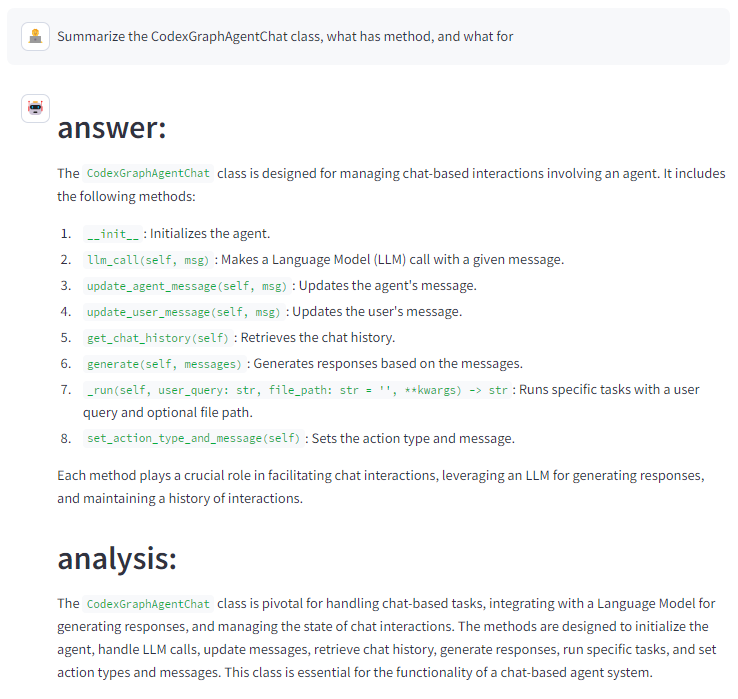

# CodexGraph：架起大型语言模型与代码仓库之间的桥梁，借助代码图数据库实现连接。

发布时间：2024年08月07日

`Agent` `软件工程` `人工智能`

> CodexGraph: Bridging Large Language Models and Code Repositories via Code Graph Databases

# 摘要

> 大型语言模型 (LLM) 在独立代码任务如 HumanEval 和 MBPP 中表现卓越，但在处理整个代码库时面临挑战。为此，我们研究了在仓库规模上增强 LLM 与代码库交互的方法。现有解决方案如基于相似性的检索或手动工具和 API 各有不足，前者在复杂任务中召回率低，后者则需要专家知识且通用性有限。为此，我们开发了 \framework，该系统结合 LLM 代理与从代码库提取的图数据库接口，利用图数据库的结构特性和图查询语言的灵活性，使 LLM 代理能够进行精确的代码结构感知检索和导航。我们通过 CrossCodeEval、SWE-bench 和 EvoCodeBench 三个基准测试评估了 \framework，并开发了五个实际编码应用。\framework 在学术和实际环境中均展现了出色的性能和潜力，证明了其在软件工程中的多功能性和有效性。应用演示链接：https://github.com/modelscope/modelscope-agent/tree/master/apps/codexgraph_agent。

> Large Language Models (LLMs) excel in stand-alone code tasks like HumanEval and MBPP, but struggle with handling entire code repositories. This challenge has prompted research on enhancing LLM-codebase interaction at a repository scale. Current solutions rely on similarity-based retrieval or manual tools and APIs, each with notable drawbacks. Similarity-based retrieval often has low recall in complex tasks, while manual tools and APIs are typically task-specific and require expert knowledge, reducing their generalizability across diverse code tasks and real-world applications. To mitigate these limitations, we introduce \framework, a system that integrates LLM agents with graph database interfaces extracted from code repositories. By leveraging the structural properties of graph databases and the flexibility of the graph query language, \framework enables the LLM agent to construct and execute queries, allowing for precise, code structure-aware context retrieval and code navigation. We assess \framework using three benchmarks: CrossCodeEval, SWE-bench, and EvoCodeBench. Additionally, we develop five real-world coding applications. With a unified graph database schema, \framework demonstrates competitive performance and potential in both academic and real-world environments, showcasing its versatility and efficacy in software engineering. Our application demo: https://github.com/modelscope/modelscope-agent/tree/master/apps/codexgraph_agent.

[Arxiv](https://arxiv.org/abs/2408.03910)