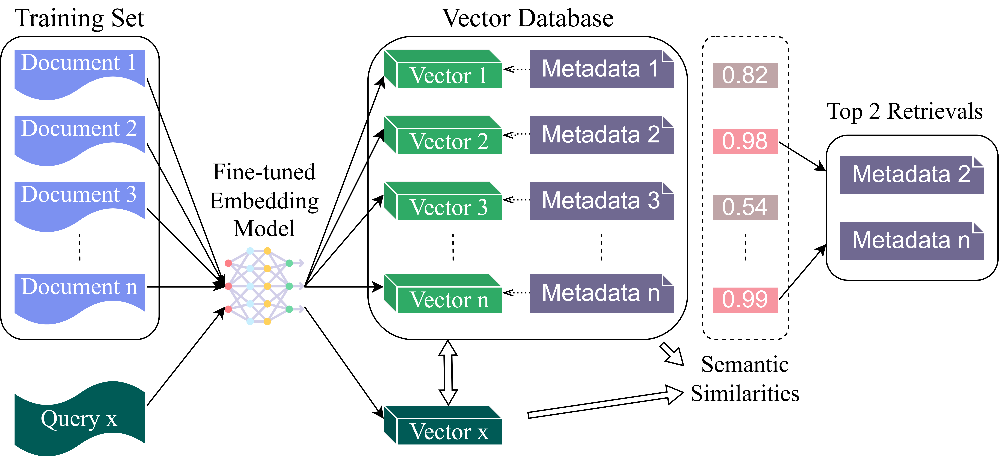
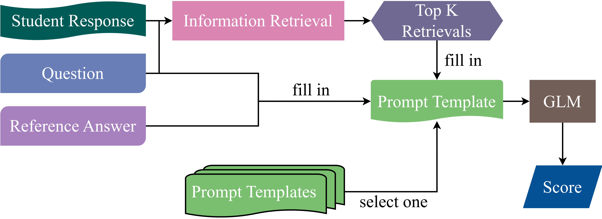

# 结合检索增强技术的生成语言模型，助力自动化简短答案评分

发布时间：2024年08月07日

`LLM应用`

> Generative Language Models with Retrieval Augmented Generation for Automated Short Answer Scoring

# 摘要

> 自动简答评分（ASAS）在教育评估中至关重要。传统方法依赖规则或深度学习，而生成语言模型（GLMs）的进步为ASAS带来了新机遇。本研究利用GLMs的多领域性能，提出结合向量数据库、变换器编码器和GLMs的新流程，以提升评分准确性。我们存储训练数据，推理时检索相似答案，并由GLM分析评分。通过优化检索和提示设计，系统在SemEval 2013数据集上显著超越现有方法，展示了GLMs在ASAS领域的巨大潜力。

> Automated Short Answer Scoring (ASAS) is a critical component in educational assessment. While traditional ASAS systems relied on rule-based algorithms or complex deep learning methods, recent advancements in Generative Language Models (GLMs) offer new opportunities for improvement. This study explores the application of GLMs to ASAS, leveraging their off-the-shelf capabilities and performance in various domains. We propose a novel pipeline that combines vector databases, transformer-based encoders, and GLMs to enhance short answer scoring accuracy. Our approach stores training responses in a vector database, retrieves semantically similar responses during inference, and employs a GLM to analyze these responses and determine appropriate scores. We further optimize the system through fine-tuned retrieval processes and prompt engineering. Evaluation on the SemEval 2013 dataset demonstrates a significant improvement on the SCIENTSBANK 3-way and 2-way tasks compared to existing methods, highlighting the potential of GLMs in advancing ASAS technology.

[Arxiv](https://arxiv.org/abs/2408.03811)