# In2Core：借助影响力函数优化大型语言模型指令微调中的核心集选择

发布时间：2024年08月07日

`LLM理论` `人工智能` `开源社区`

> In2Core: Leveraging Influence Functions for Coreset Selection in Instruction Finetuning of Large Language Models

# 摘要

> 尽管技术进步，微调 LLM 因参数众多和数据需求巨大而成本高昂，计算资源可及性成开源社区难题。为此，我们创新 In2Core 算法，通过分析训练与评估样本与模型间的关联，精选核心集。我们利用模型内部梯度评估此关联，优化训练点贡献排序。为提升效率，我们简化影响函数计算层数，保持精度。应用此算法于 LLM 微调，仅需半数训练数据即可达同等性能。同时，影响函数分析模型对测试样本的覆盖，为训练集覆盖度提供可靠可解释的信号。

> Despite advancements, fine-tuning Large Language Models (LLMs) remains costly due to the extensive parameter count and substantial data requirements for model generalization. Accessibility to computing resources remains a barrier for the open-source community. To address this challenge, we propose the In2Core algorithm, which selects a coreset by analyzing the correlation between training and evaluation samples with a trained model. Notably, we assess the model's internal gradients to estimate this relationship, aiming to rank the contribution of each training point. To enhance efficiency, we propose an optimization to compute influence functions with a reduced number of layers while achieving similar accuracy. By applying our algorithm to instruction fine-tuning data of LLMs, we can achieve similar performance with just 50% of the training data. Meantime, using influence functions to analyze model coverage to certain testing samples could provide a reliable and interpretable signal on the training set's coverage of those test points.

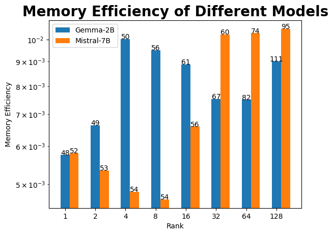

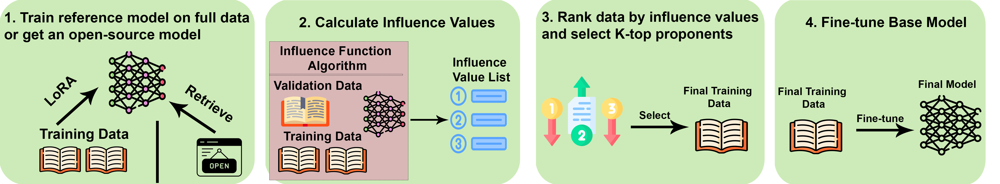

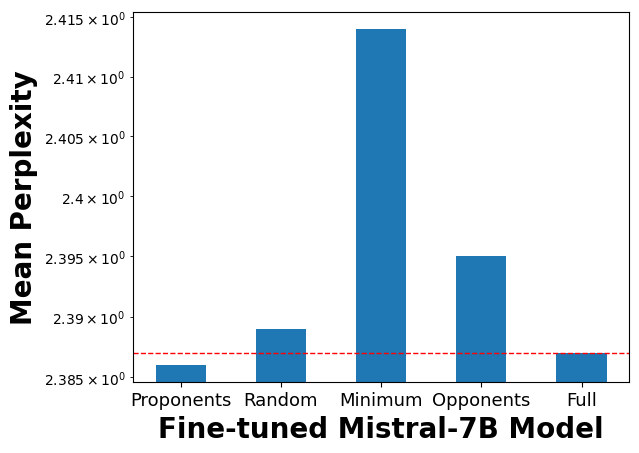

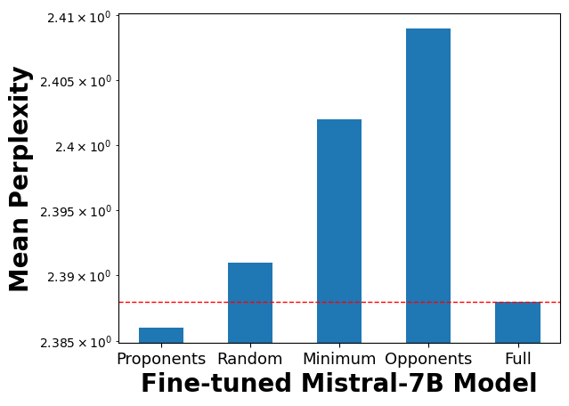

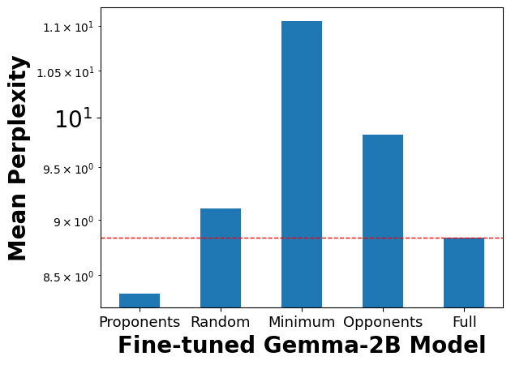

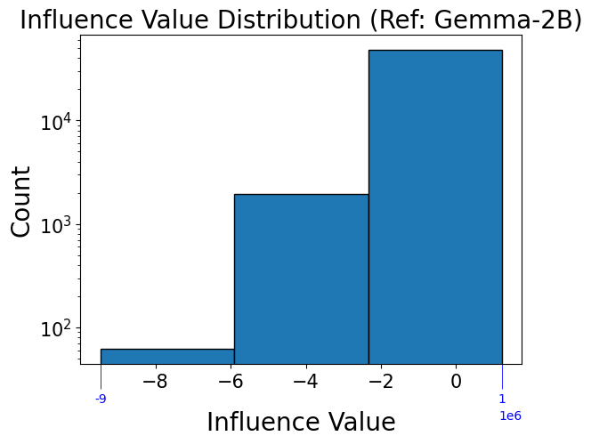

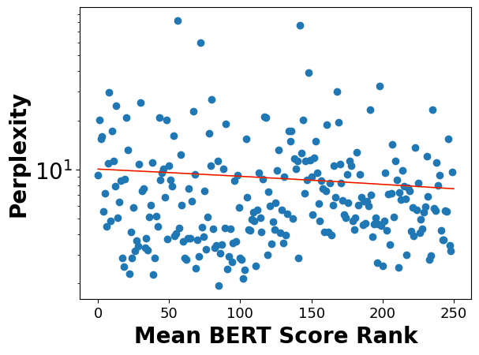

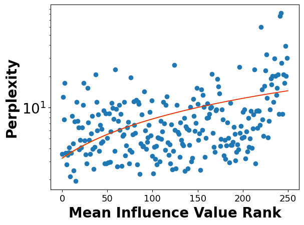

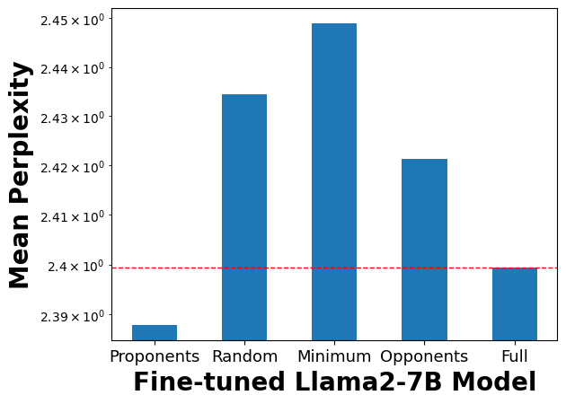

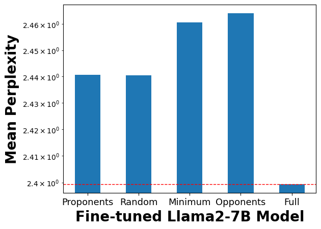

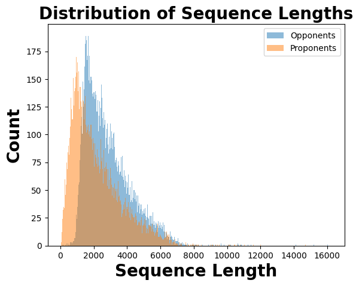

[Arxiv](https://arxiv.org/abs/2408.03560)