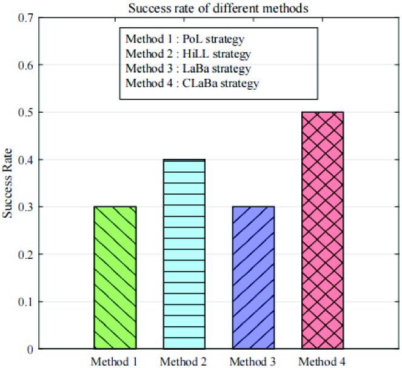

# 利用大型语言模型进行基站智能选址，通过提示或代理实现高效部署。

发布时间：2024年08月07日

`Agent` `网络优化` `人工智能`

> Large Language Models for Base Station Siting: Intelligent Deployment based on Prompt or Agent

# 摘要

> 随着大型语言模型（LLM）技术的进步，特别是在提示工程和代理工程领域，网络优化正迎来一场革命。本研究探索了一种新方法，通过精心设计的提示将人类智慧融入LLM，并利用自主代理作为桥梁，实现机器与人类的无缝沟通。我们开发了一个LLM赋能的BSS优化框架，并提出了四种创新策略：提示优化的LLM（PoL）、人机协同的LLM（HiLL）、LLM赋能的自主BSS代理（LaBa）和多LLM协作的自主BSS代理（CLaBa）。实验证明，这些方法能显著提升网络部署的效率和可靠性，同时减少人工负担。

> Traditional base station siting (BSS) methods rely heavily on drive testing and user feedback, which are laborious and require extensive expertise in communication, networking, and optimization. As large language models (LLMs) and their associated technologies advance, particularly in the realms of prompt engineering and agent engineering, network optimization will witness a revolutionary approach. This approach entails the strategic use of well-crafted prompts to infuse human experience and knowledge into these sophisticated LLMs, and the deployment of autonomous agents as a communication bridge to seamlessly connect the machine language based LLMs with human users using natural language. This integration represents the future paradigm of artificial intelligence (AI) as a service and AI for more ease. As a preliminary exploration, this research first develops a novel LLM-empowered BSS optimization framework, and heuristically proposes four different potential implementations: the strategies based on Prompt-optimized LLM (PoL), human-in-the-Loop LLM (HiLL), LLM-empowered autonomous BSS agent (LaBa), and Cooperative multiple LLM-based autonomous BSS agents (CLaBa). Through evaluation on real-world data, the experiments demonstrate that prompt-assisted LLMs and LLM-based agents can generate more efficient, cost-effective, and reliable network deployments, noticeably enhancing the efficiency of BSS optimization and reducing trivial manual participation.

[Arxiv](https://arxiv.org/abs/2408.03631)