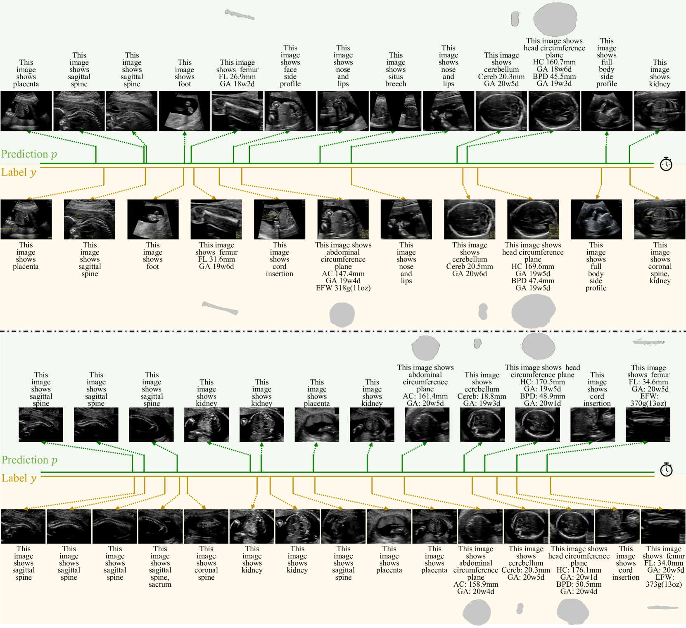

# MMSummary：胎儿超声视频的多模态摘要生成

发布时间：2024年08月07日

`LLM应用` `医学影像`

> MMSummary: Multimodal Summary Generation for Fetal Ultrasound Video

# 摘要

> 我们推出了首个自动化多模态医学影像视频摘要系统MMSummary，专注于胎儿超声分析。该系统仿照人类超声师的检查流程，分为三个阶段：关键帧检测、字幕生成及解剖结构分割与测量。在关键帧检测阶段，我们创新性地设计了一个自动化流程，精简地选取关键帧，确保视频信息完整无冗余。接着，我们利用大型语言模型为胎儿超声关键帧生成富含信息的字幕。若关键帧涉及胎儿生物测量，系统会依据字幕内容进行目标区域分割并计算相关参数。实验显示，MMSummary能大幅缩短扫描时间（约31.5%），有望显著提升临床工作效率。

> We present the first automated multimodal summary generation system, MMSummary, for medical imaging video, particularly with a focus on fetal ultrasound analysis. Imitating the examination process performed by a human sonographer, MMSummary is designed as a three-stage pipeline, progressing from keyframe detection to keyframe captioning and finally anatomy segmentation and measurement. In the keyframe detection stage, an innovative automated workflow is proposed to progressively select a concise set of keyframes, preserving sufficient video information without redundancy. Subsequently, we adapt a large language model to generate meaningful captions for fetal ultrasound keyframes in the keyframe captioning stage. If a keyframe is captioned as fetal biometry, the segmentation and measurement stage estimates biometric parameters by segmenting the region of interest according to the textual prior. The MMSummary system provides comprehensive summaries for fetal ultrasound examinations and based on reported experiments is estimated to reduce scanning time by approximately 31.5%, thereby suggesting the potential to enhance clinical workflow efficiency.

[Arxiv](https://arxiv.org/abs/2408.03761)