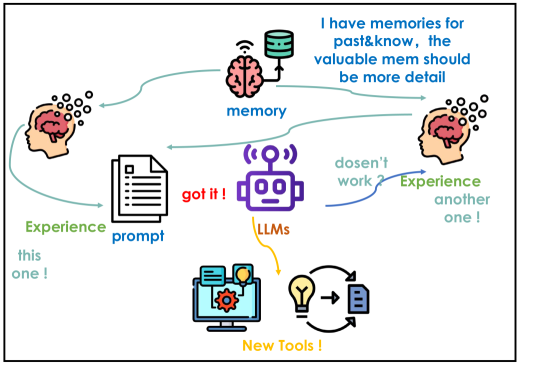
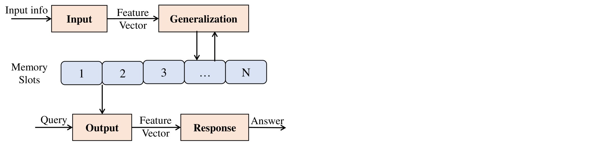
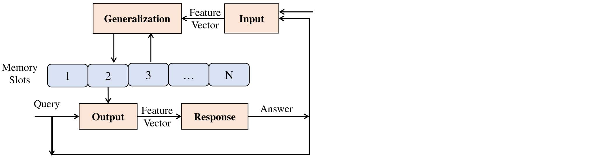
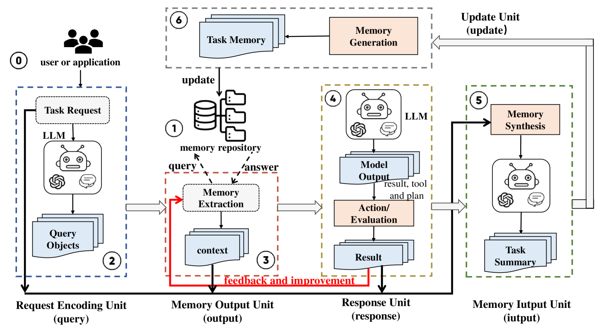
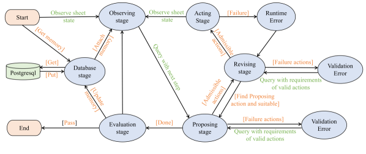

# MaxMind：借助大型语言模型的力量，通过内存循环网络提升软件开发效率

发布时间：2024年08月07日

`LLM应用` `软件开发` `人工智能`

> MaxMind: A Memory Loop Network to Enhance Software Productivity based on Large Language Models

# 摘要

> 大型语言模型在提升软件生产力方面的应用，如同人类早期利用工具加速文明进步，正推动自动化软件操作与工具生成（SOTG）。这些复杂任务需AI持续优化。然而，现有研究常忽略实时任务经验向系统记忆的转化及知识未来价值的区分。本文通过进化外部记忆模型为Memory-Loop网络，实现及时记忆与经验引用，解决这一问题。同时，我们通过知识精确分割强化RAG机制，基于价值差异利用记忆，并设计MaxMind模型用于SOTG。为验证此方法，我们开发了MaxMind4Sheet电子表格处理系统。对比实验显示，任务记忆的积累与循环显著提升任务成功率，每轮提升约3%-6%。随着记忆增长，累积改进将更显著。记忆循环还能提升系统效率达25%，并通过记忆转移解决LLM处理专业任务时的再训练难题。这表明MaxMind在增强SOTG中LLM系统能力与生产力方面潜力巨大。

> The application of large language models to facilitate automated software operations and tool generation (SOTG), thus augmenting software productivity, mirrors the early stages of human evolution when the ability to create and use tools accelerated the progress of civilization. These complex tasks require AI to continuously summarize and improve. Current research often overlooks the importance of converting real-time task experiences into system memory and differentiating the value of existing knowledge for future reference. This paper addresses these issues by evolving external memory models into Memory-Loop Networks for timely memorization and experience referencing. We also enhance a RAG mechanism with knowledge precision segmentation to utilize memory based on value differentiation, and design the MaxMind model for SOTG accordingly.To demonstrate our approach, we developed MaxMind4Sheet, an electronic spreadsheet processing system aligned with the MaxMind philosophy. Comparative experiments with SheetCopilot have demonstrated that the accumulation and recycling of task memories lead to a steady enhancement in task success rate, with an improvement rate of approximately 3%-6% per round in this implementation example. Note that as the memories continue to grow, this cumulative improvement may be substantial. The inclusion of memory recycling can also boost the system's task execution efficiency by up to 25%, and it can address the retraining issue faced by LLMs when handling specialized tasks through memories transfer.These suggest that MaxMind has significant potential to enhance the capabilities and productivity of LLM systems in SOTG.

[Arxiv](https://arxiv.org/abs/2408.03841)