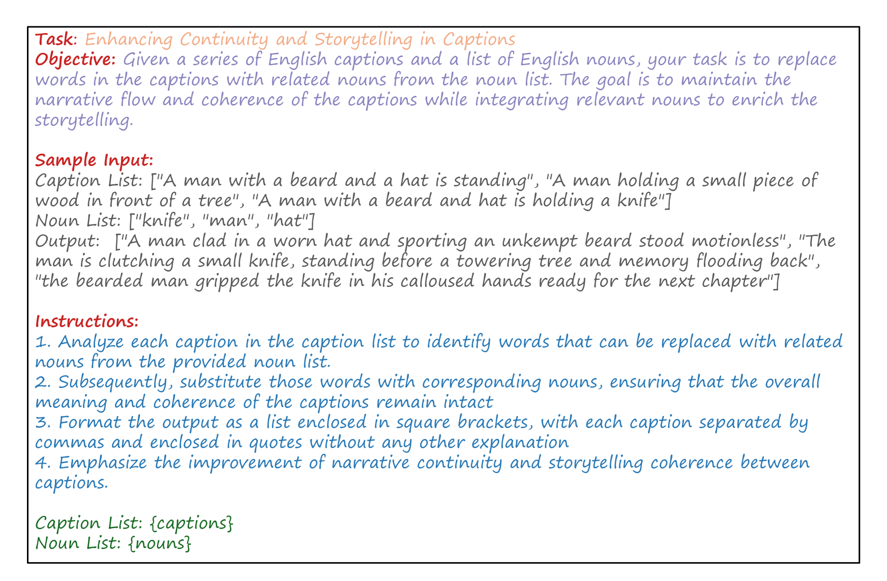
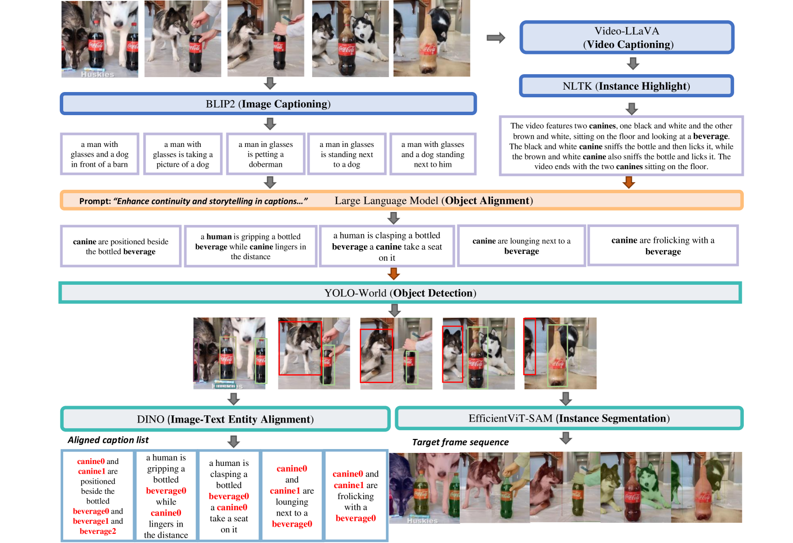
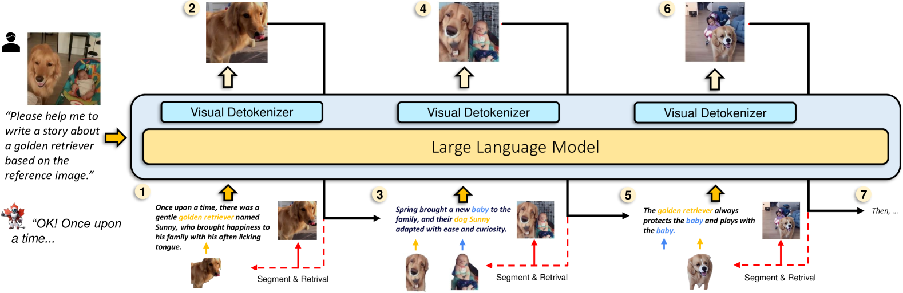
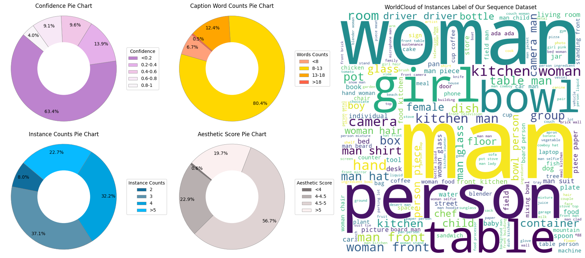
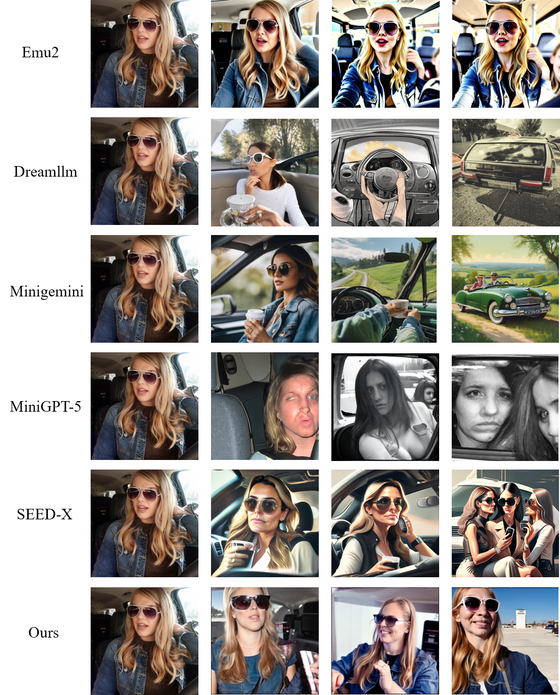

# Openstory++：大规模数据集与基准，专为开放领域中实例感知的视觉故事创作而设。

发布时间：2024年08月07日

`LLM应用` `媒体与娱乐`

> Openstory++: A Large-scale Dataset and Benchmark for Instance-aware Open-domain Visual Storytelling

# 摘要

> 最新的图像生成技术虽能从简短描述中创造精美图片，但在长篇内容下，多图间实例一致性却难以维持。这主要源于现有数据集缺乏细致的实例特征标记。为此，我们推出了Openstory++，一个融合了实例级注释的大规模数据集，并创新训练方法，聚焦实体为中心的图文生成，确保视觉与文本信息有效融合。Openstory++还优化了开放领域视频的关键帧提取，并借助大型语言模型提升描述的叙事连贯性。它以更丰富的开放领域资源超越前人，涵盖自动字幕、高分辨率图像及长帧序列，强化时间一致性。我们还首创了Cohere-Bench基准，评估长篇多模态上下文中的图像生成，确保背景、风格、实例的连贯性。与现有基准相比，我们的工作填补了多模态生成的关键空白，推动了开放领域复杂叙事生成与解读模型的发展。实验证明，Openstory++在培养高质量视觉叙事模型方面表现卓越，提升了处理开放领域生成任务的能力。更多详情，请访问https://openstorypp.github.io/。

> Recent image generation models excel at creating high-quality images from brief captions. However, they fail to maintain consistency of multiple instances across images when encountering lengthy contexts. This inconsistency is largely due to in existing training datasets the absence of granular instance feature labeling in existing training datasets. To tackle these issues, we introduce Openstory++, a large-scale dataset combining additional instance-level annotations with both images and text. Furthermore, we develop a training methodology that emphasizes entity-centric image-text generation, ensuring that the models learn to effectively interweave visual and textual information. Specifically, Openstory++ streamlines the process of keyframe extraction from open-domain videos, employing vision-language models to generate captions that are then polished by a large language model for narrative continuity. It surpasses previous datasets by offering a more expansive open-domain resource, which incorporates automated captioning, high-resolution imagery tailored for instance count, and extensive frame sequences for temporal consistency. Additionally, we present Cohere-Bench, a pioneering benchmark framework for evaluating the image generation tasks when long multimodal context is provided, including the ability to keep the background, style, instances in the given context coherent. Compared to existing benchmarks, our work fills critical gaps in multi-modal generation, propelling the development of models that can adeptly generate and interpret complex narratives in open-domain environments. Experiments conducted within Cohere-Bench confirm the superiority of Openstory++ in nurturing high-quality visual storytelling models, enhancing their ability to address open-domain generation tasks. More details can be found at https://openstorypp.github.io/

[Arxiv](https://arxiv.org/abs/2408.03695)