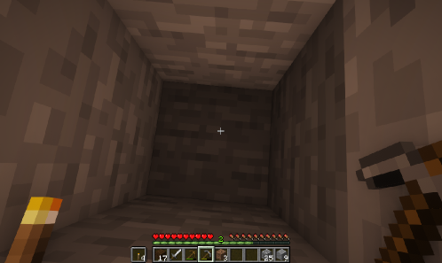

# Optimus-1 通过混合多模态记忆技术，使代理在处理长时程任务时表现卓越。

发布时间：2024年08月07日

`Agent` `人工智能`

> Optimus-1: Hybrid Multimodal Memory Empowered Agents Excel in Long-Horizon Tasks

# 摘要

> 在人工智能领域，打造一个全能型代理一直是我们的梦想。尽管现有代理在多个领域取得了不俗的成绩，但在开放世界中执行长期任务时仍显力不从心。究其原因，在于它们缺乏必要的世界知识和多模态经验，这些是完成复杂长期任务的关键。为此，我们设计了一个混合多模态记忆模块，该模块通过1）构建分层有向知识图来明确表达和学习世界知识，以及2）创建抽象多模态经验池来提供丰富的学习参考，从而助力代理应对挑战。基于此模块，我们打造了多模态代理Optimus-1，它拥有知识引导的规划器和经验驱动的反射器，使其在Minecraft中的长期任务处理上表现卓越。实验证明，Optimus-1在多项长期任务基准测试中大幅领先现有代理，甚至在许多任务上达到了人类水平。同时，我们还整合了多模态大型语言模型（MLLMs）作为其核心，实验显示，Optimus-1凭借混合多模态记忆模块的加持，在多个任务上超越了GPT-4V的表现。

> Building a general-purpose agent is a long-standing vision in the field of artificial intelligence. Existing agents have made remarkable progress in many domains, yet they still struggle to complete long-horizon tasks in an open world. We attribute this to the lack of necessary world knowledge and multimodal experience that can guide agents through a variety of long-horizon tasks. In this paper, we propose a Hybrid Multimodal Memory module to address the above challenges. It 1) transforms knowledge into Hierarchical Directed Knowledge Graph that allows agents to explicitly represent and learn world knowledge, and 2) summarises historical information into Abstracted Multimodal Experience Pool that provide agents with rich references for in-context learning. On top of the Hybrid Multimodal Memory module, a multimodal agent, Optimus-1, is constructed with dedicated Knowledge-guided Planner and Experience-Driven Reflector, contributing to a better planning and reflection in the face of long-horizon tasks in Minecraft. Extensive experimental results show that Optimus-1 significantly outperforms all existing agents on challenging long-horizon task benchmarks, and exhibits near human-level performance on many tasks. In addition, we introduce various Multimodal Large Language Models (MLLMs) as the backbone of Optimus-1. Experimental results show that Optimus-1 exhibits strong generalization with the help of the Hybrid Multimodal Memory module, outperforming the GPT-4V baseline on many tasks.

[Arxiv](https://arxiv.org/abs/2408.03615)