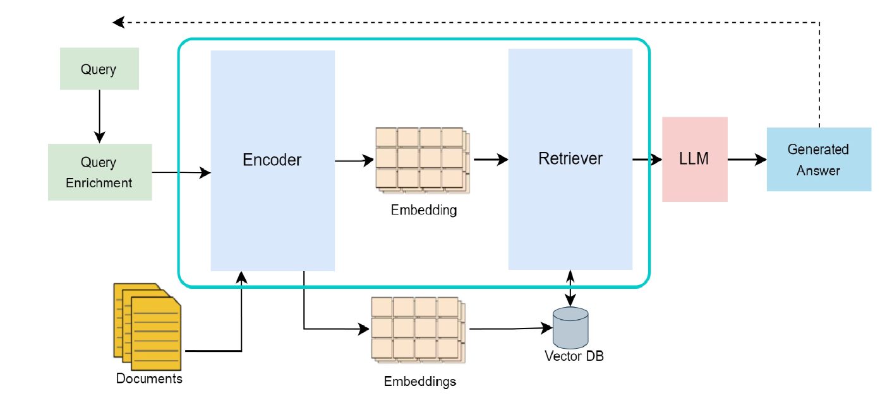
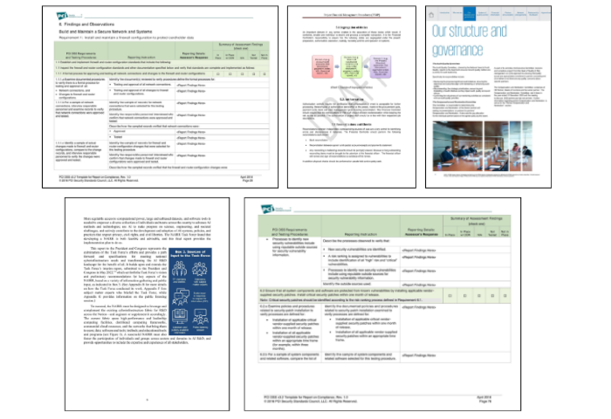
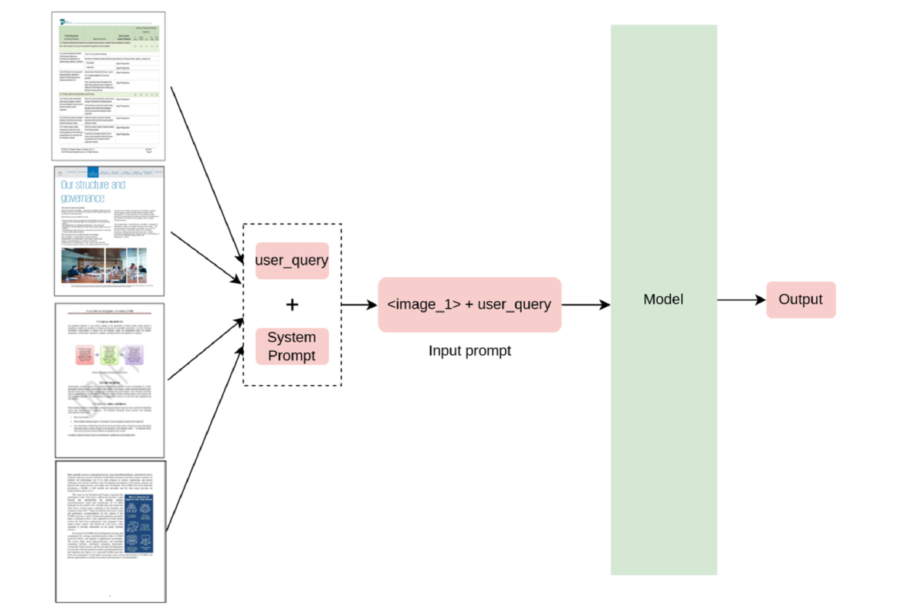
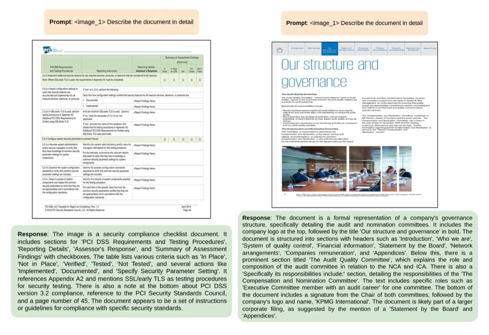
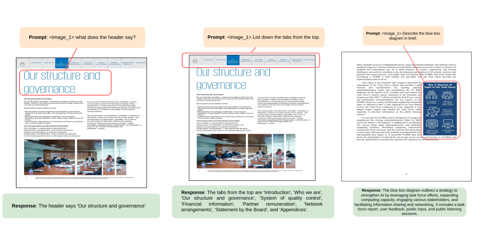

# 利用目标提示进行信息提取，结合视觉语言模型技术。

发布时间：2024年08月07日

`LLM应用` `信息提取` `问答系统`

> Target Prompting for Information Extraction with Vision Language Model

# 摘要

> 大型视觉和语言模型的最新进展为信息提取系统带来了革新。VLMs凭借其尖端技术，在文档理解和跨行业问答系统构建方面树立了新标杆。它们在从文档图像生成文本和提供精准答案方面表现卓越。然而，利用这些模型构建高效对话系统仍存挑战。通用提示技术往往不适用于这些特制的视觉语言模型，导致输出普通且可能与文档实际内容存在信息断层。为获取更精确具体的答案，视觉语言模型需结合文档图像，采用针对性强的提示。本文探讨的“目标提示”技术，即精准定位文档图像特定部分并据此生成答案，并评估了不同提示技术在应对多样用户查询时的表现。

> The recent trend in the Large Vision and Language model has brought a new change in how information extraction systems are built. VLMs have set a new benchmark with their State-of-the-art techniques in understanding documents and building question-answering systems across various industries. They are significantly better at generating text from document images and providing accurate answers to questions. However, there are still some challenges in effectively utilizing these models to build a precise conversational system. General prompting techniques used with large language models are often not suitable for these specially designed vision language models. The output generated by such generic input prompts is ordinary and may contain information gaps when compared with the actual content of the document. To obtain more accurate and specific answers, a well-targeted prompt is required by the vision language model, along with the document image. In this paper, a technique is discussed called Target prompting, which focuses on explicitly targeting parts of document images and generating related answers from those specific regions only. The paper also covers the evaluation of response for each prompting technique using different user queries and input prompts.

[Arxiv](https://arxiv.org/abs/2408.03834)