# 突破非母语环境的限制：通过母语提示，有效促进知识的引出。

发布时间：2024年08月07日

`LLM应用` `人工智能` `语言处理`

> Unlocking the Non-Native Language Context Limitation: Native Language Prompting Facilitates Knowledge Elicitation

# 摘要

> 多语言大型语言模型 (MLLMs) 在应对非主流语言问题时显得力不从心，尽管它们已从主流语言语料库中汲取了知识。相反，人类多语言者能通过正向母语转移 (PNLT) 利用母语文本中的丰富知识来解决这一难题。受此启发，我们提出母语提示 (NatLan) 策略，模拟人类多语言者的 PNLT 现象，为 MLLMs 构建母语环境，以在问答时激发其母语知识的潜力，突破非母语环境的限制。通过多 MLLM 协作，NatLan 不仅减轻了每个模型的负担，还优化了语义传递。在 C-Eval 基准测试中，NatLan 为五个 MLLMs 带来了高达 10.1% 的平均准确度提升，以及硬级别子集高达 5.0% 的增长，超越了所有同类顶尖方法。我们的代码已公开在 https://github.com/AnonyNLP/NatLan。

> Multilingual large language models (MLLMs) struggle to answer questions posed in non-dominant languages, even though they have already acquired the relevant knowledge from their dominant language corpus. In contrast, human multilinguals can overcome this issue by invoking the relatively rich knowledge acquired from native language texts through Positive Native Language Transfer (PNLT). Inspired by this, we analogize the dominant language of MLLMs to the native language of human multilinguals, and propose Native Language Prompting (NatLan) to simulate the PNLT observed in human multilinguals. It explicitly creates native language contexts for MLLMs to facilitate the elicitation of the rich native language knowledge during question-answering, unlocking the limitations imposed by non-native language contexts on the effective application of knowledge. By employing multi-MLLM collaboration, NatLan reduces the workload on each MLLM in simulating PNLT and refines semantic transfer. On the C-Eval benchmark, NatLan provides up to a 10.1% average accuracy improvement and up to a 5.0% increase in the hard-level subset across five MLLMs, surpassing all top-notch related methods. Our code is available at https://github.com/AnonyNLP/NatLan.

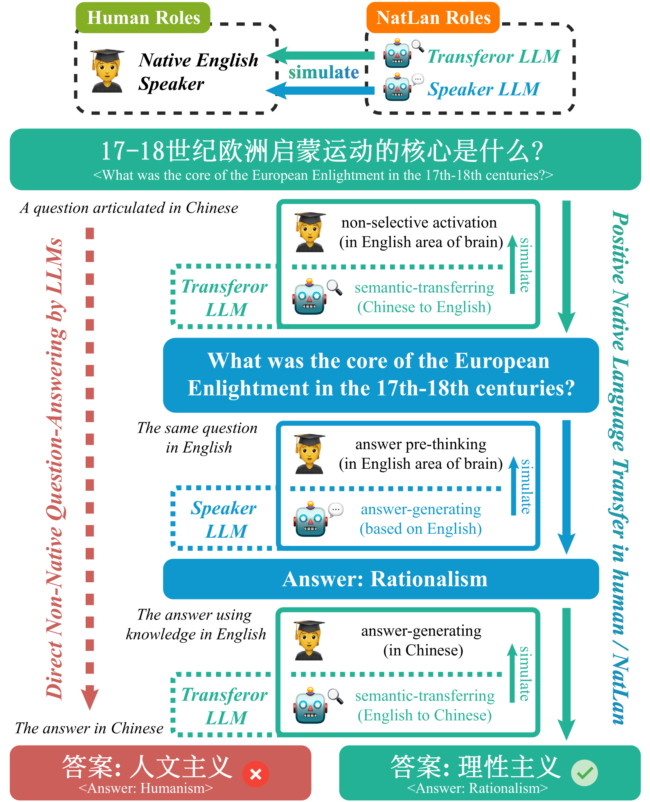

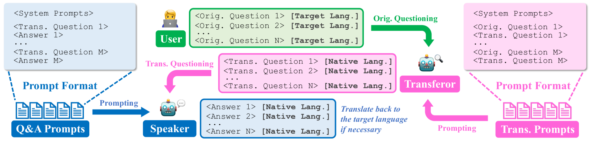

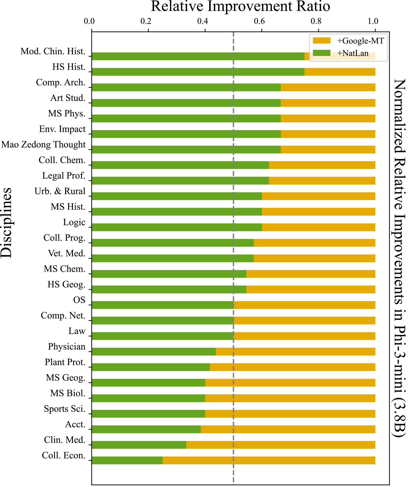

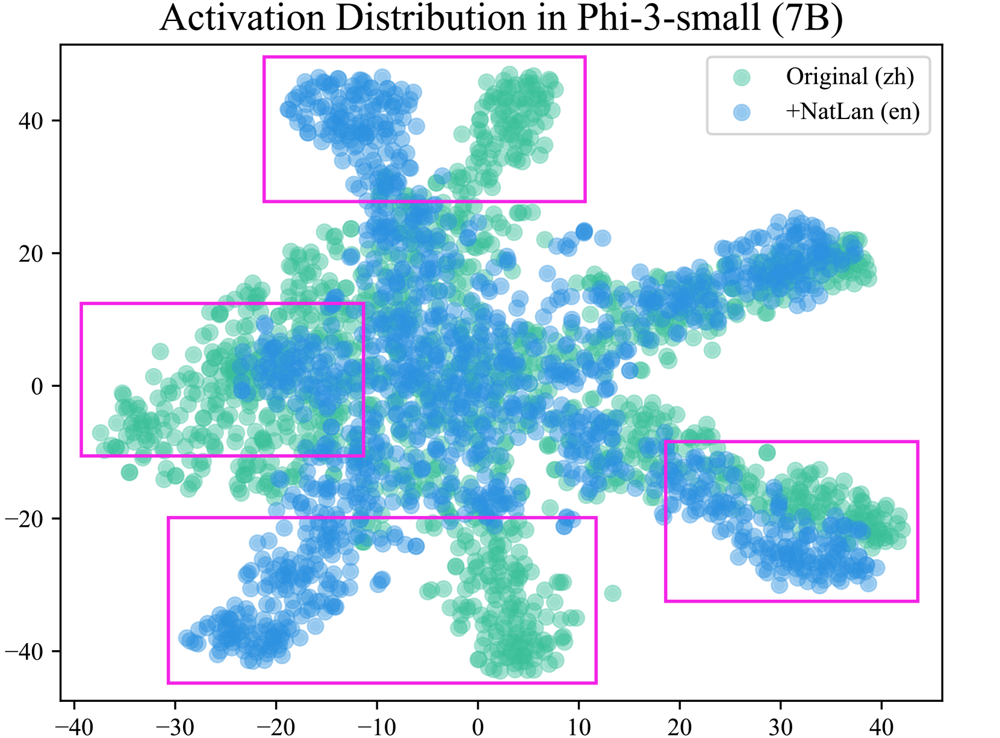

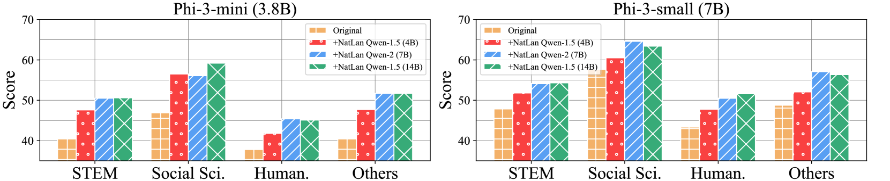

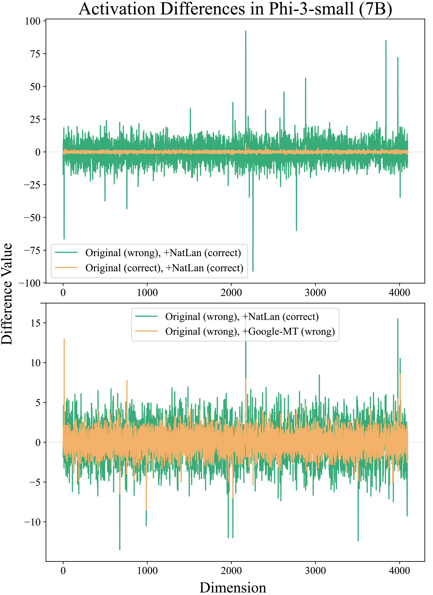

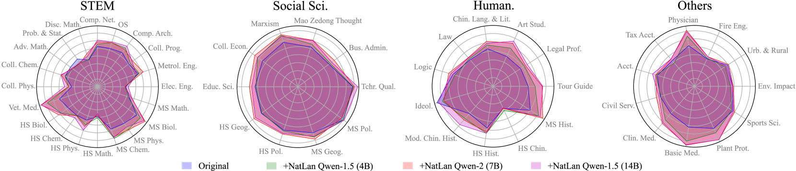

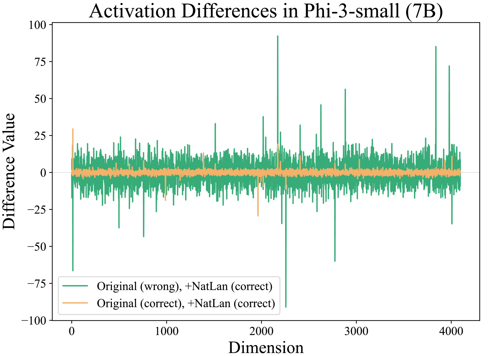

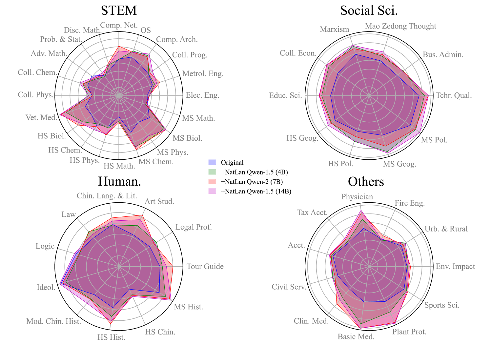

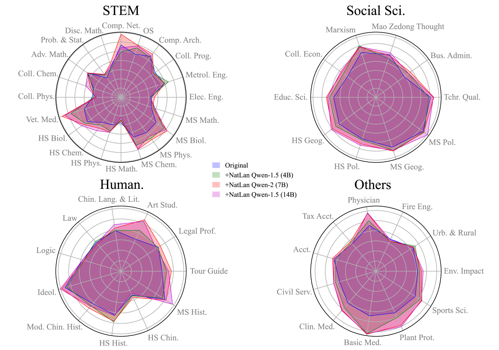

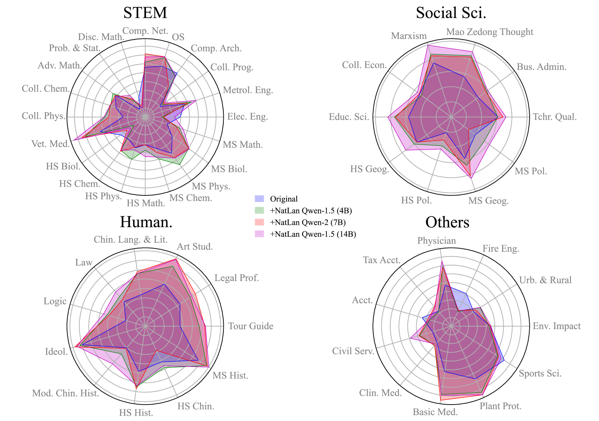

[Arxiv](https://arxiv.org/abs/2408.03544)