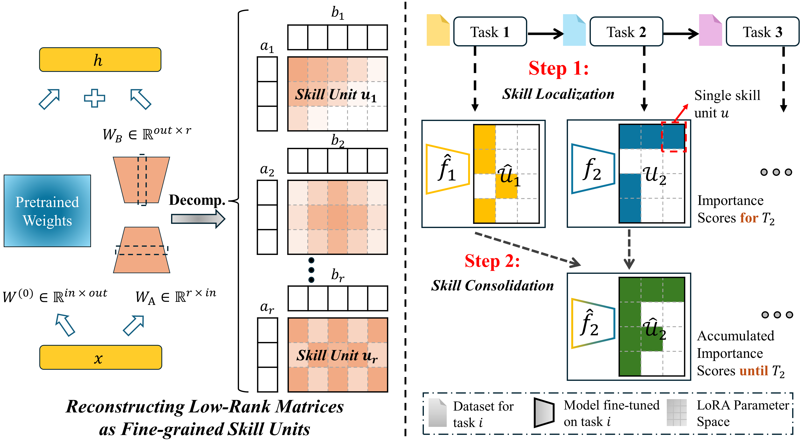

# TaSL：语言模型持续学习中的任务技能定位与整合

发布时间：2024年08月09日

`LLM理论` `人工智能`

> TaSL: Task Skill Localization and Consolidation for Language Model Continual Learning

# 摘要

> 语言模型持续学习 (CL) 因其无需重新训练即可适应大型语言模型 (LLM) 到动态现实世界环境的能力而备受关注。然而，灾难性遗忘是该领域的一大挑战，即模型在学习新任务时会丢失先前知识。现有方法虽采用参数高效的微调 (PEFT) 块来获取任务特定知识，但效率低下且忽视了任务交互间的知识转移。本文提出了一种新型 CL 框架——任务技能定位与整合 (TaSL)，它通过不依赖记忆回放的方式增强知识转移。TaSL 首先将模型细分为“技能单元”，然后利用组内技能定位技术识别新任务的技能单元重要性。通过比较这些重要性与先前任务的分布，TaSL 实施细粒度技能整合策略，保留特定任务知识并更新共享知识，促进双向知识转移。实验证明，TaSL 在保留先前知识和适应新任务间实现了优越平衡，具有强大泛化能力和显著可扩展性，适用于多种模型和 PEFT 方法，如 LoRA，并可与记忆回放结合以进一步提升性能。

> Language model continual learning (CL) has recently garnered significant interest due to its potential to adapt large language models (LLMs) to dynamic real-world environments without re-training. A key challenge in this field is catastrophic forgetting, where models lose previously acquired knowledge when learning new tasks. Existing methods commonly employ multiple parameter-efficient fine-tuning (PEFT) blocks to acquire task-specific knowledge for each task, but these approaches lack efficiency and overlook the potential for knowledge transfer through task interaction. In this paper, we present a novel CL framework for language models called Task Skill Localization and Consolidation (TaSL), which enhances knowledge transfer without relying on memory replay. TaSL first divides the model into `skill units' based on parameter dependencies, enabling more granular control. It then employs a novel group-wise skill localization technique to identify the importance distribution of skill units for a new task. By comparing this importance distribution with those from previous tasks, we implement a fine-grained skill consolidation strategy that retains task-specific knowledge, thereby preventing forgetting, and updates task-shared knowledge, which facilitates bi-directional knowledge transfer. As a result, TaSL achieves a superior balance between retaining previous knowledge and excelling in new tasks. TaSL also shows strong generalizability, suitable for general models and customizable for PEFT methods like LoRA. Additionally, it demonstrates notable extensibility, allowing integration with memory replay to further enhance performance. Extensive experiments on two CL benchmarks, with varying model sizes (from 220M to 7B), demonstrate the effectiveness of TaSL and its variants across different settings.

[Arxiv](https://arxiv.org/abs/2408.05200)