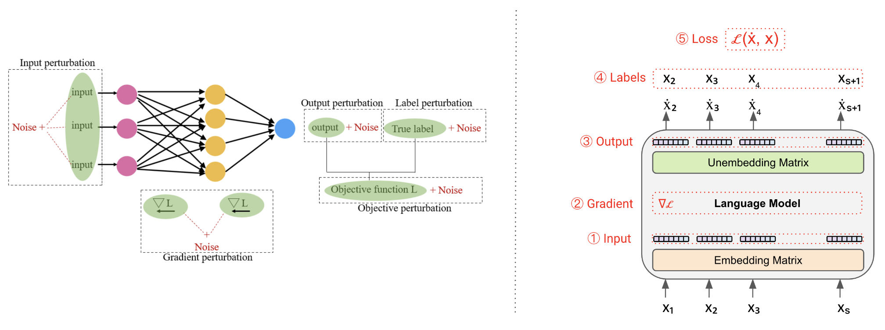
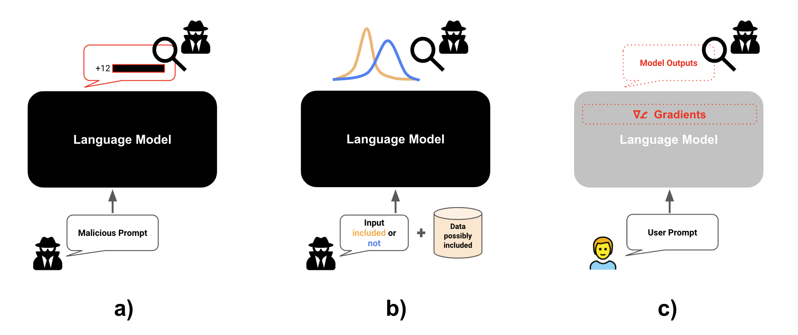
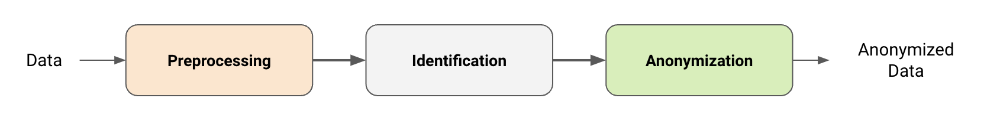
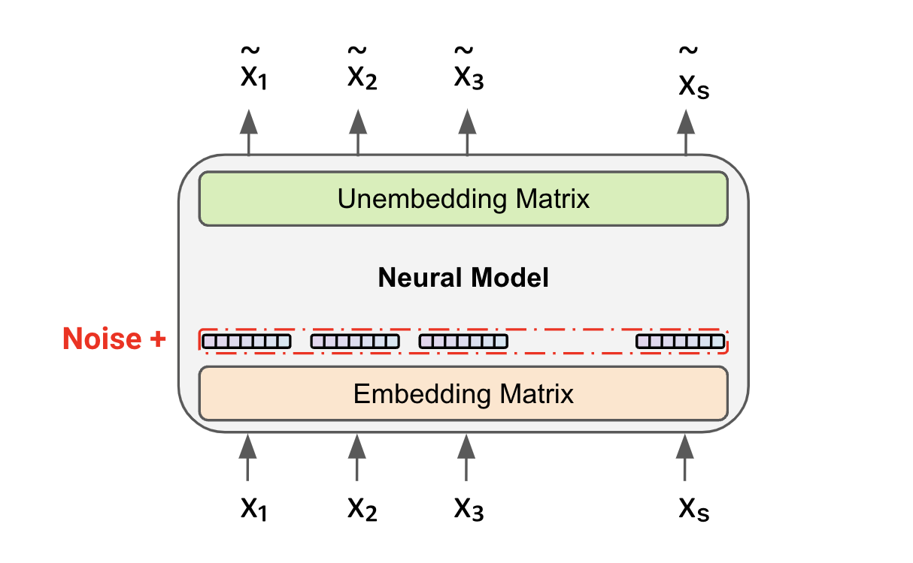
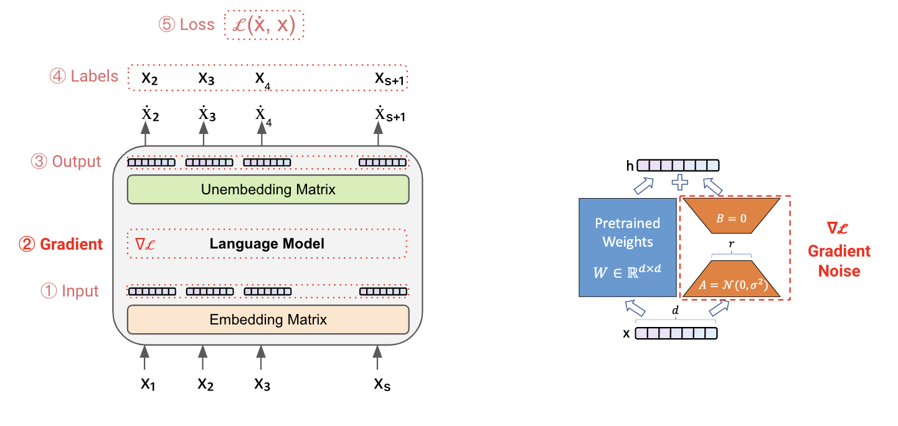

# 大型语言模型中的隐私保护：探索当前威胁与解决方案

发布时间：2024年08月10日

`LLM理论` `医疗保健` `人工智能`

> Preserving Privacy in Large Language Models: A Survey on Current Threats and Solutions

# 摘要

> 大型语言模型（LLM）在人工智能领域取得了显著进展，广泛应用于各个领域。然而，它们依赖于来自互联网的大规模数据集进行训练，带来了显著的隐私问题，在关键领域（如医疗保健）中这些问题更加严重。此外，某些特定应用场景可能需要在这些模型上对私有数据进行微调。本调查批判性地审视了与 LLM 相关的隐私威胁，强调这些模型可能记忆并无意中泄露敏感信息的风险。我们通过回顾对 LLM 的隐私攻击来探讨当前威胁，并提出在整个学习流程中整合隐私机制的综合解决方案。这些解决方案包括匿名化训练数据集、在训练或推理过程中实施差分隐私以及在训练后进行机器遗忘。我们对现有文献的全面回顾突出了持续的挑战、可用的工具以及保护 LLM 隐私的未来方向。这项工作旨在通过深入理解隐私保护方法及其在减轻风险方面的有效性，指导开发更安全、更可信赖的 AI 系统。

> Large Language Models (LLMs) represent a significant advancement in artificial intelligence, finding applications across various domains. However, their reliance on massive internet-sourced datasets for training brings notable privacy issues, which are exacerbated in critical domains (e.g., healthcare). Moreover, certain application-specific scenarios may require fine-tuning these models on private data. This survey critically examines the privacy threats associated with LLMs, emphasizing the potential for these models to memorize and inadvertently reveal sensitive information. We explore current threats by reviewing privacy attacks on LLMs and propose comprehensive solutions for integrating privacy mechanisms throughout the entire learning pipeline. These solutions range from anonymizing training datasets to implementing differential privacy during training or inference and machine unlearning after training. Our comprehensive review of existing literature highlights ongoing challenges, available tools, and future directions for preserving privacy in LLMs. This work aims to guide the development of more secure and trustworthy AI systems by providing a thorough understanding of privacy preservation methods and their effectiveness in mitigating risks.

[Arxiv](https://arxiv.org/abs/2408.05212)